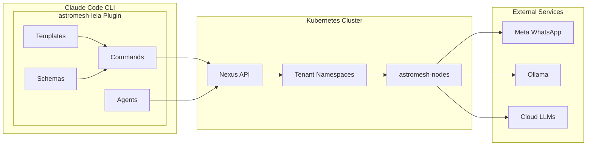

<div align="center">

# Astromesh Leia

**Agent operations in plain English, from inside Claude Code.**

[](https://monaccode.github.io/astromesh/#ecosystem)
[](https://github.com/monaccode/astromesh-leia/releases/tag/v0.5.0)
[](https://github.com/monaccode/astromesh-leia/actions/workflows/validate.yml)
[](https://github.com/monaccode/astromesh-leia/actions/workflows/install-test.yml)
[](https://github.com/monaccode/astromesh-leia/releases)
[](https://claude.com/claude-code)
[](https://monaccode.github.io/astromesh/leia/introduction/)
[](LICENSE)

[Documentation](https://monaccode.github.io/astromesh/leia/introduction/) ·
[Quick Start](https://monaccode.github.io/astromesh/leia/quickstart/) ·
[Command Reference](https://monaccode.github.io/astromesh/leia/commands/) ·
[Templates & Agents](https://monaccode.github.io/astromesh/leia/templates/)

</div>

---

A Claude Code plugin that provides a natural-language interface for creating, deploying, and managing AI agents on astromesh-nexus clusters. Named after Leia, a lemon beagle, this plugin takes you from business idea to deployed WhatsApp agent in minutes -- no Kubernetes expertise required.

## Architecture



## Install

```bash
# Clone and install
git clone https://github.com/monaccode/astromesh-leia.git
claude plugins add ./astromesh-leia

# Or install from a release
curl -L https://github.com/monaccode/astromesh-leia/releases/latest/download/astromesh-leia-v0.5.0.tar.gz | tar xz
claude plugins add ./astromesh-leia
```

## Quick Start

```bash
# 1. Bootstrap a local nexus cluster
/leia bootstrap local

# 2. Create your first WhatsApp agent
/leia I need a customer support bot for my coffee shop

# 3. Check status
/leia status

# 4. Test it
/leia test coffee-support
```

## Command Reference

| Command | Description |
|---------|-------------|
| `/leia` | Conversational entry point |
| `/leia create` | Create agent (wizard or NL) |
| `/leia deploy` | Deploy agent YAML to nexus |
| `/leia status` | CLI dashboard |
| `/leia logs` | Agent log viewer |
| `/leia test` | Interactive agent testing |
| `/leia templates` | Browse templates |
| `/leia config` | Connection management |
| `/leia bootstrap` | Cluster lifecycle |
| `/leia teardown` | Destroy cluster |

## Templates

| Template | Description |
|----------|-------------|
| `customer-support` | Customer support agent with FAQ handling and escalation |
| `restaurant-booking` | Restaurant reservation and menu inquiry agent |
| `ecommerce-assistant` | Product search, cart management, and order tracking agent |
| `appointment-scheduler` | Calendar-aware appointment booking agent |
| `lead-qualifier` | Lead scoring and qualification conversational agent |
| `onboarding-guide` | User onboarding and product walkthrough agent |

## Subagents

| Agent | Model | Role |
|-------|-------|------|
| `interpreter` | Sonnet | Parses natural-language intent into structured specs |
| `architect` | Opus | Designs agent architecture and generates manifests |
| `operator` | Sonnet | Executes kubectl and Nexus API operations |
| `tester` | Sonnet | Runs conversation simulations and validates behavior |
| `doctor` | Sonnet | Diagnoses failures and suggests remediation |

## Documentation

| Document | Path |
|----------|------|
| Tutorials | [docs/tutorials/](docs/tutorials/) |
| Plugin Development | [docs/](docs/) |

## Version Compatibility

| Leia | Nexus | Astromesh |
|------|-------|-----------|
| 0.5.x | 0.3.x | 0.29 – 0.38.x |
| 0.4.x | 0.3.x | 0.29 – 0.36.x |
| 0.2.x | 0.3.x | 0.18 – 0.28.9 |
| 0.1.x | 0.1.x | 0.18+ |

## License

Licensed under the Apache License, Version 2.0. See [LICENSE](LICENSE) for details.
