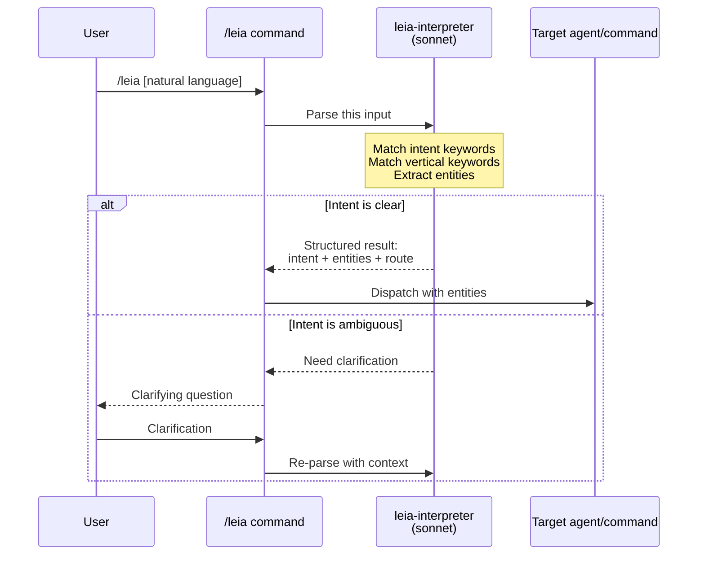
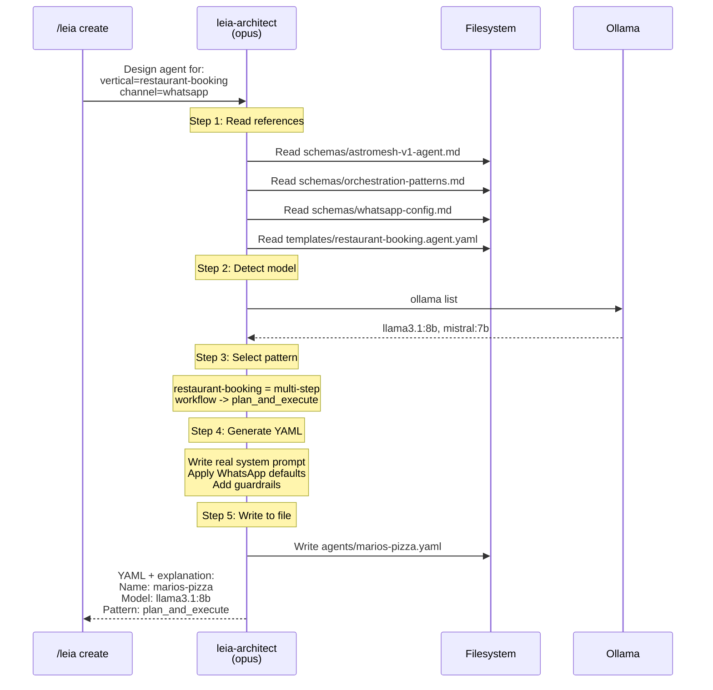
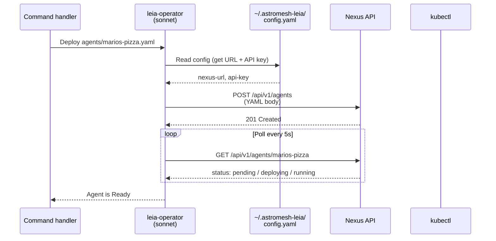
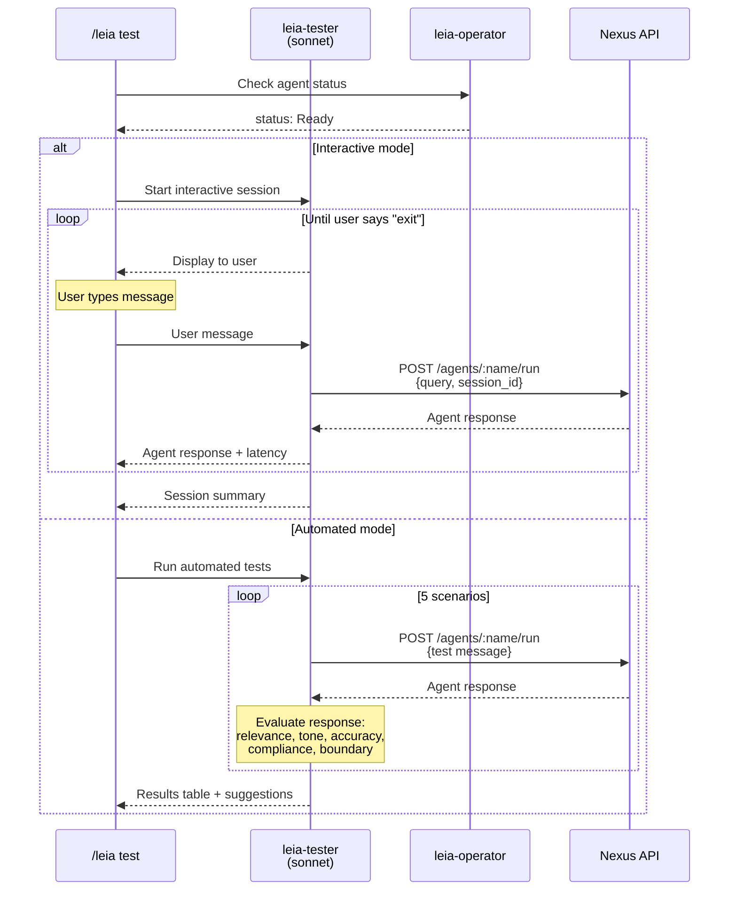
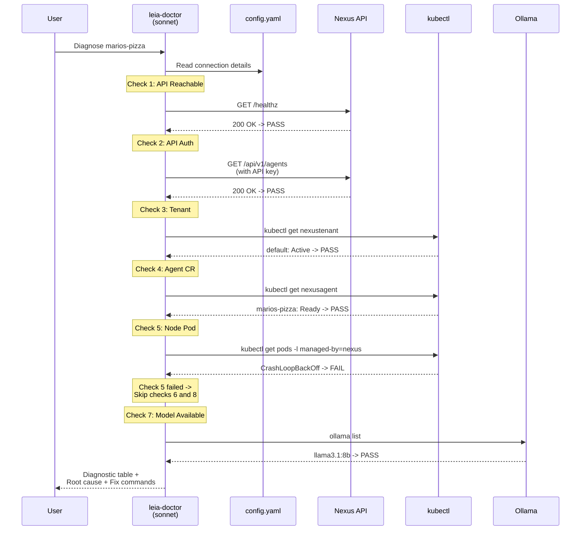

# Subagents Guide

astromesh-leia uses 5 specialized subagents to handle different aspects of the AI agent lifecycle. Each subagent is defined as a Markdown file in the `agents/` directory with frontmatter specifying its model, tools, and color. Claude Code reads these files at invocation time and uses them as system prompts for the dispatched agent.

This document covers the purpose, design rationale, tool access, knowledge sources, decision logic, and interaction patterns for each subagent.

---

## leia-interpreter

### Purpose

The interpreter is the front door of the plugin. It parses natural language input from the user into a structured intent with entities, then routes the request to the correct command flow. It exists so that users can type things like "I need a WhatsApp bot for my pizza restaurant" instead of memorizing command names and flags.

### Why It Exists

Without the interpreter, every natural language invocation of `/leia` would require the main command handler to parse intent, match keywords to verticals, and extract entities -- all in a single, increasingly complex prompt. By isolating intent parsing into its own agent, the main command stays clean and the interpreter's prompt can be tuned independently.

### Model: Sonnet

Sonnet is used because intent parsing is a structured classification task with well-defined rules. The interpreter follows a lookup table for intent detection and a keyword matching table for vertical selection. These are pattern-matching tasks where Sonnet excels without the overhead of Opus.

### Tools

| Tool | Why |
|---|---|
| Read | Reads additional context files if needed for disambiguation |
| Glob | Searches for template files to validate vertical matches |

### Knowledge Sources

- **Built-in intent detection table**: 13 user patterns mapped to actions and routes (e.g., "create/build/make/set up/new agent" maps to `create` action routed to `leia-architect`)
- **Vertical matching table**: 6 keyword-to-template mappings (e.g., "restaurant/food/dining/menu/reservation" maps to `restaurant-booking`)

### Decision Logic

1. **Receive** the user's natural language input from the `/leia` command.
2. **Match intent** by scanning for action keywords against the intent detection table. The first matching pattern wins.
3. **Match vertical** by counting keyword hits against the vertical matching table. The vertical with the most hits wins. If no vertical matches, set to `custom`.
4. **Extract entities**: business_type, channel (default: whatsapp), agent_name, tenant, vertical, capabilities.
5. **If ambiguous** (multiple intents match equally, or no intent matches), ask a single clarifying question instead of guessing.
6. **Output** the structured result: intent, entities, and routing target.

### Example Input and Output

**Input:**
```
I need a WhatsApp bot for my pizza restaurant that handles reservations and menu questions
```

**Output:**
```
Intent: create
Entities:
  business_type: pizza restaurant
  channel: whatsapp
  agent_name: null
  tenant: null
  vertical: restaurant-booking
  capabilities: [reservations, menu questions]
Routing: leia-architect
```

### Interaction Diagram



---

## leia-architect

### Purpose

The architect is the creative engine of the plugin. It takes structured entities (business type, channel, vertical, capabilities) and produces a complete, deployable `astromesh/v1` Agent YAML manifest with a real, detailed system prompt -- never a placeholder. It also selects the orchestration pattern, detects available model providers, applies channel-specific defaults, and writes the YAML to the filesystem.

### Why It Exists

Generating a complete agent manifest is the most complex task in the plugin. It requires reading and understanding the CRD schema, selecting from 6 orchestration patterns, writing a business-specific system prompt with the right tone and boundaries, configuring guardrails, and handling channel-specific constraints (e.g., WhatsApp's 1600 character limit). This task benefits from isolation in a dedicated agent with access to all reference schemas and templates.

### Model: Opus

Opus is used because this is a creative, high-stakes generation task. The architect must:
- Synthesize information from 4+ reference documents
- Write a natural, detailed system prompt tailored to a specific business (not a generic template)
- Make nuanced decisions about orchestration patterns, temperature settings, and guardrails
- Produce valid YAML that passes schema validation

Sonnet can produce adequate YAML, but Opus produces significantly better system prompts and makes more appropriate orchestration pattern choices, especially for edge cases.

### Tools

| Tool | Why |
|---|---|
| Read | Reads schema docs, orchestration patterns, templates, and WhatsApp config |
| Glob | Discovers available template files |
| Bash | Runs `ollama list` to detect locally available models |
| Write | Writes the generated YAML to the filesystem |

### Knowledge Sources

| Source | Path | What It Provides |
|---|---|---|
| Agent CRD schema | `schemas/astromesh-v1-agent.md` | All valid fields, types, defaults, validation rules |
| Orchestration patterns | `schemas/orchestration-patterns.md` | 6 patterns with when-to-use guidance and YAML examples |
| WhatsApp config | `schemas/whatsapp-config.md` | Webhook setup, message limits, multimedia handling, recommended settings |
| Template YAML | `templates/<vertical>.agent.yaml` | Real working example for the matched vertical |

### Decision Logic

The architect follows a 5-step process:

**Step 1 -- Read references.** Before generating anything, read all 4 schema/reference files plus the matched template. This ensures decisions are grounded in the current spec, not training data.

**Step 2 -- Detect model provider.** Run `ollama list` via Bash.
- If models are found: pick the best available (preference order: llama3 > mistral > phi3 > whatever is listed).
- If Ollama is not running or returns no models: default to `ollama/llama3` and note that the user needs to pull the model.
- Never assume cloud API keys exist unless the user explicitly provides one.

**Step 3 -- Select orchestration pattern.** Choose based on the agent's needs:
- `react` for general-purpose Q&A with tools (customer-support, ecommerce, lead-qualifier, onboarding)
- `plan_and_execute` for multi-step workflows (restaurant-booking with reservation flow, appointment-scheduler with booking flow)
- `parallel_fan_out` only when explicitly needed
- `supervisor` or `swarm` for multi-agent scenarios

**Step 4 -- Generate YAML.** Produce a complete manifest with:
- RFC 1123 compliant name (e.g., "Mario's Pizza" becomes `marios-pizza`)
- Real, detailed system prompt tailored to the business
- Channel-appropriate defaults (WhatsApp: 30s timeout, 256 max_tokens, 1600 char limit, 10 memory turns; Web: 120s timeout, 1024 max_tokens, 4096 char limit, 20 memory turns)
- Guardrails (PII detection, content filtering, max length)
- Comments in the YAML explaining non-obvious choices

**Step 5 -- Write to file.** Save the YAML to `agents/<agent-name>.yaml` or a user-specified path.

### Example Input and Output

**Input (from interpreter):**
```
business_type: pizza restaurant
channel: whatsapp
vertical: restaurant-booking
capabilities: [reservations, menu questions]
```

**Output (abbreviated):**
```yaml
apiVersion: astromesh/v1
kind: Agent
metadata:
  name: marios-pizza
  version: "1.0.0"
  labels:
    template: restaurant-booking
    channel: whatsapp
spec:
  identity:
    display_name: "Mario's Pizza Assistant"
    description: "Handles table reservations, menu inquiries, dietary questions, and hours for Mario's Pizza."
  model:
    primary:
      provider: ollama
      model: "llama3.1:8b"        # Detected locally via ollama list
      endpoint: "http://localhost:11434"
      parameters:
        temperature: 0.4
        max_tokens: 1024
  prompts:
    system: |
      You are the Booking Assistant for Mario's Pizza.
      [... full, detailed, real system prompt ...]
  orchestration:
    pattern: plan_and_execute      # Multi-step reservation workflow
    max_iterations: 8
    timeout_seconds: 30
  # ... memory, guardrails, etc.
```

### Interaction Diagram



---

## leia-operator

### Purpose

The operator is the execution engine for all cluster operations. It reads the config file for connection details, then uses `curl` for Nexus REST API calls and `kubectl` for direct Kubernetes access. It handles: deploy, delete, list, get, status, logs, metrics, health, tenants, bootstrap, and teardown.

### Why It Exists

Cluster operations require careful error handling, status polling, output formatting, and awareness of the config context system. By isolating these into a dedicated agent, the operator's prompt can include detailed error handling tables, exact curl/kubectl commands for every operation, and output formatting rules without polluting the prompts of other agents.

### Model: Sonnet

Sonnet is used because the operator follows well-defined procedures. Every operation has an exact curl or kubectl command, specific response codes to handle, and a defined output format. This is execution, not creative generation. Sonnet handles it efficiently.

### Tools

| Tool | Why |
|---|---|
| Read | Reads `~/.astromesh-leia/config.yaml` for connection details; reads agent YAML files for deployment |
| Bash | Executes curl commands (Nexus API) and kubectl commands (direct cluster access) |
| Write | Writes/updates config.yaml during bootstrap and teardown |
| Glob | Discovers agent YAML files when no file path is specified |

### Knowledge Sources

| Source | Path | What It Provides |
|---|---|---|
| Nexus API reference | `schemas/nexus-api.md` | All API endpoints, request/response formats, error codes |
| Config file | `~/.astromesh-leia/config.yaml` | Nexus URL, API key, cluster type, tenant, nexus repo path |

### Decision Logic

**Before any operation:**
1. Read `~/.astromesh-leia/config.yaml` to get the active context.
2. Extract `nexus-url` and `api-key` from the active context.
3. If the config file does not exist, report: "No config found. Run `/leia bootstrap` or create the config manually."

**Operation-specific logic:**

| Operation | Primary Tool | Key Behavior |
|---|---|---|
| Deploy | `curl POST /api/v1/agents` | Post YAML, then poll status every 5s for up to 60s |
| Delete | `curl DELETE /api/v1/agents/:name` | Confirm with user before executing, verify deletion after |
| List | `curl GET /api/v1/agents` | Format as table: NAME, STATUS, MODEL, CHANNEL, AGE |
| Get | `curl GET /api/v1/agents/:name` | Show full agent details |
| Logs | `curl GET /api/v1/agents/:name/logs` | Stream last 100 lines by default, support `?lines=` parameter |
| Metrics | `curl GET /api/v1/agents/:name/metrics` | Format as readable summary |
| Health | `curl GET /healthz` + `/readyz` | Report both endpoints, suggest doctor on failure |
| Tenants | `kubectl get nexustenant` | List tenants with phase and agent count |
| Bootstrap | `bash hack/bootstrap.sh` | Run script, poll health, generate API key, save config |
| Teardown | `bash hack/teardown.sh` | Confirm, run script, remove context from config |

**Error handling:**

| Error | Response | Suggestion |
|---|---|---|
| Connection refused | Cluster not running | "Run `/leia bootstrap` or check config" |
| 401 Unauthorized | Invalid API key | "Check API key in config" |
| 400 Bad Request | Invalid YAML | Show API error body |
| 404 Not Found | Agent does not exist | List available agents |
| 500 Internal Error | Server-side issue | "Run `/leia diagnose`" |

### Example Input and Output

**Input:**
```
Deploy agents/marios-pizza.yaml to the cluster
```

**Output:**
```
Deploying marios-pizza to tenant "default"...
  POST /api/v1/agents... 201 Created
  [5s]  status: pending
  [10s] status: deploying
  [15s] status: running

Agent "marios-pizza" is Ready.
```

### Interaction Diagram



---

## leia-tester

### Purpose

The tester validates that deployed agents are working correctly. It operates in two modes: interactive (proxied chat session with stats tracking) and automated (5 predefined scenarios per template type with scoring on relevance, tone, accuracy, channel compliance, and boundary respect).

### Why It Exists

Testing agents manually by sending WhatsApp messages is slow and unrepeatable. The tester provides a fast feedback loop within the CLI. Interactive mode lets the user have a real conversation with the agent to check behavior. Automated mode provides a repeatable test suite that catches regressions when the system prompt or model is changed.

### Model: Sonnet

Sonnet is used because test evaluation follows a structured rubric. Each response is scored on 5 predefined criteria with clear definitions. The evaluation prompts are template-specific (5 scenarios per template type) and follow consistent patterns. Sonnet handles structured evaluation reliably.

### Tools

| Tool | Why |
|---|---|
| Read | Reads config.yaml for API connection; reads agent manifest to determine template type |
| Bash | Executes curl commands to send messages to the agent API and receive responses |
| Glob | Discovers agent files for template type detection |

### Knowledge Sources

| Source | What It Provides |
|---|---|
| Template-specific test scenarios | 5 predefined message-and-expectation pairs for each of the 6 template types (30 scenarios total) |
| Evaluation criteria | 5-axis rubric: relevance (0-10), tone (0-10), accuracy (0-10), channel compliance (pass/fail), boundary respect (pass/fail) |
| Pass criteria | Relevance >= 7, Tone >= 7, Channel compliance = pass, Boundary respect = pass |

### Decision Logic

**Before testing:**
1. Read config.yaml for cluster connection.
2. Check agent status via the operator. If not `Ready`, abort with suggestion.

**Interactive mode:**
1. Generate a unique session ID (`test-<timestamp>`).
2. For each user message: `POST /api/v1/agents/:name/run` with the message and session ID.
3. Display the agent's response.
4. Track: message count, response times, errors.
5. On "exit/quit/done/stop": show session summary with stats and qualitative observations.

**Automated mode:**
1. Determine the agent's template type from its labels or manifest.
2. Run the 5 predefined scenarios for that template type.
3. For each scenario: send the test message, receive the response, evaluate on all 5 criteria.
4. A scenario passes if relevance >= 7, tone >= 7, channel compliance = pass, boundary respect = pass.
5. Display results table and summary with suggestions for any failures.

### Example Input and Output

**Input (automated mode):**
```
Test marios-pizza with automated scenarios
```

**Output:**
```
Running automated tests for marios-pizza...

SCENARIO          RELEVANCE  TONE  ACCURACY  COMPLIANCE  BOUNDARY  RESULT
Reserve table     9          9     8         PASS        PASS      PASS
Cancel booking    8          8     7         PASS        PASS      PASS
Menu inquiry      9          9     6         PASS        PASS      PASS
Full capacity     7          8     5         PASS        PASS      PASS
Dietary allergy   9          10    7         PASS        PASS      PASS

Summary: 5/5 passed

Suggestions:
  - All scenarios passed. The agent handles restaurant-booking conversations well.
```

### Interaction Diagram



---

## leia-doctor

### Purpose

The doctor is the systematic diagnostician. When something goes wrong (agent not responding, deployment failed, health check failing), the doctor runs through an ordered 8-step diagnostic checklist, checking each layer of the stack from bottom (API reachability) to top (WhatsApp webhook). If an earlier check fails, dependent checks are skipped. The output is a diagnostic table, root cause identification, and exact fix commands.

### Why It Exists

Debugging distributed systems is hard, especially for users without Kubernetes experience. Instead of asking users to manually run `kubectl get pods`, check API health, verify config files, and inspect webhook settings, the doctor automates the entire diagnostic process. It reduces time-to-resolution from minutes (or hours for new users) to a single command invocation.

### Model: Sonnet

Sonnet is used because the doctor follows a strict, ordered checklist. Each step has a specific command to run, expected outputs, and branching logic based on the result. This is procedural execution, not creative generation. Sonnet follows checklists reliably and efficiently.

### Tools

| Tool | Why |
|---|---|
| Read | Reads config.yaml for connection details; reads agent YAML for expected configuration |
| Bash | Executes curl (API checks) and kubectl (cluster checks, pod logs, pod exec) commands |
| Glob | Searches for config and agent files |

### Knowledge Sources

| Source | What It Provides |
|---|---|
| Diagnostic checklist | 8 ordered checks with commands, expected outputs, and failure handling |
| Common causes reference | 6 known failure patterns with root causes and fixes |
| Config file | Connection details for API and cluster access |

### Decision Logic

The doctor runs checks in strict order. If a check fails, all dependent downstream checks are marked `SKIP`.

| # | Check | Command | Depends On | Failure Means |
|---|---|---|---|---|
| 1 | Nexus API reachable | `curl /healthz` | -- | Cluster not running or nexus not deployed |
| 2 | API authentication | `curl -H "Authorization" /api/v1/agents` | 1 | Invalid or expired API key |
| 3 | Tenant exists | `kubectl get nexustenant` | 1 | Cluster not fully bootstrapped |
| 4 | Agent CR exists | `kubectl get nexusagent -n <tenant>` | 3 | Agent not deployed or wrong namespace |
| 5 | Node pod running | `kubectl get pods -l managed-by=nexus` | 4 | Pod crash, scheduling issue, or resource limit |
| 6 | Node health | `kubectl exec -- wget /v1/health` | 5 | Node process crashed or overloaded |
| 7 | Model available | `ollama list` | -- | Model not pulled or Ollama not running |
| 8 | WhatsApp webhook | `kubectl exec -- env \| grep WHATSAPP` | 5 | Missing credentials or webhook misconfiguration |

**After running checks:**
1. Present the diagnostic table with PASS/FAIL/SKIP for each check.
2. Identify the root cause as a single sentence.
3. Provide the exact commands to fix the issue.

### Example Input and Output

**Input:**
```
/leia diagnose marios-pizza
```

**Output:**
```
Running diagnostics for marios-pizza...

# | Check              | Result | Detail
--|--------------------+--------+----------------------------------
1 | Nexus API          | PASS   | HTTP 200
2 | API Auth           | PASS   | HTTP 200
3 | Tenant             | PASS   | "default" is Active
4 | Agent CR           | PASS   | Phase: Ready
5 | Node Pod           | FAIL   | CrashLoopBackOff (3 restarts)
6 | Node Health        | SKIP   | Skipped (pod not running)
7 | Model Available    | PASS   | llama3.1:8b found
8 | WhatsApp Webhook   | SKIP   | Skipped (pod not running)

Root cause: The agent's node pod is in CrashLoopBackOff.
Last 5 lines of pod logs:
  ERROR: Failed to load model "llama3.1:8b" - connection refused to http://localhost:11434
  ERROR: Ollama endpoint not reachable from inside the pod
  FATAL: Agent runtime exiting

Suggested fix:
  # Ensure Ollama is accessible from inside the cluster
  # If using Kind, the pod cannot reach localhost:11434 on the host
  # Update the agent YAML to use the cluster-internal Ollama endpoint:
  kubectl port-forward svc/ollama 11434:11434 -n default
  # Or update the model endpoint in the agent YAML:
  #   endpoint: "http://host.docker.internal:11434"
```

### Interaction Diagram


