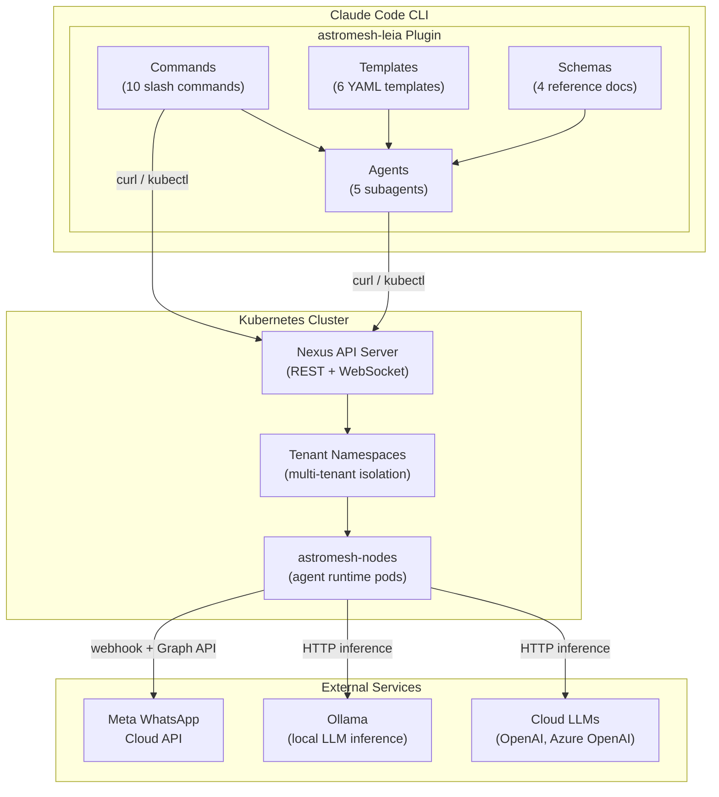
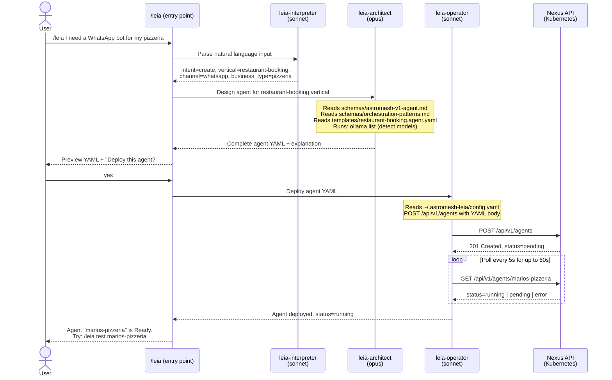
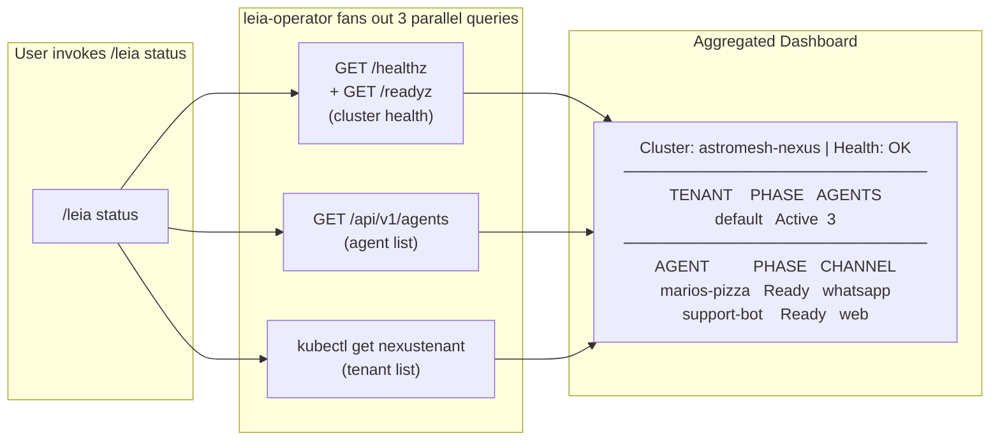

# astromesh-leia Plugin Architecture

astromesh-leia is a pure Claude Code plugin that provides a natural-language interface for creating, deploying, and managing AI agents on astromesh-nexus Kubernetes clusters. It contains zero compiled code, zero runtime dependencies, and zero external packages. The entire plugin is a collection of Markdown command definitions, Markdown agent prompts, YAML templates, and Markdown schema references that Claude Code reads and executes at invocation time. Named after Leia, a lemon beagle, the plugin takes users from a business idea to a deployed WhatsApp agent in minutes without requiring any Kubernetes expertise.

---

## System Architecture



The plugin runs entirely inside the Claude Code CLI process. It has no server component, no daemon, and no background process. Every operation is a Claude Code conversation turn that reads plugin files, reasons about the task, and executes shell commands (curl, kubectl) against the target Kubernetes cluster.

---

## How It Works

astromesh-leia maintains **zero runtime state** of its own. All state lives in exactly three places:

| State Location | What It Holds | Persistence |
|---|---|---|
| **Nexus API** (Kubernetes cluster) | Agent manifests, runtime status, logs, metrics | Persistent across sessions and machines |
| **Config file** (`~/.astromesh-leia/config.yaml`) | Cluster connection contexts, API keys, defaults | Persistent across sessions on the same machine |
| **Local filesystem** (working directory) | Generated agent YAML files waiting for deployment | Persistent until the user deletes them |

When a user invokes a command, the following happens:

1. **Claude Code reads the command definition** from `commands/<name>.md`. The frontmatter contains the description and argument hint. The body contains the full behavioral specification.
2. **The command dispatches to one or more subagents** by reading their definitions from `agents/<name>.md`. Each agent has a frontmatter declaring its model (sonnet or opus), available tools, and color.
3. **Subagents use standard Claude Code tools** (Bash, Read, Write, Glob) to interact with the filesystem, the Nexus API (via curl), and the Kubernetes cluster (via kubectl).
4. **Results flow back** through the agent chain to the user as formatted terminal output.

There is no custom runtime, no RPC layer, and no intermediate format. Claude Code's native tool-use capabilities are the execution engine.

---

## Command to Agent to Cluster Flow



This sequence shows the full lifecycle of the most common operation: creating and deploying an agent from a natural language description. The interpreter parses intent, the architect generates the manifest, and the operator handles the cluster interaction.

---

## Subagent Architecture

| Agent | Model | Tools | Purpose | Knowledge Sources |
|---|---|---|---|---|
| **leia-interpreter** | Sonnet | Read, Glob | Parses natural language into structured intent (action + entities). Routes requests to the correct command flow. | Built-in keyword-to-vertical mapping table, intent detection rules |
| **leia-architect** | Opus | Read, Glob, Bash, Write | Designs complete `astromesh/v1` Agent YAML manifests. Writes real system prompts, selects orchestration patterns, detects local models via `ollama list`. | `schemas/astromesh-v1-agent.md`, `schemas/orchestration-patterns.md`, `schemas/whatsapp-config.md`, `templates/*.agent.yaml` |
| **leia-operator** | Sonnet | Read, Bash, Write, Glob | Executes all cluster operations: deploy, delete, list, status, logs, metrics, health, bootstrap, teardown. Uses curl for the Nexus REST API and kubectl for direct cluster access. | `schemas/nexus-api.md`, `~/.astromesh-leia/config.yaml` |
| **leia-tester** | Sonnet | Read, Bash, Glob | Tests deployed agents in interactive mode (proxied chat) or automated mode (5 predefined scenarios per template type with scoring). | Template-specific test scenarios, evaluation criteria (relevance, tone, accuracy, compliance, boundary) |
| **leia-doctor** | Sonnet | Read, Bash, Glob | Systematically diagnoses failures by checking each stack layer in order: API reachability, authentication, tenant status, agent CR, pod health, node health, model availability, WhatsApp webhook. | Diagnostic checklist, common-cause reference table |

The architect uses **Opus** because it generates complex, multi-section YAML manifests with real (non-placeholder) system prompts tailored to the business description. This is the highest-stakes generation task in the plugin and benefits from the strongest reasoning model. All other agents use **Sonnet** because their tasks are well-defined and structured: parsing intent, executing shell commands, running test scenarios, and following diagnostic checklists.

---

## Parallel Operations

The `/leia status` command demonstrates how a single command fans out to multiple parallel data-collection operations before aggregating results into a unified dashboard.



The operator collects health, agent, and tenant data concurrently, then formats the combined result into a single CLI dashboard. If any individual query fails, the dashboard still renders what it can and notes the failures.

---

## Configuration Model

All configuration lives in `~/.astromesh-leia/config.yaml`. The file supports multiple named contexts (similar to kubeconfig) so users can switch between local development clusters and remote production clusters without editing the file manually.

```yaml
# ~/.astromesh-leia/config.yaml
current-context: local                    # Which context is active
contexts:
  local:                                   # Local Kind development cluster
    nexus-url: http://localhost:8080
    api-key: nxk_abc123...
    cluster-type: kind
    cluster-name: nexus-local
    nexus-repo: D:\monaccode\astromesh-nexus
  staging:                                 # Remote staging cluster
    nexus-url: https://nexus-staging.example.com
    api-key: nxk_def456...
    cluster-type: remote
    cluster-name: staging-east
defaults:                                  # Global defaults
  channel: whatsapp                        # Default messaging channel
  model-provider: auto                     # Auto-detect Ollama models
  tenant: default                          # Default tenant namespace
```

The config is managed through `/leia config` subcommands:

| Subcommand | Purpose |
|---|---|
| `/leia config` or `/leia config show` | Display the current active context |
| `/leia config list` | List all contexts, marking the active one with `*` |
| `/leia config use <name>` | Switch the active context |
| `/leia config add <name>` | Add a new context interactively |
| `/leia config set <key> <value>` | Set any config value using dot notation (e.g., `defaults.channel web`) |

---

## Decision Log

The following table records the 12 key design decisions made during the specification of astromesh-leia, along with the rationale for each.

| # | Decision | Rationale |
|---|---|---|
| 1 | **Pure plugin architecture (no compiled code)** | Zero dependencies, zero build steps, zero version conflicts. The plugin is just Markdown and YAML files that Claude Code reads. Installation is `git clone` + `claude plugins add`. Uninstallation is removing the directory. This makes the plugin trivially portable and eliminates an entire class of "it doesn't build on my machine" issues. |
| 2 | **`/leia` as the conversational entry point** | Lowest friction for new users. Instead of memorizing 10 commands, a user can type `/leia I need a WhatsApp bot for my restaurant` and the system figures out the rest. The single entry point also serves as a help menu when invoked with no arguments. |
| 3 | **Hybrid natural language + direct commands** | Progressive abstraction. New users start with natural language (`/leia create a support bot`), power users graduate to direct commands (`/leia deploy agent.yaml --tenant production`). Both paths lead to the same execution pipeline. |
| 4 | **5 specialized subagents instead of 1 monolithic agent** | Separation of concerns. Each agent has a focused system prompt, a specific model assignment, and a minimal tool set. This makes each agent easier to test, debug, and improve independently. It also prevents prompt pollution where unrelated instructions degrade performance. |
| 5 | **Opus for architect, Sonnet for the rest** | Quality where it matters, cost efficiency everywhere else. The architect generates the most complex output (multi-section YAML with real system prompts tailored to business descriptions). This is a creative, high-stakes task that benefits from the strongest model. All other agents follow structured checklists or execute well-defined operations where Sonnet excels. |
| 6 | **Real YAML templates (not JSON Schema or code generators)** | Claude understands real YAML better than abstract schemas. By providing complete, working YAML templates with inline comments, the architect can read a real example, understand the structure, and modify it for the user's needs. This is more reliable than generating YAML from a JSON Schema description. |
| 7 | **Schemas as Markdown documents (not JSON Schema files)** | Claude reasons better with natural language than with formal schema syntax. The Markdown schema docs include field descriptions, validation rules, default values, examples, and "when to use" guidance in prose. This gives the architect richer context for decision-making than a bare JSON Schema would. |
| 8 | **Config stored in `~/.astromesh-leia/`** | Persists across sessions and across projects. Unlike project-level config, user-level config means you can run `/leia status` from any directory and reach your cluster. The multi-context model (inspired by kubeconfig) supports switching between local and remote clusters without editing files. |
| 9 | **WhatsApp-first but channel-agnostic architecture** | Business demand is overwhelmingly WhatsApp (especially in Latin America and SMB markets). By making WhatsApp the default channel with sensible defaults (1600 char limit, 30s timeout, PII masking), we optimize for the 80% case. The architecture supports web and future channels through the same template and deployment pipeline. |
| 10 | **Auto-detect model provider via `ollama list`** | Reduces friction for local development. Instead of asking the user to configure a model provider, the architect runs `ollama list` to discover what is available and picks the best model automatically. If Ollama is not running, it falls back gracefully with a clear message about what to install. |
| 11 | **`leia-doctor` as a dedicated diagnostic agent** | Proactive troubleshooting. Instead of asking users to manually check pod logs, API health, and config files when something fails, the doctor runs a systematic 8-step diagnostic checklist and reports the root cause with the exact fix command. This dramatically reduces time-to-resolution for common issues. |
| 12 | **Named after Leia the beagle** | Memorable and personal. A friendly name makes the tool approachable (especially for non-technical users). The beagle personality (loyal, friendly, concise) sets the tone for all user-facing messages. It also differentiates the plugin from generic tool names in the Claude Code ecosystem. |
