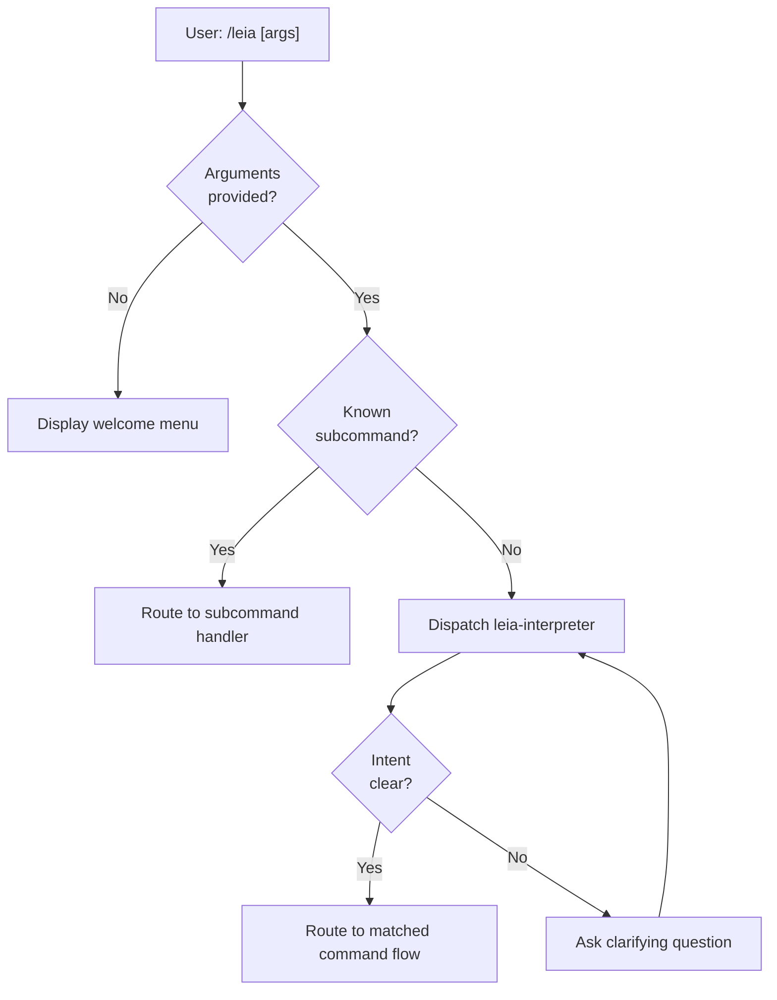
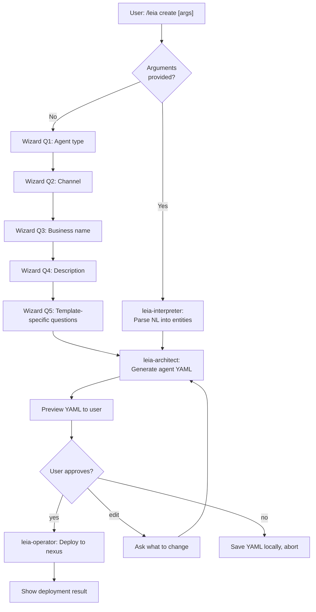
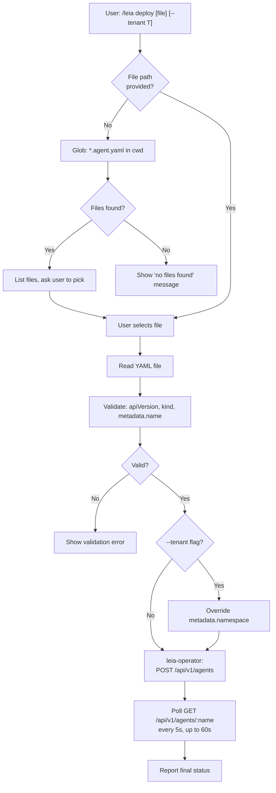
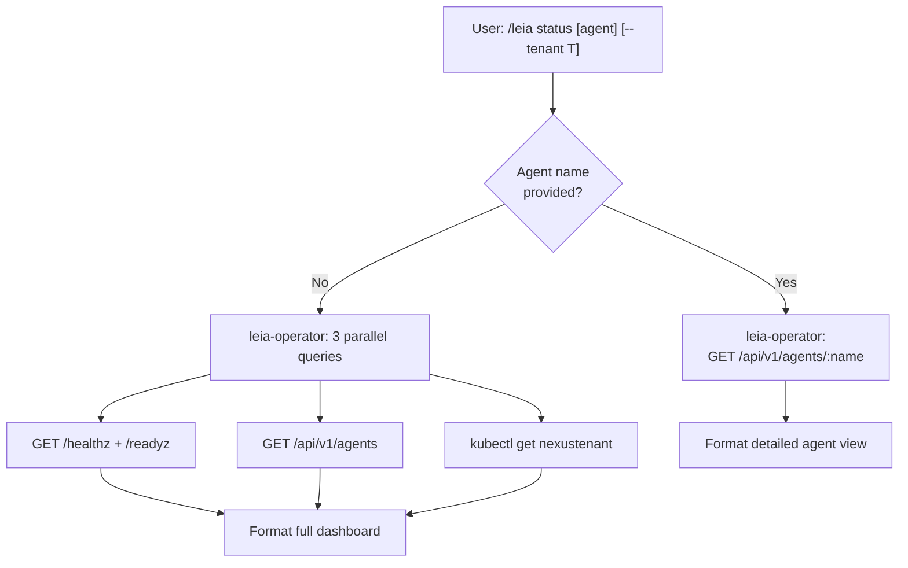
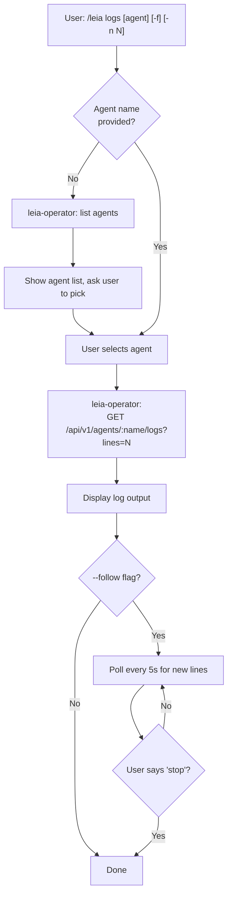
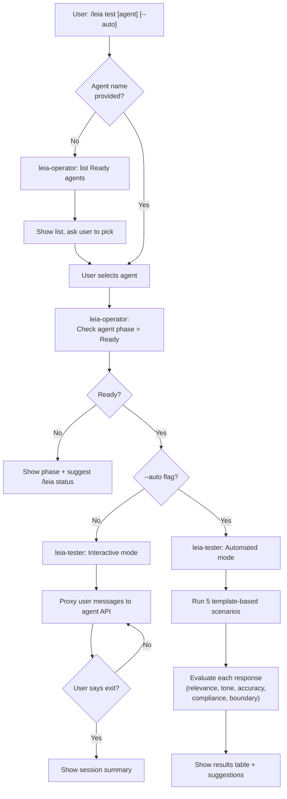
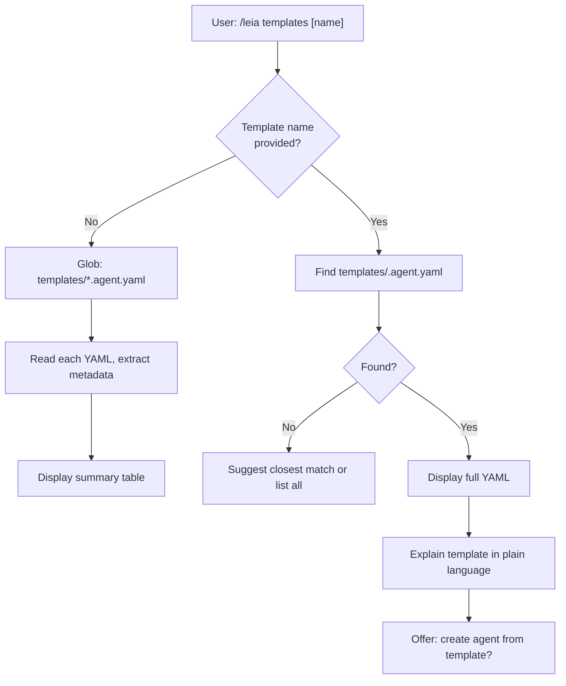
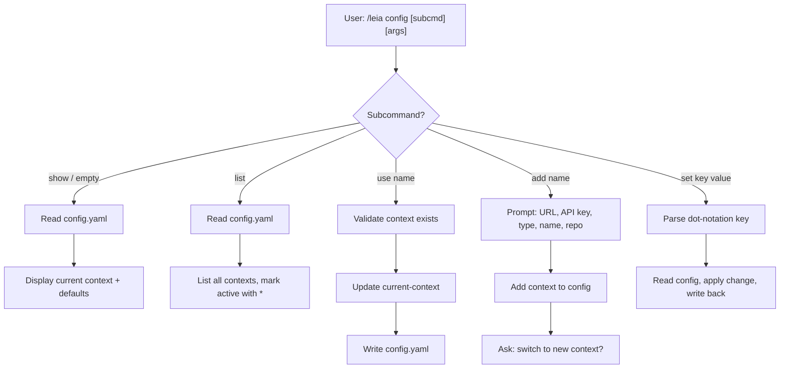
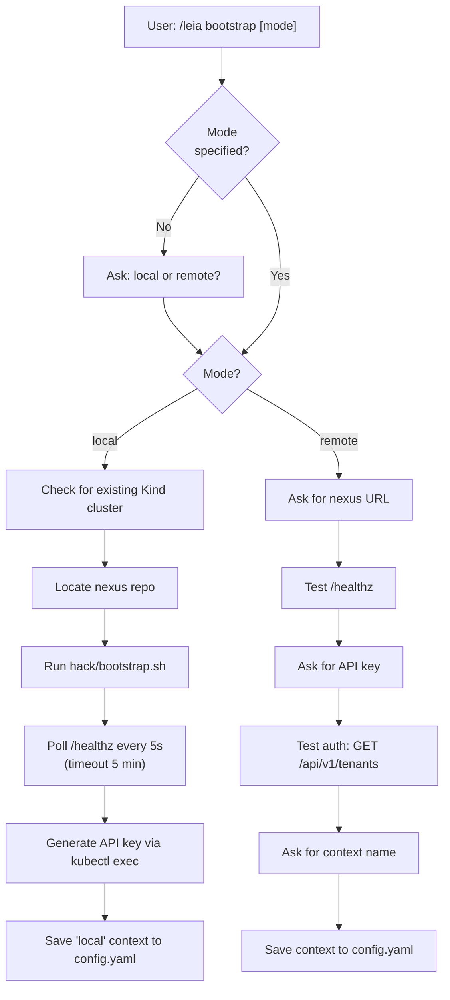
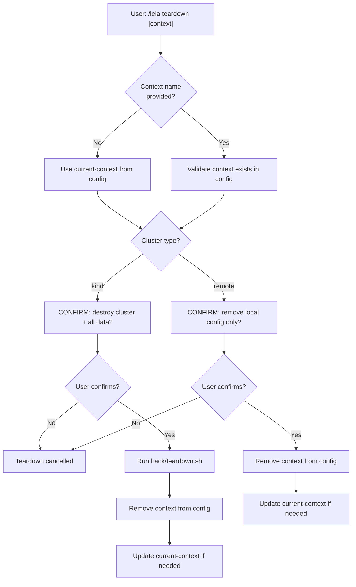

# Commands Reference

Complete reference documentation for all 10 astromesh-leia commands. Each command is a slash command registered with Claude Code that dispatches to one or more subagents for execution.

---

## /leia

### Synopsis

Conversational entry point for the astromesh-leia plugin. Routes natural language to the correct command flow.

### Description

`/leia` is the primary entry point for interacting with the astromesh-leia plugin. When invoked with no arguments, it displays a welcome menu listing all available subcommands. When invoked with natural language (e.g., `/leia I need a WhatsApp bot for my restaurant`), it dispatches to the `leia-interpreter` agent to parse the intent and entities, then routes to the appropriate subcommand flow. This makes the plugin accessible to users who do not want to memorize command names.

### Arguments and Flags

| Name | Type | Required | Default | Description |
|---|---|---|---|---|
| `description` | string (positional, variadic) | No | -- | Natural language description of what the user wants to do. If omitted, the welcome menu is shown. |

### Usage Examples

**Beginner -- show the welcome menu:**
```
/leia
```

**Intermediate -- create an agent from natural language:**
```
/leia I need a WhatsApp bot for my pizza restaurant
```

**Advanced -- diagnose a failing agent:**
```
/leia what's wrong with marios-pizza? it stopped responding 10 minutes ago
```

### Expected Output

When invoked with no arguments:

```
🐾 Leia -- Astromesh Agent Manager

Available commands:
  /leia create     Create a new AI agent (wizard or natural language)
  /leia deploy     Deploy an agent YAML to nexus
  /leia status     Cluster and agent status dashboard
  /leia logs       View agent logs
  /leia test       Test an agent interactively or with automated scenarios
  /leia templates  Browse agent templates
  /leia config     Manage nexus connection
  /leia bootstrap  Set up a nexus cluster
  /leia teardown   Destroy a local cluster

Or just describe what you need:
  /leia I need a WhatsApp bot for my restaurant

Docs: https://github.com/monaccode/astromesh-leia
```

When invoked with natural language, the output depends on the detected intent and is described in the relevant subcommand section.

### Error Scenarios

| Scenario | Message |
|---|---|
| Ambiguous intent | "I'm not sure what you'd like to do. Could you clarify? For example: create a new agent, check status, or deploy an existing YAML?" |
| Interpreter cannot match any intent | "I didn't understand that. Try describing what you need, or use one of the subcommands listed in `/leia`." |

### Related Commands

All subcommands: `/leia create`, `/leia deploy`, `/leia status`, `/leia logs`, `/leia test`, `/leia templates`, `/leia config`, `/leia bootstrap`, `/leia teardown`

### Internal Flow



---

## /leia create

### Synopsis

Create a new AI agent from a natural language description or through a guided wizard.

### Description

`/leia create` is the primary agent creation command. It operates in two modes. When arguments are provided, it uses natural language mode: the interpreter parses the description into structured entities, the architect generates a complete `astromesh/v1` Agent YAML with a real system prompt, and the user previews, approves, and optionally deploys it immediately. When no arguments are provided, it launches a guided wizard that walks through questions one at a time (agent type, channel, business name, description, and template-specific follow-ups).

### Arguments and Flags

| Name | Type | Required | Default | Description |
|---|---|---|---|---|
| `description` | string (positional, variadic) | No | -- | Natural language description of the agent to create. If omitted, the guided wizard starts. |

### Usage Examples

**Beginner -- guided wizard:**
```
/leia create
```

**Intermediate -- natural language with implicit template:**
```
/leia create a WhatsApp bot for a pizza restaurant that handles reservations and menu questions
```

**Advanced -- natural language with explicit constraints:**
```
/leia create a multilingual customer support agent for an online shoe store, web channel, with complaint escalation and order tracking
```

### Expected Output

Natural language mode (after architect generates YAML):

```
Generated agent YAML for "marios-pizza":

  Name:    marios-pizza (derived from "Mario's Pizza")
  Model:   ollama/llama3.1:8b (detected locally)
  Pattern: plan_and_execute (multi-step reservation workflow)
  Channel: whatsapp (default)

  Assumptions:
  - Using locally available llama3.1:8b model
  - WhatsApp webhook credentials need to be configured after deployment

---
apiVersion: astromesh/v1
kind: Agent
metadata:
  name: marios-pizza
  ...
---

Deploy this agent? (yes / no / edit)
```

Wizard mode (first question):

```
What kind of agent do you want to create?

  1. Restaurant Booking -- reservations, menu, hours
  2. Customer Support -- FAQ, complaints, escalation
  3. E-commerce Assistant -- products, orders, returns
  4. Appointment Scheduler -- bookings, calendar, availability
  5. Lead Qualifier -- sales qualification, pricing, handoff
  6. Onboarding Guide -- new hire orientation, policies, IT setup
  7. Custom -- describe your own use case
```

### Error Scenarios

| Scenario | Message |
|---|---|
| Interpreter cannot determine intent | "I couldn't parse that description. Could you rephrase, or run `/leia create` with no arguments for the guided wizard?" |
| Architect fails to generate YAML | "Failed to generate the agent manifest. Error: [details]. Try the guided wizard for more structured input: `/leia create`" |
| Deployment fails after approval | "Deployment failed: [error from operator]. Run `/leia diagnose` to investigate." |
| No Ollama models detected | "No local models found. The YAML uses ollama/llama3 but you need to run `ollama pull llama3` first." |

### Related Commands

`/leia deploy`, `/leia templates`, `/leia test`

### Internal Flow



---

## /leia deploy

### Synopsis

Deploy an existing agent YAML file to the nexus cluster.

### Description

`/leia deploy` takes a YAML file path, validates it against the `astromesh/v1` Agent schema, and deploys it to the cluster via the Nexus REST API. If no file is specified, it searches the current directory for `*.agent.yaml` files and presents them as options. After deploying, it polls the agent status for up to 60 seconds until the agent reaches `Ready` phase or times out.

### Arguments and Flags

| Name | Type | Required | Default | Description |
|---|---|---|---|---|
| `yaml-file` | string (positional) | No | -- | Path to the agent YAML file to deploy. If omitted, searches current directory. |
| `--tenant` | string | No | Config default | Tenant namespace to deploy into. Overrides `metadata.namespace` in the YAML. |

### Usage Examples

**Beginner -- auto-discover YAML files:**
```
/leia deploy
```

**Intermediate -- deploy a specific file:**
```
/leia deploy restaurant-booking.agent.yaml
```

**Advanced -- deploy to a specific tenant:**
```
/leia deploy agents/marios-pizza.yaml --tenant production
```

### Expected Output

Successful deployment:

```
Deploying marios-pizza to tenant "default"...

  Validating YAML... OK
  POST /api/v1/agents... 201 Created
  Waiting for Ready status...
    [5s]  status: pending
    [10s] status: deploying
    [15s] status: running

Agent "marios-pizza" is Ready.
  Tenant:  default
  Channel: whatsapp
  Phase:   Ready

Next: /leia test marios-pizza
```

No file specified (auto-discovery):

```
Found agent YAML files:
  1. restaurant-booking.agent.yaml
  2. customer-support.agent.yaml
Which one would you like to deploy? (number or name)
```

### Error Scenarios

| Scenario | Message |
|---|---|
| File not found | "File not found: `./nonexistent.yaml`. Check the path and try again." |
| Invalid apiVersion | "Invalid apiVersion: expected `astromesh/v1`, got `v2beta1`." |
| Invalid kind | "Invalid kind: expected `Agent`, got `Deployment`." |
| Missing metadata.name | "Invalid or missing `metadata.name`." |
| Connection refused | "Cannot reach the nexus cluster. Is it running? Try `/leia status` to check cluster health." |
| 401 Unauthorized | "Authentication failed. Check your API key in `~/.astromesh-leia/config.yaml`." |
| 400 Bad Request | "Deployment rejected by the API: [error body from API]" |
| 409 Conflict | "An agent with this name already exists. Use a different name or delete the existing agent first." |
| No YAML files in directory | "No .agent.yaml files found in the current directory.\n- Use `/leia create` to design a new agent\n- Specify a path: `/leia deploy path/to/agent.yaml`\n- Browse templates: `/leia templates`" |

### Related Commands

`/leia create`, `/leia status`, `/leia logs`, `/leia test`

### Internal Flow



---

## /leia status

### Synopsis

Display a CLI dashboard showing cluster health, tenants, and agent status.

### Description

`/leia status` gathers data from three sources in parallel (cluster health endpoints, agent list API, and kubectl tenant list), then formats the results into a unified CLI dashboard. When an agent name is provided, it shows a detailed single-agent view with conditions and events. The `--tenant` flag filters the agent list to a specific namespace.

### Arguments and Flags

| Name | Type | Required | Default | Description |
|---|---|---|---|---|
| `agent-name` | string (positional) | No | -- | Show detailed status for a specific agent. If omitted, shows the full dashboard. |
| `--tenant` | string | No | -- | Filter agents to a specific tenant namespace. |

### Usage Examples

**Beginner -- full dashboard:**
```
/leia status
```

**Intermediate -- specific agent:**
```
/leia status marios-pizza
```

**Advanced -- filter by tenant:**
```
/leia status --tenant production
```

### Expected Output

Full dashboard:

```
Cluster: astromesh-nexus | Type: kind | Health: OK

TENANT          PHASE    AGENTS   NODE ENDPOINT
default         Active   3        ws://node-default:9090
production      Active   5        ws://node-prod:9090
staging         Active   1        ws://node-staging:9090

AGENT                  TENANT      PHASE    CHANNEL    LAST SYNCED
marios-pizza           default     Ready    whatsapp   2m ago
support-bot            default     Ready    web        5m ago
lead-qualifier         production  Running  whatsapp   30s ago
```

Detailed agent view:

```
Agent: marios-pizza
  Tenant:     default
  Phase:      Ready
  Channel:    whatsapp
  Created:    2026-04-02T10:30:00Z
  Last Synced: 2026-04-02T10:32:00Z (2m ago)
  Node Ack:   true

  Conditions:
    TYPE           STATUS   REASON              MESSAGE
    Validated      True     ValidationPassed    Schema validation passed
    Deployed       True     DeploymentReady     Agent deployed to node
    ChannelReady   True     WebhookRegistered   WhatsApp webhook active
```

### Error Scenarios

| Scenario | Message |
|---|---|
| Cluster unreachable | "Cannot connect to the nexus cluster. Check that it is running and your config is correct in `~/.astromesh-leia/config.yaml`." |
| No tenants found | "No tenants found. The cluster may need bootstrapping. Try `/leia bootstrap`." |
| No agents deployed | "No agents deployed yet. Create one with `/leia create`." |
| No agents matching tenant filter | "No agents found in tenant `production`. Check the tenant name or list all with `/leia status`." |
| Partial failure (health down, agents OK) | Shows agents table normally, but: "Cluster: astromesh-nexus | Health: DEGRADED -- run `/leia diagnose`" |

### Related Commands

`/leia logs`, `/leia test`, `/leia deploy`, `/leia config`

### Internal Flow



---

## /leia logs

### Synopsis

View logs for a deployed agent, with optional follow mode.

### Description

`/leia logs` retrieves log output from a deployed agent via the Nexus API logs endpoint. By default it fetches the last 50 lines. The `--follow` flag enables continuous polling for new log entries every 5 seconds until the user says "stop". If no agent name is provided, it lists all deployed agents and asks the user to pick one.

### Arguments and Flags

| Name | Type | Required | Default | Description |
|---|---|---|---|---|
| `agent-name` | string (positional) | No | -- | Name of the agent whose logs to view. If omitted, lists agents to choose from. |
| `--follow`, `-f` | boolean | No | `false` | Continuously poll for new log entries. |
| `--lines`, `-n` | integer | No | `50` | Number of log lines to fetch. |

### Usage Examples

**Beginner -- pick an agent interactively:**
```
/leia logs
```

**Intermediate -- view last 50 lines:**
```
/leia logs marios-pizza
```

**Advanced -- follow mode with 200 lines of history:**
```
/leia logs marios-pizza --follow --lines 200
```

### Expected Output

Normal log output:

```
[2026-04-02 10:30:01] INFO  Agent started
[2026-04-02 10:30:05] INFO  WhatsApp webhook registered
[2026-04-02 10:31:12] INFO  Received message from +1234567890
[2026-04-02 10:31:13] INFO  Generated response (245ms)
[2026-04-02 10:31:13] INFO  Sent reply to +1234567890
```

Follow mode header:

```
Following logs for marios-pizza... (say 'stop' to end)
```

Agent selection (no name provided):

```
Which agent's logs do you want to view?
  1. marios-pizza (Ready)
  2. support-bot (Ready)
  3. lead-qualifier (Running)
```

### Error Scenarios

| Scenario | Message |
|---|---|
| Agent not found | "No agent named `pizza-bot` found. Run `/leia status` to see deployed agents." |
| Cluster unreachable | "Cannot reach the nexus cluster. Check your config in `~/.astromesh-leia/config.yaml`." |
| No logs available | "No logs available yet for `marios-pizza`. The agent may not have received any requests." |
| Logs endpoint not available | "The logs endpoint is not available. The agent may still be initializing." |

### Related Commands

`/leia status`, `/leia test`, `/leia deploy`

### Internal Flow



---

## /leia test

### Synopsis

Test a deployed agent interactively or with automated test scenarios.

### Description

`/leia test` verifies that a deployed agent is working correctly. In interactive mode (default), it starts a proxied chat session where user messages are forwarded to the agent via the Nexus API and responses are displayed. Session stats (message count, response times, errors) are tracked and shown when the user exits. In automated mode (`--auto`), it runs 5 predefined test scenarios based on the agent's template type and evaluates each response on relevance (0-10), tone (0-10), accuracy (0-10), channel compliance (pass/fail), and boundary respect (pass/fail).

### Arguments and Flags

| Name | Type | Required | Default | Description |
|---|---|---|---|---|
| `agent-name` | string (positional) | No | -- | Name of the agent to test. If omitted, lists ready agents to choose from. |
| `--auto` | boolean | No | `false` | Run automated test scenarios instead of interactive chat. |

### Usage Examples

**Beginner -- interactive test (pick agent from list):**
```
/leia test
```

**Intermediate -- interactive test with a specific agent:**
```
/leia test marios-pizza
```

**Advanced -- automated test suite:**
```
/leia test marios-pizza --auto
```

### Expected Output

Interactive mode start:

```
Starting interactive test with marios-pizza...
Type your messages to chat with the agent. Say "exit" to end the session.
```

Interactive mode session end:

```
Session Summary:
  Messages exchanged: 8
  Average response time: 1.2s
  Errors: 0
  Observations: Agent stayed in character throughout. Reservation flow was smooth.
```

Automated mode results:

```
Running automated tests for marios-pizza...

SCENARIO          RELEVANCE  TONE  ACCURACY  COMPLIANCE  BOUNDARY  RESULT
Reserve table     9          9     8         PASS        PASS      PASS
Cancel booking    8          8     7         PASS        PASS      PASS
Menu inquiry      9          9     6         PASS        PASS      PASS
Full capacity     7          8     5         PASS        PASS      PASS
Dietary allergy   9          10    7         PASS        PASS      PASS

Summary: 5/5 passed

Suggestions:
  - All scenarios passed. The agent handles restaurant-booking conversations well.
```

### Error Scenarios

| Scenario | Message |
|---|---|
| Agent not found | "No agent named `pizza-bot` found. Run `/leia status` to see deployed agents." |
| Agent not ready | "Agent `marios-pizza` is in phase `Pending`. Run `/leia status marios-pizza` to monitor or `/leia logs marios-pizza` to debug." |
| No ready agents | "No agents are currently ready for testing. Run `/leia status` to check agent states." |
| Connection error during test | "Lost connection to the agent. The agent may have crashed. Check `/leia logs marios-pizza`." |
| Response timeout | "Agent did not respond within 30 seconds. It may be overloaded or stuck. Check `/leia logs marios-pizza`." |

### Related Commands

`/leia create`, `/leia deploy`, `/leia status`, `/leia logs`

### Internal Flow



---

## /leia templates

### Synopsis

Browse available agent templates and preview their YAML.

### Description

`/leia templates` reads all `templates/*.agent.yaml` files from the plugin repository and presents them in a summary table. When a specific template name is provided, it displays the full YAML, a plain-language explanation of the template's purpose and configuration, customization points, and offers to create an agent based on it.

### Arguments and Flags

| Name | Type | Required | Default | Description |
|---|---|---|---|---|
| `template-name` | string (positional) | No | -- | Name of a specific template to preview. If omitted, lists all templates. |

### Usage Examples

**Beginner -- browse all templates:**
```
/leia templates
```

**Intermediate -- preview a specific template:**
```
/leia templates restaurant-booking
```

**Advanced -- review a template before creating a customized agent:**
```
/leia templates lead-qualifier
```

### Expected Output

Browse all templates:

```
TEMPLATE               CHANNEL    PATTERN             DESCRIPTION
restaurant-booking     whatsapp   plan_and_execute    Reservations, menu inquiries, hours
customer-support       whatsapp   react               FAQ, complaints, escalation handling
ecommerce-assistant    whatsapp   react               Product search, orders, returns
appointment-scheduler  whatsapp   plan_and_execute    Booking, rescheduling, availability
lead-qualifier         whatsapp   react               Sales qualification, pricing, handoff
onboarding-guide       web        react               New hire orientation, policies, IT setup

Use /leia templates <name> to preview a template in detail.
Use /leia create to build a new agent from a template.
```

Specific template preview (abbreviated):

```yaml
apiVersion: astromesh/v1
kind: Agent
metadata:
  name: restaurant-booking
  ...
```

Followed by a plain-language explanation covering: what it does, orchestration pattern, channel settings, system prompt summary, and customization points.

```
Would you like to create an agent based on this template?
Use /leia create to get started, or I can customize this template for you now.
```

### Error Scenarios

| Scenario | Message |
|---|---|
| Template not found | "No template named `hotel-booking` found. Run `/leia templates` to see available templates." |
| Templates directory missing | "Templates directory not found. Make sure you are in the astromesh-leia project root." |

### Related Commands

`/leia create`, `/leia deploy`

### Internal Flow



---

## /leia config

### Synopsis

Manage nexus cluster connection contexts.

### Description

`/leia config` provides CRUD operations for managing cluster connection contexts stored in `~/.astromesh-leia/config.yaml`. The config file supports multiple named contexts (similar to kubeconfig), each with a nexus URL, API key, cluster type, and optional nexus repo path. The `defaults` section stores global preferences like default channel and tenant.

### Arguments and Flags

| Name | Type | Required | Default | Description |
|---|---|---|---|---|
| `subcommand` | string (positional) | No | `show` | One of: `show`, `list`, `use`, `add`, `set` |
| `context-name` | string (positional, for `use` and `add`) | Conditional | -- | Name of the context to switch to or create. Required for `use` and `add`. |
| `key` | string (positional, for `set`) | Conditional | -- | Dot-notation key to set (e.g., `defaults.channel`). Required for `set`. |
| `value` | string (positional, for `set`) | Conditional | -- | Value to set. Required for `set`. |

### Usage Examples

**Beginner -- show current config:**
```
/leia config
```

**Intermediate -- switch context:**
```
/leia config use production
```

**Advanced -- add a remote context:**
```
/leia config add staging
```

**Advanced -- set a default value:**
```
/leia config set defaults.channel web
```

### Expected Output

Show current config:

```
Current context: local

  Nexus URL:    http://localhost:8080
  Cluster type: kind
  Cluster name: nexus-local

Defaults:
  Channel:        whatsapp
  Model provider: auto
  Tenant:         default
```

List contexts:

```
CONTEXT      TYPE     URL
* local      kind     http://localhost:8080
  staging    remote   https://nexus-staging.example.com
  production remote   https://nexus.example.com
```

Add context (interactive prompts):

```
Adding new context "staging"...
  Nexus URL (required): https://nexus-staging.example.com
  API key (required): nxk_...
  Cluster type (kind/remote) [remote]: remote
  Cluster name [staging]: staging-east

Context "staging" added. Switch to it now? (yes/no)
```

Set value:

```
Set defaults.channel = "web"
```

### Error Scenarios

| Scenario | Message |
|---|---|
| Config file does not exist | Creates `~/.astromesh-leia/` directory and a default config with empty contexts. |
| Context not found (for `use`) | "Context `production` not found. Available contexts: local, staging" |
| Unknown subcommand | "Unknown config subcommand `reset`. Available: show, list, use, add, set" |
| Missing required argument | "Usage: `/leia config use <context-name>`" |

### Related Commands

`/leia bootstrap`, `/leia teardown`, `/leia status`

### Internal Flow



---

## /leia bootstrap

### Synopsis

Set up a nexus cluster for local development or connect to an existing remote cluster.

### Description

`/leia bootstrap` handles the complete cluster lifecycle setup. In `local` mode, it creates a Kind cluster, deploys all nexus components via the bootstrap script, waits for the health endpoint, generates an API key, and saves the connection context to config. In `remote` mode, it connects to an existing nexus cluster by testing the health endpoint, validating the API key, and saving the connection context. If no mode is specified, it asks the user to choose.

### Arguments and Flags

| Name | Type | Required | Default | Description |
|---|---|---|---|---|
| `mode` | string (positional) | No | -- | `local` for Kind cluster creation, `remote` for connecting to an existing cluster. If omitted, asks the user. |

### Usage Examples

**Beginner -- choose interactively:**
```
/leia bootstrap
```

**Intermediate -- local development cluster:**
```
/leia bootstrap local
```

**Advanced -- connect to remote cluster:**
```
/leia bootstrap remote
```

### Expected Output

Local bootstrap:

```
Bootstrapping local Kind cluster...

  [1/6] Checking for existing cluster... not found
  [2/6] Locating nexus repo... D:\monaccode\astromesh-nexus
  [3/6] Running hack/bootstrap.sh...
        Creating Kind cluster "nexus-local"...
        Deploying nexus components...
        (streaming output from bootstrap script)
  [4/6] Waiting for healthy... (polling every 5s)
        [15s] /healthz returned 200
        [15s] /readyz returned 200
  [5/6] Generating API key...
        Created key: nxk_abc123...
  [6/6] Saving config...

Bootstrap complete. Cluster "nexus-local" is ready.
  Context "local" is now active.

Next: /leia create to build your first agent.
```

Remote bootstrap:

```
Connecting to remote nexus cluster...

  Nexus URL: https://nexus.example.com
  Testing health endpoint... OK
  API key: nxk_...
  Testing authentication... OK
  Context name [nexus.example.com]: production

Context "production" saved and set as active.
```

### Error Scenarios

| Scenario | Message |
|---|---|
| `kind` not installed | "Kind is not installed. Install it from: https://kind.sigs.k8s.io/docs/user/quick-start/#installation" |
| `kubectl` not available | "kubectl is not available. Install it before proceeding." |
| Nexus repo not found | "Cannot find the astromesh-nexus repo at the expected paths. Please specify the location." |
| Bootstrap script fails | "Bootstrap failed. Last 20 lines of output:\n[output]\nCheck prerequisites and try again." |
| Health endpoint timeout (5 min) | "Nexus API did not become healthy within 5 minutes. Check pod status: `kubectl get pods -n nexus-system`" |
| Remote URL unreachable | "Cannot reach `https://nexus.example.com/healthz`. Verify the URL and network access." |
| Remote auth fails | "Authentication failed with the provided API key. Verify the key is correct and has the right scope." |
| Existing cluster detected | "A Kind cluster 'nexus-local' is already running. Tear down and recreate? Or just reconnect?" |

### Related Commands

`/leia teardown`, `/leia config`, `/leia status`

### Internal Flow



---

## /leia teardown

### Synopsis

Destroy a local Kind cluster or disconnect a remote context.

### Description

`/leia teardown` removes a cluster context. For Kind (local) clusters, it runs the teardown script to destroy the cluster and all its data, then removes the context from config. For remote clusters, it only removes the local connection config without touching the remote cluster. Both paths require explicit user confirmation before proceeding. If no context name is provided, it uses the current active context.

### Arguments and Flags

| Name | Type | Required | Default | Description |
|---|---|---|---|---|
| `context-name` | string (positional) | No | Current context | Name of the context to tear down. If omitted, uses the current active context. |

### Usage Examples

**Beginner -- tear down current context:**
```
/leia teardown
```

**Intermediate -- tear down a specific context:**
```
/leia teardown staging
```

**Advanced -- tear down a local cluster explicitly:**
```
/leia teardown local
```

### Expected Output

Kind cluster teardown:

```
Tearing down context "local" (Kind cluster: nexus-local)...

WARNING: This will DESTROY the local Kind cluster and DELETE ALL DATA.
Type "yes" to confirm: yes

  Running hack/teardown.sh...
  Cluster "nexus-local" deleted.
  Context "local" removed from config.

Current context switched to "staging".
```

Remote context teardown:

```
Disconnecting context "staging" (remote cluster)...

This will remove the local connection config only.
The remote cluster at https://nexus-staging.example.com will NOT be affected.
Type "yes" to confirm: yes

  Context "staging" removed from config.

Current context switched to "local".
```

### Error Scenarios

| Scenario | Message |
|---|---|
| No config file | "No contexts are configured. Run `/leia bootstrap` to set up a cluster first." |
| Context not found | "Context `production` not found. Available contexts: local, staging" |
| Teardown script fails | "Teardown script failed. You may need to manually clean up: `kind delete cluster --name nexus-local`" |
| User declines confirmation | "Teardown cancelled." |
| Last context removed | "Context `local` removed. No contexts remain. Run `/leia bootstrap` to set up a new cluster." |

### Related Commands

`/leia bootstrap`, `/leia config`, `/leia status`

### Internal Flow


