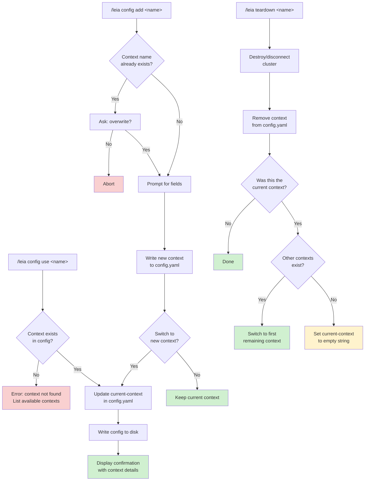
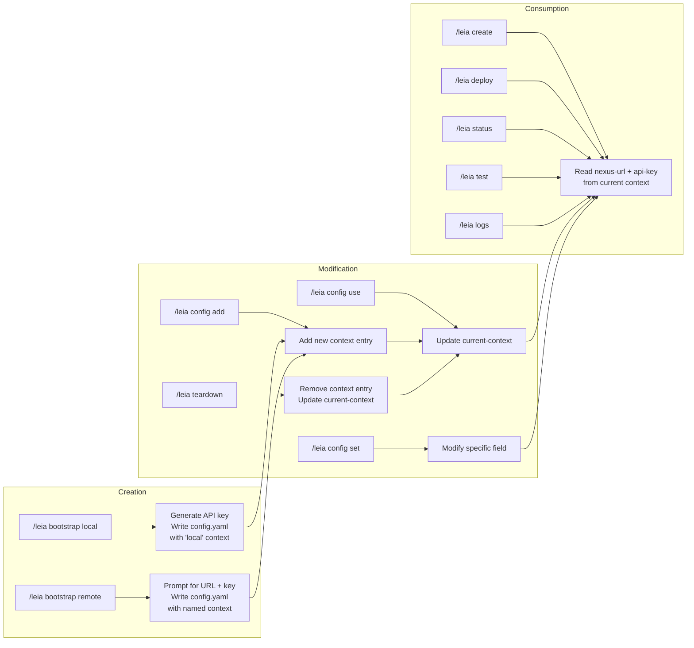

# Configuration Reference

This document is the authoritative reference for the astromesh-leia configuration file. It covers the file format, all available fields, multi-context management, environment variable overrides, and example configurations for common deployment scenarios.

---

## Table of Contents

- [Config File Location](#config-file-location)
- [Complete File Format](#complete-file-format)
- [Field Reference](#field-reference)
  - [Top-Level Fields](#top-level-fields)
  - [Context Fields](#context-fields)
  - [Defaults Fields](#defaults-fields)
- [Multi-Context Management](#multi-context-management)
  - [Adding a Context](#adding-a-context)
  - [Switching Contexts](#switching-contexts)
  - [Removing a Context](#removing-a-context)
  - [Listing Contexts](#listing-contexts)
  - [Setting Individual Values](#setting-individual-values)
- [Context Switching Flow](#context-switching-flow)
- [Example Configurations](#example-configurations)
  - [Local Development (Kind)](#local-development-kind)
  - [Staging (Remote)](#staging-remote)
  - [Production (Remote)](#production-remote)
  - [Full Multi-Environment Config](#full-multi-environment-config)
- [Environment Variable Overrides](#environment-variable-overrides)
- [Config File Lifecycle](#config-file-lifecycle)

---

## Config File Location

The configuration file is stored at:

```
~/.astromesh-leia/config.yaml
```

On different operating systems, the `~` expands to:

| OS | Expanded Path |
|----|---------------|
| Linux | `/home/<user>/.astromesh-leia/config.yaml` |
| macOS | `/Users/<user>/.astromesh-leia/config.yaml` |
| Windows | `C:\Users\<user>\.astromesh-leia\config.yaml` |

If the file or directory does not exist, running `/leia config` or `/leia bootstrap` will create them automatically with sensible defaults. The directory is created with standard user permissions. The config file is created as a valid YAML document with an empty contexts map and default values for the `defaults` section.

---

## Complete File Format

Below is the full config file format with every field documented. Optional fields are marked with comments.

```yaml
# The name of the currently active context.
# Must match one of the keys under 'contexts'.
current-context: local

# Map of named connection contexts.
# Each key is a user-chosen context name (e.g., "local", "staging", "prod").
contexts:
  local:
    nexus-url: http://localhost:8080          # REQUIRED — nexus API endpoint URL
    api-key: nxk_abc123def456                 # REQUIRED — API key for authentication
    cluster-type: kind                        # REQUIRED — "kind" or "remote"
    cluster-name: nexus-local                 # OPTIONAL — Kubernetes cluster name (defaults to context name)
    nexus-repo: D:\monaccode\astromesh-nexus  # OPTIONAL — path to nexus repo (only for kind clusters)

  staging:
    nexus-url: https://nexus-staging.example.com
    api-key: nxk_staging_789xyz
    cluster-type: remote
    cluster-name: staging-cluster

  prod:
    nexus-url: https://nexus.example.com
    api-key: nxk_prod_secure_key
    cluster-type: remote
    cluster-name: production-cluster

# Global default values applied when not overridden per-command.
defaults:
  channel: whatsapp                           # Default messaging channel: "whatsapp" or "web"
  model-provider: auto                        # Model provider strategy: "auto", "ollama", "openai", "anthropic"
  tenant: default                             # Default tenant namespace for agent deployments
```

---

## Field Reference

### Top-Level Fields

| Field | Type | Required | Description |
|-------|------|----------|-------------|
| `current-context` | string | Yes | The name of the active context. Must match a key in the `contexts` map. All commands that interact with the cluster use this context unless explicitly overridden. |
| `contexts` | map | Yes | A map of named contexts. Each key is a context name and each value is a context object (see below). At least one context must be defined for cluster operations to work. |
| `defaults` | object | No | Global default values. These are used when a command does not explicitly specify a value. If the `defaults` section is missing entirely, built-in defaults are used. |

### Context Fields

Each entry under `contexts` has the following fields:

| Field | Type | Required | Default | Description |
|-------|------|----------|---------|-------------|
| `nexus-url` | string | Yes | -- | The full URL of the astromesh-nexus API server. For local Kind clusters this is typically `http://localhost:8080`. For remote clusters, use the HTTPS URL of the nexus ingress or load balancer. Must include the protocol (`http://` or `https://`). Do not include a trailing slash. |
| `api-key` | string | Yes | -- | The API key used to authenticate against the nexus API. Keys are prefixed with `nxk_`. For local Kind clusters, a key is generated automatically during bootstrap. For remote clusters, obtain the key from your cluster administrator. |
| `cluster-type` | string | Yes | -- | The type of Kubernetes cluster. Must be one of: `kind` (local development cluster created with Kind) or `remote` (any existing Kubernetes cluster accessible via network). This field determines which teardown flow is used and whether local-only features like `nexus-repo` are relevant. |
| `cluster-name` | string | No | Same as context name | The Kubernetes cluster name. For Kind clusters, this is the name passed to `kind create cluster --name`. For remote clusters, this is informational and used in status displays. If not set, the context name is used. |
| `nexus-repo` | string | No | `D:\monaccode\astromesh-nexus` | The local filesystem path to the astromesh-nexus repository. Only relevant for `kind` cluster types. Used by `/leia bootstrap` to locate `hack/bootstrap.sh` and by `/leia teardown` to locate `hack/teardown.sh`. Ignored for remote clusters. |

### Defaults Fields

| Field | Type | Required | Default | Allowed Values | Description |
|-------|------|----------|---------|----------------|-------------|
| `channel` | string | No | `whatsapp` | `whatsapp`, `web` | The default messaging channel used when creating or deploying agents. WhatsApp requires additional configuration (see [WhatsApp Setup Guide](whatsapp-setup.md)). Web channel uses a built-in HTTP/WebSocket interface. |
| `model-provider` | string | No | `auto` | `auto`, `ollama`, `openai`, `anthropic` | The default model provider for new agents. When set to `auto`, the system detects available providers in this order: (1) check if Ollama is running locally, (2) check for `OPENAI_API_KEY` environment variable, (3) check for `ANTHROPIC_API_KEY` environment variable. The first available provider is used. When set explicitly, that provider is always used. |
| `tenant` | string | No | `default` | Any valid Kubernetes namespace name | The default tenant namespace for agent deployments. Tenants provide resource isolation and RBAC boundaries. The `default` tenant is created automatically during cluster bootstrap. Additional tenants must be created by the cluster administrator before they can be used. |

---

## Multi-Context Management

Contexts allow you to manage connections to multiple nexus clusters from a single machine. This is essential for workflows where you develop locally, test on staging, and deploy to production.

All context management is done through the `/leia config` command.

### Adding a Context

Use `/leia config add <name>` to add a new context interactively. The command prompts for each required field.

```
> /leia config add staging

Nexus URL: https://nexus-staging.example.com
API Key: nxk_staging_789xyz
Cluster type (kind/remote) [remote]: remote
Cluster name [staging]: staging-cluster

Context 'staging' added. Switch to it now? (yes/no): yes
Switched to context 'staging'.
```

**What happens:**
1. The command validates that the context name does not already exist (if it does, it asks whether to overwrite).
2. Each field is prompted individually with defaults shown in brackets.
3. For `kind` clusters, `nexus-repo` is also prompted.
4. The new context is written to the config file.
5. You are asked whether to switch `current-context` to the new context.

### Switching Contexts

Use `/leia config use <name>` to switch the active context.

```
> /leia config use prod

Switched to context 'prod'.
  Nexus URL: https://nexus.example.com
  Cluster: production-cluster (remote)
```

**What happens:**
1. The command validates that the named context exists in the config.
2. `current-context` is updated to the given name.
3. The updated config is written back to disk.
4. A confirmation is displayed showing the new context details.

If the context name does not exist, the command reports an error and lists available contexts.

### Removing a Context

There is no dedicated `remove` subcommand. To remove a context:

1. Use `/leia teardown <context-name>` which removes the context entry from the config after tearing down the cluster (for Kind) or disconnecting (for remote).
2. Alternatively, manually edit `~/.astromesh-leia/config.yaml` and delete the context entry.

If the removed context was `current-context`, the system automatically switches to the first remaining context. If no contexts remain, `current-context` is set to an empty string.

### Listing Contexts

Use `/leia config list` to see all configured contexts.

```
> /leia config list

  local     http://localhost:8080         kind    nexus-local
* staging   https://nexus-staging.example.com  remote  staging-cluster
  prod      https://nexus.example.com     remote  production-cluster
```

The `*` marker indicates the current active context.

### Setting Individual Values

Use `/leia config set <key> <value>` with dot notation to modify any config value without going through the interactive flow.

```
> /leia config set defaults.channel web
Set defaults.channel = web

> /leia config set contexts.local.nexus-url http://localhost:9090
Set contexts.local.nexus-url = http://localhost:9090

> /leia config set defaults.tenant production
Set defaults.tenant = production
```

**Supported dot-notation paths:**

| Path Pattern | Example | Description |
|--------------|---------|-------------|
| `current-context` | `/leia config set current-context prod` | Switch active context (same as `use`) |
| `defaults.<key>` | `/leia config set defaults.channel web` | Set a default value |
| `contexts.<name>.<key>` | `/leia config set contexts.local.api-key nxk_new` | Set a field on a specific context |

---

## Context Switching Flow

The following diagram shows how context switching works and what checks are performed.



---

## Example Configurations

### Local Development (Kind)

A minimal configuration for local development using a Kind cluster. This is what `/leia bootstrap local` creates automatically.

```yaml
current-context: local
contexts:
  local:
    nexus-url: http://localhost:8080
    api-key: nxk_local_dev_key_generated_by_bootstrap
    cluster-type: kind
    cluster-name: nexus-local
    nexus-repo: D:\monaccode\astromesh-nexus
defaults:
  channel: whatsapp
  model-provider: auto
  tenant: default
```

**Notes:**
- `nexus-url` is `http://localhost:8080` because the Kind cluster port-forwards the nexus API to localhost.
- `api-key` is generated automatically by the bootstrap script. You do not need to create it manually.
- `nexus-repo` points to the local astromesh-nexus repository. This path is used by bootstrap and teardown scripts.
- `model-provider: auto` will detect Ollama running locally, which is the typical setup for local development.

### Staging (Remote)

A configuration for connecting to a shared staging environment.

```yaml
current-context: staging
contexts:
  staging:
    nexus-url: https://nexus-staging.example.com
    api-key: nxk_stg_abc123def456ghi789
    cluster-type: remote
    cluster-name: staging-eks-us-east-1
defaults:
  channel: whatsapp
  model-provider: openai
  tenant: staging
```

**Notes:**
- `nexus-url` uses HTTPS, which is required for remote clusters in any environment beyond local development.
- `cluster-type: remote` means teardown will only remove the local config entry, not touch the remote cluster.
- `cluster-name` is informational and helps identify the cluster in status displays.
- `model-provider: openai` is typical for staging/production since Ollama is not usually available on remote clusters.
- `tenant: staging` isolates staging deployments from other environments on the same cluster.

### Production (Remote)

A configuration for a production nexus cluster.

```yaml
current-context: prod
contexts:
  prod:
    nexus-url: https://nexus.example.com
    api-key: nxk_prod_secure_production_key
    cluster-type: remote
    cluster-name: production-gke-us-central1
defaults:
  channel: whatsapp
  model-provider: openai
  tenant: production
```

**Notes:**
- Production API keys should be rotated regularly. If your key stops working, request a new one from the cluster administrator.
- The `tenant` is set to `production` to keep production agents isolated.
- Consider using a dedicated service account key rather than a personal key for production deployments.

### Full Multi-Environment Config

A complete configuration managing all three environments from a single machine.

```yaml
current-context: local
contexts:
  local:
    nexus-url: http://localhost:8080
    api-key: nxk_local_dev_abc123
    cluster-type: kind
    cluster-name: nexus-local
    nexus-repo: D:\monaccode\astromesh-nexus

  staging:
    nexus-url: https://nexus-staging.example.com
    api-key: nxk_stg_def456ghi789
    cluster-type: remote
    cluster-name: staging-eks-us-east-1

  prod:
    nexus-url: https://nexus.example.com
    api-key: nxk_prod_jkl012mno345
    cluster-type: remote
    cluster-name: production-gke-us-central1

defaults:
  channel: whatsapp
  model-provider: auto
  tenant: default
```

**Typical workflow with multiple contexts:**

1. Develop and test locally:
   ```
   /leia config use local
   /leia create a pizza restaurant booking bot
   /leia test marios-pizza
   ```

2. Deploy to staging for team testing:
   ```
   /leia config use staging
   /leia deploy marios-pizza.agent.yaml --tenant staging
   /leia test marios-pizza --auto
   ```

3. Promote to production:
   ```
   /leia config use prod
   /leia deploy marios-pizza.agent.yaml --tenant production
   /leia status marios-pizza
   ```

---

## Environment Variable Overrides

The following environment variables override config file values when set. This is useful for CI/CD pipelines, automation scripts, and ephemeral environments where you do not want to write a config file.

| Environment Variable | Overrides | Description |
|---------------------|-----------|-------------|
| `ASTROMESH_NEXUS_URL` | `contexts.<current>.nexus-url` | Override the nexus API URL for the current context. |
| `ASTROMESH_API_KEY` | `contexts.<current>.api-key` | Override the API key for the current context. |
| `ASTROMESH_TENANT` | `defaults.tenant` | Override the default tenant namespace. |
| `ASTROMESH_CHANNEL` | `defaults.channel` | Override the default messaging channel. |
| `ASTROMESH_CONTEXT` | `current-context` | Override which context is active without modifying the config file. |
| `OPENAI_API_KEY` | -- | Used by the `openai` model provider. Not a config override but required when `model-provider` is `openai` or `auto` (and OpenAI is the detected provider). |
| `ANTHROPIC_API_KEY` | -- | Used by the `anthropic` model provider. Required when `model-provider` is `anthropic` or `auto` (and Anthropic is the detected provider). |

**Precedence order** (highest to lowest):

1. Command-line flags (e.g., `--tenant production`)
2. Environment variables (e.g., `ASTROMESH_TENANT=production`)
3. Config file values (e.g., `defaults.tenant: production`)
4. Built-in defaults (e.g., `default`)

**Example: CI/CD usage without a config file**

```bash
export ASTROMESH_NEXUS_URL=https://nexus-staging.example.com
export ASTROMESH_API_KEY=nxk_ci_pipeline_key
export ASTROMESH_TENANT=ci-tests

# These commands work without a config file
/leia deploy agent.yaml
/leia test my-agent --auto
/leia teardown
```

---

## Config File Lifecycle

The following diagram illustrates how the config file is created, modified, and consumed throughout the plugin lifecycle.


