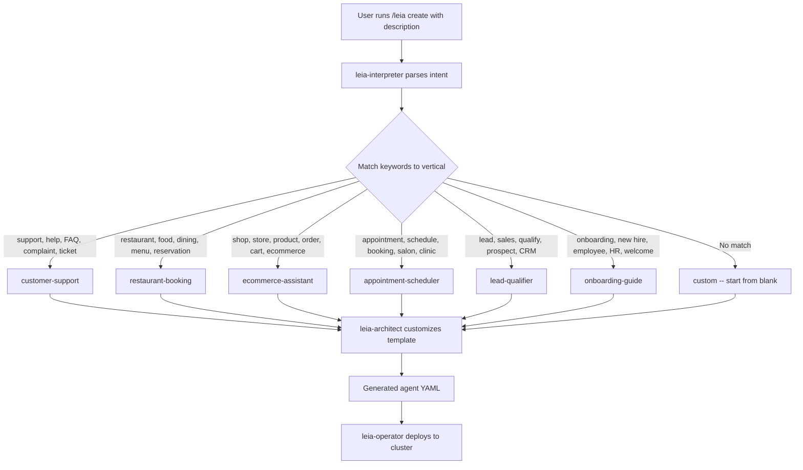
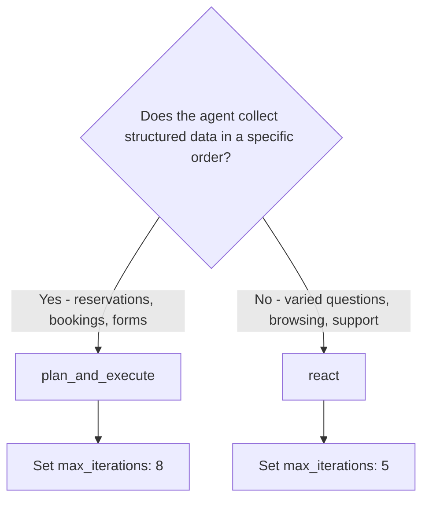
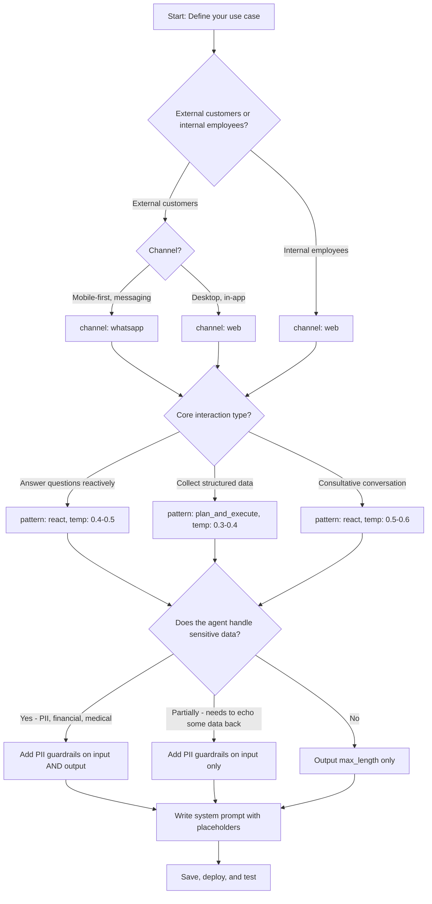

# Agent Templates Guide

This guide covers all 6 agent templates included with astromesh-leia. Each template is a pre-configured `Agent` resource in YAML that targets a specific business vertical. Templates handle common conversation patterns, guardrails, and channel formatting so you can deploy a working agent in minutes and customize it for your specific business.

---

## Table of Contents

- [Overview](#overview)
- [Template Selection Flow](#template-selection-flow)
- [Comparison Table](#comparison-table)
- [1. customer-support](#1-customer-support)
- [2. restaurant-booking](#2-restaurant-booking)
- [3. ecommerce-assistant](#3-ecommerce-assistant)
- [4. appointment-scheduler](#4-appointment-scheduler)
- [5. lead-qualifier](#5-lead-qualifier)
- [6. onboarding-guide](#6-onboarding-guide)
- [Creating Custom Templates](#creating-custom-templates)

---

## Overview

Templates live in the `templates/` directory as `*.agent.yaml` files. When you run `/leia create`, the interpreter matches your description to the best template using keyword analysis, then the architect customizes it with your business details.

Every template follows the same `astromesh/v1` `Agent` schema:

- **metadata** -- name, version, labels (template type and channel)
- **spec.identity** -- display name and description shown to users
- **spec.model** -- LLM provider, model, endpoint, and inference parameters
- **spec.prompts** -- system prompt with `{{placeholder}}` variables for business-specific content
- **spec.orchestration** -- reasoning pattern (react or plan_and_execute), iteration limits, timeout
- **spec.memory** -- conversation history strategy and turn limits
- **spec.guardrails** -- input/output filters (PII detection, max message length)

### Template Selection Flow

The following diagram shows how the leia-interpreter routes a user's natural language request to the correct template:



---

## Comparison Table

| Property | customer-support | restaurant-booking | ecommerce-assistant | appointment-scheduler | lead-qualifier | onboarding-guide |
|---|---|---|---|---|---|---|
| **Channel** | whatsapp | whatsapp | whatsapp | whatsapp | whatsapp | web |
| **Pattern** | react | plan_and_execute | react | plan_and_execute | react | react |
| **Temperature** | 0.5 | 0.4 | 0.3 | 0.3 | 0.5 | 0.5 |
| **Max tokens** | 1024 | 1024 | 1024 | 1024 | 1024 | 2048 |
| **Timeout (sec)** | 30 | 30 | 30 | 30 | 30 | 60 |
| **Max turns** | 20 | 30 | 25 | 20 | 30 | 40 |
| **Max iterations** | 5 | 8 | 5 | 8 | 8 | 5 |
| **Output max length** | 1600 | 1600 | 1600 | 1600 | 1600 | 4000 |
| **Input PII redaction** | yes | yes | yes | no | yes | yes |
| **Output PII redaction** | yes | no | yes | no | no | yes |

Key observations:

- **plan_and_execute** is used for templates where the agent must collect multiple pieces of structured data in a specific order (reservations, appointments). **react** is used where the agent responds to varied, unpredictable questions.
- **Lower temperature** (0.3) is used for transactional agents (ecommerce, appointments) where precision matters. **Higher temperature** (0.5) suits conversational agents (support, lead qualification, onboarding) where natural tone is important.
- **onboarding-guide** is the only web-channel template -- it allows longer messages (4000 chars) and a longer timeout (60s) because web interfaces support richer formatting and users expect more detailed answers.
- **Max turns** is highest for onboarding (40) because onboarding is a multi-session, multi-day process. It is lowest for customer-support and appointment-scheduler (20) because those interactions are typically short and focused.

---

## 1. customer-support

### Full YAML

```yaml
# API version for all astromesh agent resources
apiVersion: astromesh/v1
# Resource type -- always "Agent" for agent definitions
kind: Agent
metadata:
  # Unique identifier for this agent within the cluster
  name: customer-support
  # Semantic version -- increment when you change the agent's behavior
  version: "1.0.0"
  labels:
    # Template identifier -- used by leia-tester to select test scenarios
    template: customer-support
    # Delivery channel -- affects message formatting limits and guardrails
    channel: whatsapp
spec:
  identity:
    # Human-readable name shown in dashboards and status output
    display_name: "Customer Support Assistant"
    # Description used for agent discovery and documentation
    description: "Handles frequently asked questions, troubleshooting, complaint resolution, and escalation to human agents when needed."
  model:
    primary:
      # LLM provider -- "ollama" for local models, or cloud providers
      provider: ollama
      # Model identifier -- must match what the provider serves
      model: "llama3.1:8b"
      # Provider API endpoint -- for Ollama, this is the local server
      endpoint: "http://localhost:11434"
      parameters:
        # Temperature 0.5 balances consistency with natural conversation
        temperature: 0.5
        # Max tokens per response -- 1024 is safe for WhatsApp's char limits
        max_tokens: 1024
  prompts:
    system: |
      You are the Customer Support Assistant for {{business_name}}.

      ## Responsibilities
      - Answer frequently asked questions about {{business_name}} products and services.
      - Guide customers through basic troubleshooting steps.
      - Handle complaints with empathy, acknowledge the issue, and offer concrete next steps.
      - Escalate to a human agent when the issue is outside your capabilities or the customer explicitly requests it.

      ## Guidelines
      - Keep responses concise and well-formatted for WhatsApp (short paragraphs, bullet points).
      - Be empathetic and professional at all times.
      - Never fabricate information. If you don't know the answer, say so and offer to escalate.
      - Stay on topic — do not engage in conversations unrelated to {{business_name}} support.
  orchestration:
    # "react" pattern: observe the user message, reason about it, act with a response.
    # Good for varied, unpredictable queries where multi-step planning is not needed.
    pattern: react
    # Maximum reasoning iterations before forcing a response
    max_iterations: 5
    # Hard timeout per request -- prevents hanging on slow models
    timeout_seconds: 30
  memory:
    # Conversational memory tracks the full back-and-forth exchange
    type: conversational
    # in_memory backend -- fast, no external dependencies, lost on pod restart
    backend: in_memory
    # sliding_window drops the oldest turns when max_turns is reached
    strategy: sliding_window
    # 20 turns is enough for typical support interactions (10 user + 10 agent messages)
    max_turns: 20
  guardrails:
    input:
      # Detect and redact PII (emails, phone numbers, addresses) from user input
      # before it reaches the model -- protects privacy in logs and training data
      - type: pii_detection
        action: redact
    output:
      # Also redact any PII the model might generate in responses
      - type: pii_detection
        action: redact
      # WhatsApp messages over ~1600 chars get truncated or split awkwardly
      - type: max_length
        limit: 1600
```

### Use Case

The customer-support template is designed for any business that receives repetitive inbound support queries and wants to automate first-line response while preserving the option to escalate to humans.

**Businesses this serves:**

- **SaaS / tech companies** -- handling login issues, feature questions, billing inquiries, and bug reports
- **Airlines and travel companies** -- flight status, baggage policies, rebooking procedures, loyalty program questions
- **Banks and financial services** -- account balance inquiries, card activation, fraud reporting, branch hours
- **Telecom providers** -- plan details, data usage, outage notifications, device troubleshooting
- **Subscription services** -- cancellation flows, upgrade options, billing disputes

### Customization Points

| What to change | Why | Example |
|---|---|---|
| `{{business_name}}` in system prompt | Personalizes every response | "Acme Corp", "CloudSync", "Delta Airlines" |
| Responsibilities section | Add/remove capabilities for your vertical | Add "Process warranty claims" for electronics |
| Guidelines section | Adjust tone and boundaries | Banks need stricter "never discuss other accounts" rules |
| `temperature` | Lower (0.3) for regulated industries, higher (0.6) for casual brands | 0.3 for banking, 0.6 for a gaming company |
| `max_turns` | Increase for complex multi-step troubleshooting | 30 for IT helpdesk |
| Guardrails | Add custom filters for your industry | Add `profanity_filter` for consumer-facing brands |

**What to leave alone:**

- `apiVersion`, `kind` -- these are structural and must remain as-is
- `orchestration.pattern: react` -- support queries are reactive by nature; plan_and_execute adds unnecessary overhead
- `memory.strategy: sliding_window` -- the only supported strategy currently
- `guardrails.output.max_length` -- keep at 1600 for WhatsApp unless you change the channel

### Channel Considerations

| Aspect | WhatsApp | Web |
|---|---|---|
| **Message length** | Hard limit around 4096 chars, but messages over 1600 chars become hard to read on mobile. The template enforces 1600. | No practical limit. Increase `max_length` to 4000+ for web. |
| **Formatting** | Supports bold (`*bold*`), italic (`_italic_`), strikethrough (`~strike~`), monospace. No Markdown headers or tables. | Full Markdown or HTML depending on your frontend. |
| **Response time** | Users expect replies within 5-15 seconds. The 30s timeout is the upper safety bound. | Users tolerate 10-30 seconds. Can increase timeout to 60s. |
| **Media** | Can send images, documents, audio. Useful for troubleshooting screenshots. | Depends on frontend implementation. |
| **Session persistence** | WhatsApp sessions are tied to phone numbers. Memory persists across messages naturally. | Web sessions require explicit session ID management. |

If switching to web, change `metadata.labels.channel` to `web`, increase `guardrails.output.max_length` to 4000, and optionally increase `max_tokens` to 2048 for more detailed responses.

### Model Recommendations

| Model | Provider | Best for | Notes |
|---|---|---|---|
| **llama3.1:8b** | Ollama (local) | Development, testing, low-cost production | Default. Good balance of quality and speed. Runs on 8GB+ VRAM. |
| **llama3.1:70b** | Ollama (local) | Production with nuanced complaints | Better empathy and reasoning. Needs 48GB+ VRAM or quantized. |
| **mistral:7b** | Ollama (local) | Fast responses, simpler queries | Slightly faster than Llama 3.1 8b, less nuanced on complaints. |
| **gpt-4o-mini** | OpenAI | Production with high volume | Excellent quality/cost ratio. Change provider to `openai`. |
| **gpt-4o** | OpenAI | Premium support with complex reasoning | Best quality but highest cost. Use for VIP customer tiers. |
| **claude-3.5-sonnet** | Anthropic | Production with empathy focus | Strong on empathetic, nuanced responses. Good for complaint handling. |

Vision-capable models (gpt-4o, claude-3.5-sonnet) are useful if customers send screenshots of error messages or damaged products.

### Example System Prompts

#### Tech Company (SaaS)

```
You are the Customer Support Assistant for CloudSync.

## Responsibilities
- Answer questions about CloudSync's file syncing, sharing, and collaboration features.
- Guide users through connection issues, sync errors, and account recovery.
- Explain pricing tiers (Free, Pro, Enterprise) and help users understand which plan fits their needs.
- Handle billing disputes by collecting the invoice number and escalating to the billing team.
- Escalate to a human agent for data recovery requests or security incidents.

## Guidelines
- Keep responses concise and formatted for WhatsApp (short paragraphs, bullet points).
- Be empathetic and professional. Acknowledge frustration before jumping to solutions.
- Never fabricate error codes or feature availability. If unsure, say "Let me connect you with a specialist."
- Do not discuss competitor products or make promises about future features.
```

#### Airline

```
You are the Customer Support Assistant for SkyWay Airlines.

## Responsibilities
- Provide flight status information when given a flight number or route.
- Explain baggage policies: carry-on limits, checked baggage fees, restricted items.
- Guide passengers through rebooking and cancellation procedures.
- Answer questions about the SkyWay Rewards loyalty program: points balance, tier benefits, redemption.
- Escalate to a human agent for medical accommodations, unaccompanied minors, or legal claims.

## Guidelines
- Keep responses concise and formatted for WhatsApp.
- Be calm and reassuring, especially during delays or cancellations.
- Always ask for the booking reference (PNR) before looking up reservation details.
- Never confirm seat assignments or upgrades -- direct those requests to the check-in counter or app.
- For safety-related questions, always defer to official SkyWay policies rather than general advice.
```

#### Bank

```
You are the Customer Support Assistant for TrustBank.

## Responsibilities
- Answer general questions about account types (checking, savings, business), interest rates, and fees.
- Help customers locate the nearest branch or ATM.
- Guide customers through card activation, PIN reset, and online banking setup.
- Collect initial details for fraud reports (card number last 4 digits, date, amount) and escalate to the fraud team.
- Explain loan products and mortgage options at a high level.

## Guidelines
- Keep responses concise and formatted for WhatsApp.
- NEVER ask for or display full account numbers, SSN, passwords, or PINs in conversation.
- NEVER provide specific account balances or transaction details -- direct the customer to the secure banking app.
- Be professional and reassuring. Financial issues cause anxiety; acknowledge that.
- For any request involving money movement (transfers, payments, disputes), always escalate to a human agent.
- Comply with financial regulations -- do not provide investment advice or guarantees.
```

### Test Scenarios

The automated test suite (`/leia test <agent-name> --auto`) runs these 5 scenarios for customer-support agents:

| # | Scenario | Test message | What it evaluates |
|---|---|---|---|
| 1 | **Greeting** | "Hi, I need help" | Does the agent respond with a friendly acknowledgment and offer to help? Tests basic conversational ability and tone. |
| 2 | **FAQ** | "What are your business hours?" | Can the agent handle a factual question? Expects either a direct answer (if business hours are in the prompt) or a graceful fallback ("I'll check on that for you"). |
| 3 | **Complaint** | "I'm really frustrated with your service" | Does the agent de-escalate with empathy? Looks for acknowledgment of frustration, an apology or understanding statement, and concrete next steps. Fails if dismissive or robotic. |
| 4 | **Escalation** | "I want to speak to a manager" | Does the agent honor the escalation request? Should acknowledge the request and provide a clear path to a human agent. Fails if it tries to deflect or resolve without offering escalation. |
| 5 | **Out-of-scope** | "What's the weather today?" | Does the agent maintain boundaries? Should politely redirect to support topics. Fails if it answers the weather question or engages off-topic. |

---

## 2. restaurant-booking

### Full YAML

```yaml
apiVersion: astromesh/v1
kind: Agent
metadata:
  name: restaurant-booking
  version: "1.0.0"
  labels:
    template: restaurant-booking
    # WhatsApp is the primary channel for restaurant bookings -- customers
    # often book on-the-go from their phones
    channel: whatsapp
spec:
  identity:
    display_name: "Restaurant Booking Assistant"
    description: "Manages table reservations, answers menu and dietary questions, provides hours and location info, and handles cancellations."
  model:
    primary:
      provider: ollama
      model: "llama3.1:8b"
      endpoint: "http://localhost:11434"
      parameters:
        # 0.4 is slightly more deterministic than support -- reservation details
        # must be accurate, but the tone should still feel warm
        temperature: 0.4
        max_tokens: 1024
  prompts:
    system: |
      You are the Booking Assistant for {{restaurant_name}}.

      ## Responsibilities
      - Take table reservations by collecting: date, time, party size, guest name, and phone number.
      - Answer questions about the menu, daily specials, and seasonal offerings.
      - Provide operating hours and location details.
      - Handle dietary restriction inquiries (allergies, vegan, gluten-free, etc.).
      - Process reservation cancellations and modifications.

      ## Guidelines
      - Always confirm the full reservation details before finalizing.
      - If the requested time is unavailable, suggest the nearest alternative slots.
      - Use a warm, hospitable tone that reflects the restaurant's personality.
      - Format responses for WhatsApp — keep them short, friendly, and easy to read.
  orchestration:
    # plan_and_execute is used here because reservations follow a structured
    # multi-step flow: collect date -> collect time -> collect party size ->
    # collect name -> confirm. The planner ensures no step is skipped.
    pattern: plan_and_execute
    # 8 iterations allows for the full reservation collection flow
    # plus follow-up questions and modifications
    max_iterations: 8
    timeout_seconds: 30
  memory:
    type: conversational
    backend: in_memory
    strategy: sliding_window
    # 30 turns supports a full reservation flow plus menu questions
    # and potential modifications in the same session
    max_turns: 30
  guardrails:
    input:
      # Redact PII from input -- phone numbers are collected as part of the
      # reservation but should not persist in logs
      - type: pii_detection
        action: redact
    output:
      # No output PII redaction -- the agent needs to confirm back
      # the reservation details including name and time
      - type: max_length
        limit: 1600
```

### Use Case

The restaurant-booking template handles the end-to-end reservation lifecycle for food service businesses that want to automate booking via messaging instead of phone calls.

**Businesses this serves:**

- **Independent restaurants** -- small to mid-size restaurants that get bookings via phone or walk-in and want to offer WhatsApp as a channel
- **Pizzerias and fast-casual chains** -- high-volume, simple reservations with quick turnaround
- **Fine dining establishments** -- reservations with special requirements (occasion, seating preference, wine pairing pre-orders)
- **Cafes and brunch spots** -- weekend peak bookings, waitlist management
- **Catering services** -- event-based bookings with larger party sizes and menu customization

### Customization Points

| What to change | Why | Example |
|---|---|---|
| `{{restaurant_name}}` in system prompt | Personalizes the agent | "Mario's Pizzeria", "Le Petit Bistro" |
| Responsibilities section | Match your service type | Add "Handle takeout and delivery orders" for fast casual |
| Guidelines section | Set tone and special rules | Fine dining: "Address guests formally, use 'Good evening'" |
| `temperature` | Lower for strict reservation flows, higher for chatty personality | 0.3 for chain operations, 0.5 for personality-driven spots |
| `max_turns` | Adjust for interaction complexity | 15 for quick pizza orders, 40 for catering consultations |
| Add `{{menu_highlights}}` placeholder | Give the agent actual menu data | "Margherita $12, Pepperoni $14, House Special $18" |
| Add `{{operating_hours}}` placeholder | Factual hours for accurate answers | "Tue-Sun 11am-10pm, Closed Monday" |

**What to leave alone:**

- `orchestration.pattern: plan_and_execute` -- reservation collection is inherently sequential; react would miss steps
- `guardrails.input.pii_detection` -- customers share phone numbers; redaction protects logs
- `max_iterations: 8` -- the reservation flow needs these iterations to collect all fields

### Channel Considerations

| Aspect | WhatsApp | Web |
|---|---|---|
| **Message length** | 1600 char limit enforced. Menu descriptions must be brief. | Can display full menus with sections and images. |
| **Formatting** | Use `*bold*` for reservation confirmations: `*Friday, 8pm, 4 guests*`. No tables. | Can render proper tables for availability slots. |
| **Quick replies** | WhatsApp supports interactive buttons (up to 3) -- useful for "Confirm / Modify / Cancel". | Depends on frontend; can offer richer UI elements. |
| **Location sharing** | WhatsApp supports location pins -- great for sending restaurant address. | Can embed Google Maps. |
| **Response time** | Must be fast -- customers booking on-the-go expect 5-10 second replies. | Slightly more tolerance, 10-20 seconds acceptable. |

### Model Recommendations

| Model | Provider | Best for | Notes |
|---|---|---|---|
| **llama3.1:8b** | Ollama | Default for all environments | Handles structured data collection well. |
| **mistral:7b** | Ollama | High-volume, fast response needed | Slightly faster inference for simple reservation flows. |
| **phi-3:mini** | Ollama | Resource-constrained environments | Smaller model, adequate for structured booking flows. |
| **gpt-4o-mini** | OpenAI | Production with high reliability | Very reliable at structured data extraction. |
| **claude-3.5-haiku** | Anthropic | Fast production with warm tone | Quick responses with natural hospitality language. |

Vision support is generally not needed for restaurant booking unless the business wants customers to send photos of event spaces or menus.

### Example System Prompts

#### Pizzeria

```
You are the Booking Assistant for Mario's Pizzeria.

## Menu Highlights
- Margherita (classic tomato, mozzarella, basil) — $12
- Pepperoni Supreme — $14
- Truffle Mushroom (seasonal) — $18
- Calzone (choice of 3 fillings) — $15
- Tiramisu — $8

## Operating Hours
Tuesday to Sunday: 11:00 AM - 10:00 PM
Closed Monday

## Responsibilities
- Take table reservations by collecting: date, time, party size, guest name, and phone number.
- Answer questions about pizza options, toppings, and daily specials.
- Handle takeout orders by collecting: items, pickup time, and name.
- Process reservation cancellations and modifications.

## Guidelines
- Keep the tone casual, fun, and friendly -- this is a family pizzeria.
- Always confirm the full order or reservation details before finalizing.
- For parties of 8+, mention that a 18% gratuity is added automatically.
- Format responses for WhatsApp -- short, punchy, use emojis sparingly.
```

#### Fine Dining

```
You are the Reservation Concierge for Le Petit Bistro.

## Operating Hours
Wednesday to Sunday: 6:00 PM - 11:00 PM
Closed Monday and Tuesday

## Responsibilities
- Accept dinner reservations by collecting: date, time, party size, guest name, phone number, and any special occasion.
- Describe the current tasting menu and wine pairing options.
- Handle seating preferences (window, terrace, private dining room).
- Accommodate dietary restrictions and allergies with care and discretion.
- Process cancellations -- note the 24-hour cancellation policy.

## Guidelines
- Use a refined, courteous tone: "Good evening", "It would be our pleasure".
- Never rush the guest. If they are browsing the menu, offer to answer questions.
- For parties of 6+, recommend the private dining room and mention the set menu requirement.
- Always mention the 24-hour cancellation policy when confirming a reservation.
- Dress code is smart casual -- mention it if asked.
```

#### Fast Food Chain

```
You are the Order Assistant for QuickBite.

## Menu
- Classic Burger — $6.99
- Chicken Wrap — $7.49
- Veggie Bowl — $8.99
- Fries (S/M/L) — $2.49 / $3.49 / $4.49
- Milkshakes (Chocolate, Vanilla, Strawberry) — $4.99
- Combo Deals: Any main + fries + drink — add $3.99

## Operating Hours
Every day: 10:00 AM - 11:00 PM

## Responsibilities
- Take pickup orders by collecting: items, pickup time, and name.
- Answer menu questions and suggest combo deals.
- Handle order modifications before the kitchen starts preparing.
- Provide estimated wait times.

## Guidelines
- Keep it quick and efficient -- QuickBite customers value speed.
- Always suggest the combo deal when a customer orders a main without sides.
- Confirm the full order with prices before finalizing.
- For large orders (10+ items), mention the 15-minute advance notice recommendation.
```

### Test Scenarios

The automated test suite runs these 5 scenarios for restaurant-booking agents:

| # | Scenario | Test message | What it evaluates |
|---|---|---|---|
| 1 | **Reserve** | "I'd like to book a table for 4 on Friday at 8pm" | Does the agent start the reservation flow? Should confirm or check availability, and ask for remaining details (name, phone). |
| 2 | **Cancel** | "I need to cancel my reservation" | Does the agent handle cancellations properly? Should ask for booking details (name, date) to locate the reservation. |
| 3 | **Menu** | "What vegetarian options do you have?" | Can the agent answer menu questions? Should provide relevant menu items or acknowledge the question if no menu data is loaded. |
| 4 | **Full capacity** | "Do you have anything available tonight?" | Does the agent handle unavailability gracefully? Should offer a waitlist, suggest alternative times, or manage expectations. |
| 5 | **Dietary** | "I have a severe nut allergy, can you accommodate?" | Does the agent take allergies seriously? Must not dismiss or minimize. Should acknowledge the severity and provide clear information or escalate to kitchen staff. |

---

## 3. ecommerce-assistant

### Full YAML

```yaml
apiVersion: astromesh/v1
kind: Agent
metadata:
  name: ecommerce-assistant
  version: "1.0.0"
  labels:
    template: ecommerce-assistant
    channel: whatsapp
spec:
  identity:
    display_name: "E-commerce Shopping Assistant"
    description: "Helps customers find products, check prices and promotions, track orders, and process returns or exchanges."
  model:
    primary:
      provider: ollama
      model: "llama3.1:8b"
      endpoint: "http://localhost:11434"
      parameters:
        # 0.3 is the lowest temperature across templates -- ecommerce needs
        # precise pricing and product info with minimal creative variation
        temperature: 0.3
        max_tokens: 1024
  prompts:
    system: |
      You are the Shopping Assistant for {{store_name}}.

      ## Responsibilities
      - Help customers find products by category, feature, or use case.
      - Provide accurate pricing information and highlight active promotions or discounts.
      - Assist with order tracking — ask for the order number and provide status updates.
      - Guide customers through returns and exchanges by collecting the required details (order number, item, reason).
      - Answer questions about shipping options, accepted payment methods, and store policies.

      ## Guidelines
      - Proactively suggest related or complementary products when relevant.
      - Always include prices when mentioning products.
      - When helping with order issues, ask for the order number first.
      - For returns, collect: order number, item name, and reason for return.
      - Use numbered lists for product recommendations to keep responses scannable.
      - Never attempt to process payments or handle sensitive payment information directly.
  orchestration:
    # react pattern suits ecommerce because customer queries vary widely --
    # product search, order tracking, returns, and general questions
    # don't follow a single predictable sequence
    pattern: react
    max_iterations: 5
    timeout_seconds: 30
  memory:
    type: conversational
    backend: in_memory
    strategy: sliding_window
    # 25 turns supports browsing conversations where the customer
    # explores multiple products before deciding
    max_turns: 25
  guardrails:
    input:
      # Redact PII -- customers may paste order confirmation emails
      # containing addresses and payment info
      - type: pii_detection
        action: redact
    output:
      # Redact PII in output too -- the model should not echo back
      # payment details or full addresses
      - type: pii_detection
        action: redact
      - type: max_length
        limit: 1600
```

### Use Case

The ecommerce-assistant template is built for online retailers and marketplace sellers who want to provide conversational shopping support through messaging.

**Businesses this serves:**

- **Online fashion retailers** -- helping customers find sizes, styles, and matching outfits
- **Electronics stores** -- product comparisons, spec lookups, compatibility questions
- **General marketplaces** -- product discovery across categories, order management
- **Specialty stores (books, sports, beauty)** -- curated recommendations based on preferences
- **Subscription box services** -- explaining plans, managing subscriptions, handling shipment issues

### Customization Points

| What to change | Why | Example |
|---|---|---|
| `{{store_name}}` in system prompt | Personalizes the agent | "TechGear", "StyleHouse", "BookNook" |
| Responsibilities section | Match your product type and services | Add "Provide size guides and fit recommendations" for fashion |
| Guidelines section | Adjust selling style and policies | Add return window specifics: "Our return policy is 30 days" |
| `temperature` | Keep low (0.3) for accuracy; raise slightly (0.4) for creative recommendations | 0.4 for a lifestyle brand with editorial tone |
| Add `{{product_catalog}}` placeholder | Give the agent real product data | Category names, popular items, price ranges |
| Add `{{shipping_info}}` placeholder | Enable accurate shipping answers | "Free shipping over $50, Standard 3-5 days, Express 1-2 days" |
| Add `{{return_policy}}` placeholder | Enable accurate returns handling | "30-day returns, free return shipping, refund within 5 business days" |

**What to leave alone:**

- `orchestration.pattern: react` -- shopping conversations jump between topics unpredictably
- Both input and output PII redaction -- ecommerce involves sensitive financial data
- `max_tokens: 1024` -- product lists with prices fit within this; longer responses risk overwhelming mobile users

### Channel Considerations

| Aspect | WhatsApp | Web |
|---|---|---|
| **Product display** | Text-only product descriptions. Use numbered lists. No images inline (but can send image messages separately). | Can show product cards with images, prices, and "Add to Cart" buttons. |
| **Message length** | 1600 chars. Limit product lists to 3-5 items per message. | Can show 10+ products in a scrollable grid. |
| **Links** | WhatsApp renders URL previews automatically. Product links are clickable. | Can embed direct links with custom styling. |
| **Payment** | Never handle payments in chat. Link to the checkout page. | Can integrate with payment widgets directly in the chat interface. |
| **Catalog browsing** | WhatsApp Business API supports product catalogs with images. Consider integrating. | Full catalog browsing via frontend. |

### Model Recommendations

| Model | Provider | Best for | Notes |
|---|---|---|---|
| **llama3.1:8b** | Ollama | Default development and testing | Handles product queries and order lookups well. |
| **llama3.1:70b** | Ollama | Production with large catalogs | Better at remembering product details across long conversations. |
| **gpt-4o-mini** | OpenAI | High-volume production | Excellent at structured data handling (order numbers, prices). |
| **gpt-4o** | OpenAI | Premium with image understanding | Can analyze product photos sent by customers (damaged items, returns). |
| **claude-3.5-sonnet** | Anthropic | Production with nuanced recommendations | Strong at understanding preference patterns and suggesting products. |

Vision models (gpt-4o, claude-3.5-sonnet with vision) are valuable here -- customers may send photos of damaged items for returns or photos of products they want to match.

### Example System Prompts

#### Electronics Store

```
You are the Shopping Assistant for TechGear.

## Product Categories
- Laptops (starting at $499)
- Smartphones (starting at $299)
- Audio (headphones, speakers, starting at $29)
- Accessories (cables, cases, chargers, starting at $9)

## Active Promotions
- Back-to-school: 15% off all laptops with code SCHOOL15
- Bundle deal: Any phone + case = 10% off

## Responsibilities
- Help customers find the right product by asking about their use case, budget, and preferences.
- Compare products side-by-side when customers are deciding between options.
- Provide accurate specs (RAM, storage, battery life, display size) when asked.
- Assist with order tracking and returns.
- Answer questions about warranty coverage (1 year standard, 3 year extended for $49).

## Guidelines
- Always ask about budget and primary use case before recommending.
- Include the price with every product mention.
- Use numbered lists for comparisons: 1. Product A -- specs -- $price.
- Never process payments. Direct customers to techgear.com/checkout.
- For damaged-on-arrival items, express concern and fast-track the return.
```

#### Fashion Retailer

```
You are the Shopping Assistant for StyleHouse.

## Collections
- Women's (dresses, tops, bottoms, outerwear) -- $25 to $200
- Men's (shirts, pants, jackets, accessories) -- $20 to $180
- Shoes (sneakers, boots, heels, sandals) -- $40 to $150
- Sale rack: up to 60% off last season

## Shipping
- Free shipping on orders over $75
- Standard: 3-5 business days
- Express: 1-2 business days ($12.99)

## Responsibilities
- Help customers find items by style, occasion, color, or budget.
- Provide size guidance using our size chart (XS=0-2, S=4-6, M=8-10, L=12-14, XL=16-18).
- Suggest complete outfits and complementary pieces.
- Assist with returns (30-day policy, free return shipping).

## Guidelines
- Ask about the occasion (casual, work, date night, event) to give better recommendations.
- When suggesting outfits, list 2-3 complementary pieces.
- Always mention if an item is on sale.
- Use a friendly, style-savvy tone. Think personal shopper, not salesperson.
- For size questions, ask about height and typical fit preference (relaxed vs fitted).
```

#### Bookstore

```
You are the Shopping Assistant for BookNook.

## Categories
- Fiction (literary, thriller, romance, sci-fi, fantasy)
- Non-fiction (business, self-help, biography, science, history)
- Children's (picture books, middle grade, young adult)
- Audiobooks and e-books available for most titles

## Membership
- BookNook Club: $9.99/month for 15% off all purchases and free shipping

## Responsibilities
- Help customers find books by genre, author, theme, or mood.
- Provide personalized recommendations based on what they've enjoyed before.
- Check stock availability and expected delivery times.
- Assist with gift recommendations (best sellers, staff picks, gift cards).

## Guidelines
- Ask "What did you last enjoy reading?" to calibrate recommendations.
- Suggest 3 books per recommendation, with a one-line description of each.
- Always mention the price and format availability (hardcover, paperback, e-book, audio).
- For gifts, ask about the recipient's interests and age range.
- Never spoil plot details when describing books.
```

### Test Scenarios

The automated test suite runs these 5 scenarios for ecommerce-assistant agents:

| # | Scenario | Test message | What it evaluates |
|---|---|---|---|
| 1 | **Search** | "I'm looking for running shoes under $100" | Does the agent understand product search with constraints? Should suggest products or ask clarifying questions (brand preference, use case). |
| 2 | **Price** | "How much is the Nike Air Max?" | Can the agent handle specific product price inquiries? Should provide a price or acknowledge it needs to look it up. |
| 3 | **Order status** | "Where is my order #12345?" | Does the agent handle order tracking correctly? Should ask for additional verification details or provide status. |
| 4 | **Return** | "I want to return this item" | Does the agent follow the return process? Should collect order number, item name, and reason. |
| 5 | **Complaint** | "The product arrived damaged" | Does the agent show empathy and offer resolution? Should express concern, apologize, and provide a clear path to resolution (replacement, refund, escalation). |

---

## 4. appointment-scheduler

### Full YAML

```yaml
apiVersion: astromesh/v1
kind: Agent
metadata:
  name: appointment-scheduler
  version: "1.0.0"
  labels:
    template: appointment-scheduler
    channel: whatsapp
spec:
  identity:
    display_name: "Appointment Scheduler"
    description: "Books, confirms, reschedules, and cancels appointments. Provides information about available services and pricing."
  model:
    primary:
      provider: ollama
      model: "llama3.1:8b"
      endpoint: "http://localhost:11434"
      parameters:
        # 0.3 temperature for precision -- appointment times and service
        # details must be exact with no creative interpretation
        temperature: 0.3
        max_tokens: 1024
  prompts:
    system: |
      You are the Appointment Scheduler for {{business_name}}.

      Available services: {{services_list}}

      ## Responsibilities
      - Book appointments by collecting: service type, preferred date, preferred time, client name, and phone number.
      - Send appointment confirmations with all relevant details.
      - Handle rescheduling requests — find the next available slot that works for the client.
      - Process cancellations promptly.
      - Answer questions about available services and pricing.

      ## Guidelines
      - Always confirm the full appointment details (service, date, time, name, phone) before finalizing.
      - When the requested slot is unavailable, suggest the next available times.
      - After booking, send a clear summary with all appointment details.
      - Maintain a professional but friendly tone throughout the conversation.
  orchestration:
    # plan_and_execute for the same reason as restaurant-booking:
    # appointment scheduling is a structured, sequential data collection
    # process where steps must happen in order
    pattern: plan_and_execute
    # 8 iterations for the full booking flow: greet -> service -> date ->
    # time -> name -> phone -> confirm -> done
    max_iterations: 8
    timeout_seconds: 30
  memory:
    type: conversational
    backend: in_memory
    strategy: sliding_window
    # 20 turns is sufficient -- appointment booking is typically shorter
    # than restaurant interactions (no menu browsing)
    max_turns: 20
  guardrails:
    # NOTE: No input PII redaction -- this is intentional.
    # The scheduling flow requires the agent to process names and phone
    # numbers as part of the booking. Redacting them would break the flow.
    output:
      - type: max_length
        limit: 1600
```

### Use Case

The appointment-scheduler template automates the booking lifecycle for service-based businesses where clients need to reserve specific time slots with specific providers.

**Businesses this serves:**

- **Hair salons and barbershops** -- haircuts, coloring, styling with specific stylists
- **Medical and dental clinics** -- patient appointment booking, checkup reminders
- **Auto repair shops** -- service booking with estimated duration and cost
- **Spas and wellness centers** -- massage, facial, and treatment bookings
- **Professional services (lawyers, accountants, consultants)** -- consultation scheduling
- **Tutoring and coaching** -- session booking with specific instructors

### Customization Points

| What to change | Why | Example |
|---|---|---|
| `{{business_name}}` in system prompt | Personalizes the agent | "Glow Salon", "Downtown Dental", "AutoFix" |
| `{{services_list}}` in system prompt | Critical -- defines what can be booked | "Haircut ($30, 30min), Color ($80, 90min), Trim ($15, 15min)" |
| Responsibilities section | Add provider selection, reminders, etc. | Add "Allow clients to request a specific stylist" |
| Guidelines section | Add business-specific policies | "48-hour cancellation policy", "Deposit required for first visit" |
| `temperature` | Keep at 0.3 for most scheduling; raise to 0.4 for warmer tone | 0.4 for a spa, 0.3 for a medical clinic |
| Add `{{operating_hours}}` placeholder | Prevent out-of-hours bookings | "Mon-Fri 9am-6pm, Sat 10am-4pm, Closed Sunday" |
| Add `{{cancellation_policy}}` placeholder | Automated policy enforcement | "Free cancellation up to 24 hours before appointment" |

**What to leave alone:**

- `orchestration.pattern: plan_and_execute` -- appointment booking is a sequential data collection process
- No input PII redaction -- the agent needs to process names and phone numbers to complete bookings
- `max_iterations: 8` -- the booking flow requires these steps

### Channel Considerations

| Aspect | WhatsApp | Web |
|---|---|---|
| **Date/time input** | Users type dates in natural language ("next Tuesday at 3"). The model must parse flexible formats. | Can offer date picker and time slot UI widgets. |
| **Confirmation** | Send a formatted text summary. Use bold for key details: `*Service:* Haircut, *Date:* Fri Mar 21, *Time:* 3:00 PM`. | Can show a styled confirmation card with a calendar invite button. |
| **Reminders** | Can send WhatsApp template messages for appointment reminders (requires pre-approved templates). | Can trigger email or push notifications from the web app. |
| **Calendar integration** | Limited -- link to "Add to Calendar" URL. | Can directly integrate with Google Calendar or Outlook. |
| **Multiple bookings** | One at a time in chat. Keep the flow focused. | Can show a calendar view for booking multiple slots. |

### Model Recommendations

| Model | Provider | Best for | Notes |
|---|---|---|---|
| **llama3.1:8b** | Ollama | Default for all environments | Strong at structured data collection and date parsing. |
| **mistral:7b** | Ollama | Fast scheduling, simple services | Faster inference, good enough for straightforward booking flows. |
| **phi-3:mini** | Ollama | Minimal resource usage | Adequate for simple "service + date + time" flows. |
| **gpt-4o-mini** | OpenAI | Production reliability | Excellent at parsing natural language dates and times. |
| **claude-3.5-haiku** | Anthropic | Fast production | Good date parsing with a friendly, professional tone. |

Vision support is typically not needed for appointment scheduling.

### Example System Prompts

#### Hair Salon

```
You are the Appointment Scheduler for Glow Salon.

## Available Services
- Women's Haircut — $45 (45 min)
- Men's Haircut — $30 (30 min)
- Blow Dry & Style — $35 (30 min)
- Full Color — $120 (2 hrs)
- Highlights (partial) — $90 (1.5 hrs)
- Highlights (full) — $150 (2.5 hrs)
- Balayage — $180 (3 hrs)
- Deep Conditioning Treatment — $25 (add-on, 15 min)

## Stylists
- Maria (senior stylist, specializes in color)
- Jake (senior stylist, specializes in men's cuts)
- Priya (junior stylist, all services except balayage)

## Operating Hours
Monday: Closed
Tuesday - Friday: 9:00 AM - 7:00 PM
Saturday: 9:00 AM - 5:00 PM
Sunday: 10:00 AM - 3:00 PM

## Responsibilities
- Book appointments by collecting: service, preferred stylist (optional), date, time, client name, and phone.
- If a client requests a specific stylist, check that the stylist offers that service.
- Handle rescheduling and cancellations. Mention the 24-hour cancellation policy.

## Guidelines
- Always confirm all details before booking.
- For color services, ask if the client has had color done before and when their last appointment was.
- Suggest adding a deep conditioning treatment with any color service.
- Keep a warm, welcoming tone. Glow Salon prides itself on being a friendly space.
```

#### Medical Clinic

```
You are the Appointment Scheduler for HealthFirst Medical Clinic.

## Available Services
- General Consultation — $75 (20 min)
- Annual Physical — $150 (45 min)
- Flu Vaccination — $25 (10 min)
- Blood Work (lab) — $50 (15 min)
- Follow-up Visit — $50 (15 min)
- Specialist Referral Consultation — $100 (30 min)

## Operating Hours
Monday - Friday: 8:00 AM - 5:00 PM
Saturday: 9:00 AM - 1:00 PM (urgent care only)
Sunday: Closed

## Responsibilities
- Book appointments by collecting: service type, preferred date, preferred time, patient name, and phone number.
- For new patients, also collect: date of birth and insurance provider.
- Send clear appointment confirmations.
- Handle rescheduling and cancellations.

## Guidelines
- Be professional and reassuring. Medical appointments can cause anxiety.
- NEVER provide medical advice, diagnoses, or medication recommendations.
- For urgent symptoms (chest pain, difficulty breathing, severe bleeding), advise calling 911 immediately.
- Mention the 48-hour cancellation policy for all appointments.
- Ask new patients to arrive 15 minutes early to complete paperwork.
```

#### Auto Repair Shop

```
You are the Appointment Scheduler for AutoFix Garage.

## Available Services
- Oil Change — $45 (30 min)
- Tire Rotation — $30 (20 min)
- Brake Inspection — $0 (free, 15 min)
- Brake Pad Replacement — $150-$300 (1-2 hrs, depends on vehicle)
- Full Diagnostic — $85 (1 hr)
- AC Service — $120 (1 hr)
- State Inspection — $25 (20 min)

## Operating Hours
Monday - Friday: 7:30 AM - 6:00 PM
Saturday: 8:00 AM - 2:00 PM
Sunday: Closed

## Responsibilities
- Book service appointments by collecting: service type, vehicle make/model/year, preferred date, preferred time, client name, and phone.
- Provide estimated costs and duration for each service.
- Handle rescheduling and cancellations.

## Guidelines
- Ask for vehicle make, model, and year -- pricing varies by vehicle.
- For brake pad replacement, mention the free inspection first.
- If a customer describes symptoms instead of a service, recommend the Full Diagnostic.
- Mention the free shuttle service for appointments over 1 hour.
- Keep a straightforward, no-nonsense tone. AutoFix customers value honesty and efficiency.
```

### Test Scenarios

The automated test suite runs these 5 scenarios for appointment-scheduler agents:

| # | Scenario | Test message | What it evaluates |
|---|---|---|---|
| 1 | **Book** | "I need to schedule a haircut for next Tuesday" | Does the agent start the booking flow? Should ask for preferred time and collect remaining details (name, phone). |
| 2 | **Cancel** | "Cancel my appointment on March 15th" | Does the agent handle cancellations? Should ask for confirmation details (name, service) to locate the appointment. |
| 3 | **Reschedule** | "Can I move my appointment to Thursday?" | Does the agent handle rescheduling? Should ask which appointment and check new availability. |
| 4 | **Conflict** | "I need an appointment at 3pm" (when slot is taken) | Does the agent handle scheduling conflicts? Should suggest alternative times rather than just saying "unavailable". |
| 5 | **After-hours** | "Can I book something for Sunday at 11pm?" | Does the agent enforce operating hours? Should recognize the request is outside business hours and suggest valid times. |

---

## 5. lead-qualifier

### Full YAML

```yaml
apiVersion: astromesh/v1
kind: Agent
metadata:
  name: lead-qualifier
  version: "1.0.0"
  labels:
    template: lead-qualifier
    channel: whatsapp
spec:
  identity:
    display_name: "Sales Lead Qualifier"
    description: "Qualifies inbound leads using the BANT framework, scores their interest level, and routes qualified prospects to the sales team."
  model:
    primary:
      provider: ollama
      model: "llama3.1:8b"
      endpoint: "http://localhost:11434"
      parameters:
        # 0.5 temperature for natural, consultative conversation --
        # sales conversations must feel human, not scripted
        temperature: 0.5
        max_tokens: 1024
  prompts:
    system: |
      You are the Sales Assistant for {{company_name}}.

      Products and services: {{offerings}}

      ## Qualification Framework (BANT)
      Naturally uncover the following during conversation:
      - **Budget**: Does the prospect have budget allocated or a price range in mind?
      - **Authority**: Is this person the decision-maker, or do they need to involve others?
      - **Need**: What specific problem or goal are they trying to address?
      - **Timeline**: When are they looking to make a decision or start?

      ## Guidelines
      - Keep the conversation natural and consultative — never interrogate or rapid-fire questions.
      - Share relevant benefits and use cases to build genuine interest.
      - When asked about pricing, provide ballpark ranges to keep the conversation moving.
      - When 3 or more BANT criteria are met, offer to connect the prospect with the sales team.
      - If the prospect is not yet qualified, share helpful resources and leave the door open.
      - Never use high-pressure tactics — be helpful and informative above all.
  orchestration:
    # react pattern because qualification conversations are fluid and
    # non-linear -- prospects may reveal budget before need, or jump
    # straight to pricing. The agent must adapt, not follow a rigid plan.
    pattern: react
    # 8 iterations allows for longer qualification conversations
    # where the agent needs to gather BANT criteria gradually
    max_iterations: 8
    timeout_seconds: 30
  memory:
    type: conversational
    backend: in_memory
    strategy: sliding_window
    # 30 turns supports longer sales conversations where the agent
    # needs to remember what BANT criteria have been uncovered
    max_turns: 30
  guardrails:
    input:
      # Redact PII -- prospects may share company details and contact
      # info that should not persist in unencrypted logs
      - type: pii_detection
        action: redact
    output:
      # No output PII redaction -- the agent may need to reference
      # the prospect's company name or stated needs in responses
      - type: max_length
        limit: 1600
```

### Use Case

The lead-qualifier template automates the initial sales qualification step, filtering inbound inquiries to identify high-potential prospects before routing them to human sales reps.

**Businesses this serves:**

- **B2B SaaS companies** -- qualifying trial sign-ups and demo requests by company size, budget, and timeline
- **Real estate agencies** -- qualifying buyer leads by budget, location preference, and move-in timeline
- **Insurance providers** -- qualifying policy inquiries by coverage needs, current provider, and decision timeline
- **Marketing agencies** -- qualifying potential clients by budget, project scope, and authority
- **IT services / managed service providers** -- qualifying leads by infrastructure size, pain points, and contract readiness

### Customization Points

| What to change | Why | Example |
|---|---|---|
| `{{company_name}}` in system prompt | Personalizes the agent | "AcmeSoft", "Premier Realty", "ShieldInsure" |
| `{{offerings}}` in system prompt | Critical -- defines what the agent sells | "CRM Platform ($50-500/mo), Analytics Suite ($200-1000/mo)" |
| BANT criteria section | Adapt to your sales methodology | Replace BANT with MEDDIC, CHAMP, or custom criteria |
| Guidelines section | Adjust sales style and pricing transparency | More transparent pricing for self-serve products |
| `temperature` | 0.5 is good default; 0.6 for very consultative, 0.4 for more scripted | 0.6 for enterprise sales, 0.4 for high-volume SMB |
| `max_turns` | Increase for complex enterprise sales | 40 for enterprise, 20 for SMB quick-qualification |
| Add `{{qualifying_threshold}}` | Define when to route to sales | "Route when 3/4 BANT criteria met AND company size > 50" |

**What to leave alone:**

- `orchestration.pattern: react` -- sales conversations are inherently unpredictable; plan_and_execute would make the agent feel scripted
- `max_iterations: 8` -- qualification needs more reasoning loops than simple Q&A
- Input PII redaction -- prospects share business information that should be protected

### Channel Considerations

| Aspect | WhatsApp | Web |
|---|---|---|
| **Message length** | 1600 chars. Keep value propositions concise. One key benefit per message. | Can present detailed case studies, ROI calculators, and comparison tables. |
| **Pacing** | WhatsApp conversations are async. Prospects may reply hours later. Memory must maintain context across gaps. | Web chat is typically synchronous. Faster back-and-forth enables quicker qualification. |
| **Document sharing** | Can send PDFs (brochures, case studies) as WhatsApp documents. | Can embed documents, videos, and interactive demos inline. |
| **CTA / Handoff** | "Would you like me to connect you with our sales team? They can schedule a call at your convenience." | Can show a calendar widget for instant booking with a sales rep. |
| **Follow-up** | WhatsApp allows proactive follow-up messages (with opt-in). Powerful for re-engaging cold leads. | Requires email or push notifications for follow-up. |

### Model Recommendations

| Model | Provider | Best for | Notes |
|---|---|---|---|
| **llama3.1:8b** | Ollama | Development and testing | Adequate for basic BANT qualification. |
| **llama3.1:70b** | Ollama | Production qualifying high-value leads | Better at reading between the lines, understanding objections, and natural conversation. |
| **gpt-4o-mini** | OpenAI | High-volume SMB qualification | Fast, affordable, good at structured qualification. |
| **gpt-4o** | OpenAI | Enterprise lead qualification | Best at nuanced, consultative conversations and understanding complex business needs. |
| **claude-3.5-sonnet** | Anthropic | Production with consultative tone | Excellent at natural, non-pushy sales conversations. Strong on empathy and trust-building. |

Vision support is not typically needed for lead qualification.

### Example System Prompts

#### B2B SaaS Company

```
You are the Sales Assistant for CloudOps, a DevOps automation platform.

## Products
- CloudOps Starter: CI/CD pipelines, basic monitoring — $49/month per seat
- CloudOps Pro: Full observability, incident management, on-call routing — $149/month per seat
- CloudOps Enterprise: Custom integrations, SSO, dedicated support, SLA — custom pricing

## Qualification Framework (BANT)
Naturally uncover during conversation:
- Budget: What's their current DevOps tooling spend? Do they have budget for new tooling?
- Authority: Are they the engineering lead/CTO, or do they need to involve others?
- Need: What specific DevOps pain points do they have? (slow deployments, lack of visibility, incident fatigue)
- Timeline: Are they actively evaluating tools, or just exploring?

## Guidelines
- Lead with understanding their pain points before pitching features.
- Share relevant customer stories: "Companies like [similar company] reduced deployment time by 60%."
- For pricing questions, share the Starter and Pro prices openly. For Enterprise, say "it depends on your scale — our team can build a custom quote."
- When 3+ BANT criteria are met, offer a live demo with a solutions engineer.
- Never pressure. If they're not ready, share our blog and invite them to our monthly webinar.
```

#### Real Estate Agency

```
You are the Sales Assistant for Premier Realty.

## Services
- Residential buying assistance (houses, condos, townhomes)
- Residential selling (listing, staging, marketing)
- Rental properties (apartments, houses)
- Commercial real estate (office space, retail)

## Qualification Framework (BANT)
Naturally uncover during conversation:
- Budget: What's their price range or pre-approval amount?
- Authority: Are they the primary buyer, or buying with a partner/family?
- Need: What type of property? How many bedrooms? Preferred neighborhoods?
- Timeline: When do they need to move? Are they pre-approved for a mortgage?

## Guidelines
- Start by asking what brings them to Premier Realty today.
- For buyers, ask about lifestyle needs (commute, schools, pets) to match properties.
- For sellers, ask about their timeline and whether they've had a recent appraisal.
- When qualified, offer to schedule a viewing or a consultation with an agent.
- Share market insights ("The downtown market is moving fast right now") to build credibility.
- Never quote exact property prices in chat -- say "in the range of" and offer to send listings.
```

#### Insurance Provider

```
You are the Sales Assistant for ShieldInsure.

## Products
- Auto Insurance — starting at $50/month
- Homeowners Insurance — starting at $80/month
- Life Insurance — starting at $25/month
- Business Insurance — custom pricing
- Bundle discounts: Auto + Home = 15% off

## Qualification Framework (BANT)
Naturally uncover during conversation:
- Budget: What are they currently paying? What's their target budget?
- Authority: Are they the policyholder or shopping on behalf of someone?
- Need: What type of coverage do they need? Any specific concerns (high-risk area, valuable items)?
- Timeline: When does their current policy expire? Are they comparing quotes now?

## Guidelines
- Ask about their current coverage situation before quoting.
- Mention the bundle discount proactively when they mention multiple coverage types.
- For pricing, give starting ranges. Exact quotes require details that a licensed agent provides.
- When qualified, offer to connect them with a licensed agent for a full quote.
- Never provide specific coverage advice -- only licensed agents can do that. Say "our licensed team can help you find the right coverage."
- Handle "I'm just looking" gracefully -- share our comparison guide and leave the door open.
```

### Test Scenarios

The automated test suite runs these 5 scenarios for lead-qualifier agents:

| # | Scenario | Test message | What it evaluates |
|---|---|---|---|
| 1 | **Inquiry** | "I'm interested in your enterprise plan" | Does the agent engage consultatively? Should ask about their needs rather than immediately pitching. Tests opening qualification. |
| 2 | **Qualification** | "We have 500 employees and need CRM integration" | Does the agent recognize qualification signals? Should acknowledge the need, assess it against BANT criteria, and move toward next steps. |
| 3 | **Pricing** | "How much does it cost?" | Does the agent handle pricing appropriately? Should provide ranges or tiers rather than deflecting entirely. Tests transparency vs. gate-keeping balance. |
| 4 | **Follow-up** | "Can someone call me tomorrow?" | Does the agent handle handoff requests? Should collect contact information and confirm the follow-up. |
| 5 | **Disqualify** | "I'm just a student doing research" | Does the agent handle non-qualified leads gracefully? Should be polite and helpful, possibly sharing resources, without wasting time on qualification. |

---

## 6. onboarding-guide

### Full YAML

```yaml
apiVersion: astromesh/v1
kind: Agent
metadata:
  name: onboarding-guide
  version: "1.0.0"
  labels:
    template: onboarding-guide
    # Web channel -- onboarding happens on company intranet or internal tools,
    # not WhatsApp. This is the only web-channel template.
    channel: web
spec:
  identity:
    display_name: "Employee Onboarding Guide"
    description: "Guides new employees through the onboarding process, answers questions about policies and benefits, assists with IT setup, and provides team and organizational information."
  model:
    primary:
      provider: ollama
      model: "llama3.1:8b"
      endpoint: "http://localhost:11434"
      parameters:
        # 0.5 temperature for a warm, conversational tone --
        # new employees need encouragement, not robotic instructions
        temperature: 0.5
        # 2048 max tokens -- web channel allows longer, more detailed
        # responses than WhatsApp. Onboarding answers benefit from
        # thorough step-by-step instructions.
        max_tokens: 2048
  prompts:
    system: |
      You are the Onboarding Guide for {{company_name}}.

      ## Responsibilities
      - Walk new employees through their onboarding checklist step by step.
      - Answer questions about company policies, benefits, and perks.
      - Assist with IT setup: accounts, software, VPN, hardware requests.
      - Explain team structure, reporting lines, and key contacts.
      - Point employees to relevant documents, handbooks, and internal resources.

      ## Guidelines
      - Be welcoming and encouraging — starting a new job can be overwhelming.
      - Provide clear, step-by-step instructions rather than walls of text.
      - Always link to or reference official documentation when available.
      - If you are unsure about a policy detail, direct the employee to HR rather than guessing.
      - Protect confidential information — never share salary data, performance reviews, or other sensitive details about other employees.
  orchestration:
    # react pattern -- onboarding questions are varied and unpredictable.
    # New hires jump between IT, policies, team info, and logistics.
    pattern: react
    max_iterations: 5
    # 60-second timeout -- longer than other templates because web
    # users are more patient and onboarding answers can be complex
    timeout_seconds: 60
  memory:
    type: conversational
    backend: in_memory
    strategy: sliding_window
    # 40 turns is the highest across all templates -- onboarding is a
    # multi-day process and the agent needs to remember what steps
    # the employee has already completed
    max_turns: 40
  guardrails:
    input:
      # Redact PII -- employees may paste personal info (SSN, bank details)
      # when asking about payroll or benefits setup
      - type: pii_detection
        action: redact
    output:
      # Also redact output PII -- the model must never surface another
      # employee's personal details
      - type: pii_detection
        action: redact
      # 4000 char limit for web -- much higher than WhatsApp's 1600.
      # Allows detailed step-by-step instructions with proper formatting.
      - type: max_length
        limit: 4000
```

### Use Case

The onboarding-guide template automates the repetitive Q&A that HR and IT teams handle during employee onboarding, providing 24/7 self-service support for new hires.

**Businesses this serves:**

- **Tech startups and scale-ups** -- fast-growing companies onboarding many new hires simultaneously
- **Enterprise corporations** -- standardizing onboarding across departments and locations
- **Remote-first companies** -- new hires who cannot walk to HR's desk need a reliable digital guide
- **Consulting firms** -- onboarding contractors and project-based staff quickly
- **Healthcare organizations** -- onboarding with compliance training, credentialing, and system access requirements

### Customization Points

| What to change | Why | Example |
|---|---|---|
| `{{company_name}}` in system prompt | Personalizes the agent | "Initech", "CloudCo", "MedGroup" |
| Responsibilities section | Match your onboarding process | Add "Explain compliance training requirements" for healthcare |
| Guidelines section | Add company-specific boundaries | "Never share org chart above VP level" for security |
| `temperature` | 0.5 is good default; raise to 0.6 for very casual startups | 0.6 for a gaming startup, 0.4 for a law firm |
| `max_turns` | Increase for longer onboarding periods | 60 for enterprise with multi-week onboarding |
| Add `{{onboarding_checklist}}` placeholder | Structured checklist the agent walks through | "Day 1: ID badge, Day 2: IT setup, Day 3: Team intros..." |
| Add `{{benefits_summary}}` placeholder | Enable accurate benefits answers | "Health: Aetna PPO, 401k: 4% match, PTO: 20 days" |
| Add `{{it_setup_guide}}` placeholder | Step-by-step IT instructions | "1. Go to setup.company.com, 2. Enter employee ID..." |
| Add `{{key_contacts}}` placeholder | Direct new hires to the right people | "HR: Jane Smith, IT: helpdesk@company.com, Manager: assigned" |

**What to leave alone:**

- `metadata.labels.channel: web` -- onboarding is an internal process; WhatsApp is not appropriate
- Both input and output PII redaction -- employees share sensitive personal data; the model must not leak other employees' data
- `orchestration.timeout_seconds: 60` -- web users tolerate longer waits and onboarding answers are complex
- `max_tokens: 2048` -- onboarding requires detailed, step-by-step instructions

### Channel Considerations

| Aspect | WhatsApp | Web |
|---|---|---|
| **Appropriateness** | NOT recommended for onboarding. Employees use personal WhatsApp. Mixing work onboarding with personal messaging creates boundaries issues. | The intended channel. Deployed on company intranet, Slack, Teams, or a dedicated onboarding portal. |
| **Message length** | Would need to be cut to 1600 chars, losing detail. | 4000 chars allows thorough step-by-step guides. |
| **Formatting** | Limited formatting. No headers, tables, or code blocks. | Full Markdown: headers, tables, code blocks, links. |
| **Document links** | Can share files but UX is clunky for multi-step processes. | Can embed links to company wiki, HR portal, IT helpdesk. |
| **Authentication** | No built-in auth. Anyone with the number could message. | Can integrate with SSO (Okta, Azure AD) for identity verification. |
| **Session duration** | Sessions are phone-based. Works across days naturally. | Web sessions may expire. Ensure your frontend persists session IDs. |

If you must use WhatsApp (e.g., for a field workforce without laptops), reduce `max_tokens` to 1024, `max_length` to 1600, and break the onboarding checklist into shorter daily messages.

### Model Recommendations

| Model | Provider | Best for | Notes |
|---|---|---|---|
| **llama3.1:8b** | Ollama | Development and small companies | Handles policy Q&A and basic IT instructions well. |
| **llama3.1:70b** | Ollama | Production with complex onboarding | Better at synthesizing policy documents and providing nuanced answers. |
| **mistral:7b** | Ollama | Fast responses for simple onboarding | Quicker but less thorough on complex policy questions. |
| **gpt-4o-mini** | OpenAI | Production with high employee volume | Reliable, fast, good at following structured checklists. |
| **gpt-4o** | OpenAI | Enterprise with complex compliance | Best at nuanced policy interpretation and multi-step IT guides. |
| **claude-3.5-sonnet** | Anthropic | Production with empathetic tone | Excellent at the welcoming, encouraging tone that new hires need. Strong on safety (won't leak sensitive info). |

Vision models are useful if new hires send screenshots of error messages during IT setup.

### Example System Prompts

#### Tech Startup

```
You are the Onboarding Guide for CloudCo.

## Onboarding Checklist
### Day 1
- [ ] Pick up laptop from IT (Room 204) or check shipping tracking for remote employees
- [ ] Set up email at mail.cloudco.com using your employee ID (format: first.last)
- [ ] Install Slack and join #general, #engineering, and your team channel
- [ ] Set up VPN using the guide at wiki.cloudco.com/vpn
- [ ] Complete security awareness training at learn.cloudco.com (30 min)

### Week 1
- [ ] Meet your manager for a 1:1 (your manager will schedule this)
- [ ] Read the Engineering Handbook at wiki.cloudco.com/eng-handbook
- [ ] Set up your dev environment following wiki.cloudco.com/dev-setup
- [ ] Complete your benefits enrollment at benefits.cloudco.com (deadline: Day 14)

## Benefits Summary
- Health: Blue Shield PPO, dental, vision — company pays 90%
- 401k: 4% match, vests immediately
- PTO: Unlimited (minimum 15 days encouraged)
- Learning: $2,000/year professional development budget
- Equipment: $1,500 home office stipend for remote employees

## Key Contacts
- HR: people@cloudco.com
- IT Help: helpdesk@cloudco.com or #it-help on Slack
- Your manager: check your welcome email

## Guidelines
- Be friendly and casual -- CloudCo has a relaxed culture.
- Use emojis sparingly to keep things approachable.
- For dev environment issues, point to #dev-help on Slack.
- If someone asks about salary bands or equity, direct them to their manager or HR.
```

#### Enterprise Corporation

```
You are the Onboarding Guide for GlobalCorp.

## Onboarding Checklist
### Before Day 1 (Pre-boarding)
- [ ] Complete background check forms (sent to personal email)
- [ ] Submit signed offer letter and tax documents via DocuSign
- [ ] Review the Employee Handbook at onboarding.globalcorp.com

### Day 1
- [ ] Report to Reception at 9:00 AM for badge photo and access card
- [ ] Attend New Hire Orientation (9:30 AM - 12:00 PM, Conference Room B)
- [ ] Collect IT equipment from the Service Desk (Building A, Floor 2)
- [ ] Activate your GlobalCorp account at accounts.globalcorp.com

### Week 1
- [ ] Complete mandatory compliance training modules (anti-harassment, data privacy, code of conduct)
- [ ] Enroll in benefits at benefits.globalcorp.com (deadline: Day 30)
- [ ] Schedule introductory meetings with your team members
- [ ] Review your 30-60-90 day plan with your manager

## Benefits Summary
- Health: Aetna PPO or HMO, dental (Delta), vision (VSP) — company pays 80%
- 401k: 6% match, 3-year vesting schedule
- PTO: 20 days + 10 holidays + 3 personal days
- Tuition reimbursement: up to $5,250/year
- Commuter benefits: pre-tax transit and parking

## Key Contacts
- HR Business Partner: assigned in your welcome email
- IT Service Desk: x5555 or servicedesk@globalcorp.com
- Facilities: x6000 or facilities@globalcorp.com
- Benefits hotline: x7777

## Guidelines
- Maintain a professional, supportive tone.
- For any policy question you are not 100% certain about, say "I recommend confirming with your HR Business Partner" rather than guessing.
- Never share information about other employees, their roles, or their compensation.
- Direct compliance-related questions to the Legal & Compliance team.
```

#### Remote-First Company

```
You are the Onboarding Guide for DistributedIO.

## Onboarding Checklist
### Before Day 1
- [ ] Your laptop will ship to your home address. Track it at logistics.distributed.io
- [ ] Join the team Slack workspace (invite sent to your email)
- [ ] Read the Remote Work Playbook at wiki.distributed.io/remote-playbook

### Day 1
- [ ] Attend virtual Welcome Session at 10:00 AM UTC (Zoom link in calendar)
- [ ] Set up your laptop using the guide at wiki.distributed.io/laptop-setup
- [ ] Configure VPN and 2FA using wiki.distributed.io/security-setup
- [ ] Join your team's async standup channel on Slack

### Week 1
- [ ] Complete async security training at learn.distributed.io (self-paced, ~1 hour)
- [ ] Schedule a virtual coffee chat with your onboarding buddy (assigned in Slack)
- [ ] Set up your home office (submit receipts up to $2,000 at expenses.distributed.io)
- [ ] Enroll in benefits at benefits.distributed.io (deadline: Day 21)

## Benefits Summary
- Health: Remote Health (global coverage), dental, mental health — company pays 100%
- Retirement: Country-specific matching (US: 401k 5%, UK: pension 5%, EU: varies)
- PTO: 25 days + local holidays
- Home office: $2,000 one-time + $100/month internet stipend
- Co-working: WeWork All Access pass included
- Learning: $3,000/year for courses, conferences, books

## Time Zones
- Core overlap hours: 14:00 - 18:00 UTC (everyone is expected online)
- Outside core hours: async communication only, no expectation of immediate response

## Key Contacts
- People Ops: people@distributed.io
- IT: #it-support on Slack (async, expect response within 4 hours)
- Your onboarding buddy: assigned on Day 1 in Slack

## Guidelines
- Be warm and encouraging -- remote onboarding can feel isolating.
- Emphasize async-first communication norms. New hires often feel pressure to respond immediately.
- Always mention time zones when suggesting meetings or deadlines.
- If someone has laptop shipping issues, escalate to #it-urgent on Slack.
```

### Test Scenarios

The automated test suite runs these 5 scenarios for onboarding-guide agents:

| # | Scenario | Test message | What it evaluates |
|---|---|---|---|
| 1 | **Welcome** | "Hi, I'm new here, starting Monday" | Does the agent provide a warm welcome and an overview of what to expect? Tests tone and onboarding awareness. |
| 2 | **Policy FAQ** | "What's the PTO policy?" | Can the agent answer policy questions? Should provide specific policy details or direct to the handbook. |
| 3 | **Document request** | "What forms do I need to fill out?" | Does the agent know the onboarding paperwork? Should provide a checklist or document list. |
| 4 | **IT setup** | "How do I set up my laptop and email?" | Can the agent provide IT instructions? Should give step-by-step guidance or link to the IT setup guide. |
| 5 | **Escalate** | "I have a question about my benefits package" | Does the agent handle questions near its knowledge boundary? Should provide what it knows and offer to connect with HR for specifics. |

---

## Creating Custom Templates

When none of the 6 built-in templates fit your use case, you can create a custom template from scratch. This section explains the structure, required fields, and design decisions you need to make.

### Step 1: Start with the Skeleton

Every template must follow the `astromesh/v1` Agent schema:

```yaml
apiVersion: astromesh/v1
kind: Agent
metadata:
  name: your-template-name        # lowercase, hyphenated, unique
  version: "1.0.0"                # semantic version
  labels:
    template: your-template-name  # must match metadata.name
    channel: whatsapp              # or "web"
spec:
  identity:
    display_name: ""              # human-readable name
    description: ""               # what this agent does
  model:
    primary:
      provider: ollama            # or openai, anthropic
      model: ""                   # model identifier
      endpoint: ""                # provider endpoint URL
      parameters:
        temperature: 0.5          # 0.0-1.0
        max_tokens: 1024          # max response tokens
  prompts:
    system: |
      # Your system prompt here
  orchestration:
    pattern: react                # or plan_and_execute
    max_iterations: 5             # 5-10
    timeout_seconds: 30           # 30-60
  memory:
    type: conversational
    backend: in_memory
    strategy: sliding_window
    max_turns: 20                 # 15-50
  guardrails:
    input: []
    output: []
```

### Step 2: Choose Your Orchestration Pattern



- **react**: The agent observes the user message, reasons about it, and responds. Best for unpredictable, varied conversations (support, FAQ, recommendations).
- **plan_and_execute**: The agent creates a plan to collect required information step by step. Best for structured workflows (booking, scheduling, forms).

### Step 3: Choose Your Channel and Set Limits

| Decision | WhatsApp | Web |
|---|---|---|
| `metadata.labels.channel` | `whatsapp` | `web` |
| `guardrails.output.max_length` | `1600` | `4000` |
| `model.parameters.max_tokens` | `1024` | `2048` |
| `orchestration.timeout_seconds` | `30` | `60` |
| Formatting in system prompt | "Format for WhatsApp -- short paragraphs, bullet points, bold with *asterisks*" | "Use Markdown formatting with headers, tables, and code blocks" |

### Step 4: Set Temperature Based on Use Case

| Temperature | Use case | Examples |
|---|---|---|
| **0.2-0.3** | High precision, factual, transactional | Pricing, scheduling, order tracking |
| **0.4-0.5** | Balanced precision and naturalness | Customer support, onboarding, general Q&A |
| **0.5-0.7** | Conversational, creative, personality-driven | Sales, marketing, brand ambassador |

### Step 5: Design Your System Prompt

A good system prompt has 4 sections:

1. **Identity**: "You are the [Role] for {{business_name}}."
2. **Context**: Any business-specific data the agent needs (services, products, policies, hours).
3. **Responsibilities**: Bulleted list of what the agent does.
4. **Guidelines**: Bulleted list of behavioral rules, tone, and boundaries.

Use `{{placeholder}}` syntax for anything that changes per deployment. The leia-architect will fill these in during agent creation.

### Step 6: Configure Guardrails

```yaml
guardrails:
  input:
    # Add PII redaction if users will share personal data
    - type: pii_detection
      action: redact
  output:
    # Add PII redaction if the model might generate personal data
    - type: pii_detection
      action: redact
    # Always set max_length based on channel
    - type: max_length
      limit: 1600  # or 4000 for web
```

Rules of thumb:
- **Always** add output `max_length` matching your channel.
- **Add input PII redaction** unless the agent needs to process personal data as part of its core function (e.g., appointment-scheduler needs names and phone numbers).
- **Add output PII redaction** when the model has access to personal data in its context that it should not repeat (e.g., onboarding-guide should not leak other employees' info).
- **Skip output PII redaction** when the agent needs to confirm user-provided details back (e.g., restaurant-booking confirming reservation name and time).

### Step 7: Set Memory Turns

| Interaction type | Recommended max_turns | Reasoning |
|---|---|---|
| Quick transactional (order status, simple FAQ) | 15-20 | Short conversations, no need for deep history. |
| Standard support or booking | 20-30 | Enough for a full interaction plus follow-ups. |
| Long consultative or multi-session | 30-50 | Sales qualification, onboarding, complex troubleshooting. |

### Step 8: Save and Test

1. Save your template as `templates/your-template-name.agent.yaml`.
2. Create an agent from it: `/leia create` and describe your use case.
3. Deploy: `/leia deploy <agent-name>`.
4. Test interactively: `/leia test <agent-name>`.
5. Run automated tests: `/leia test <agent-name> --auto`.

Note: Automated tests use predefined scenarios based on `metadata.labels.template`. For custom templates, the tester will run generic evaluation criteria (relevance, tone, channel compliance, boundary respect) but will not have template-specific scenarios unless you add them to the tester configuration.

### Template Design Decision Flowchart


