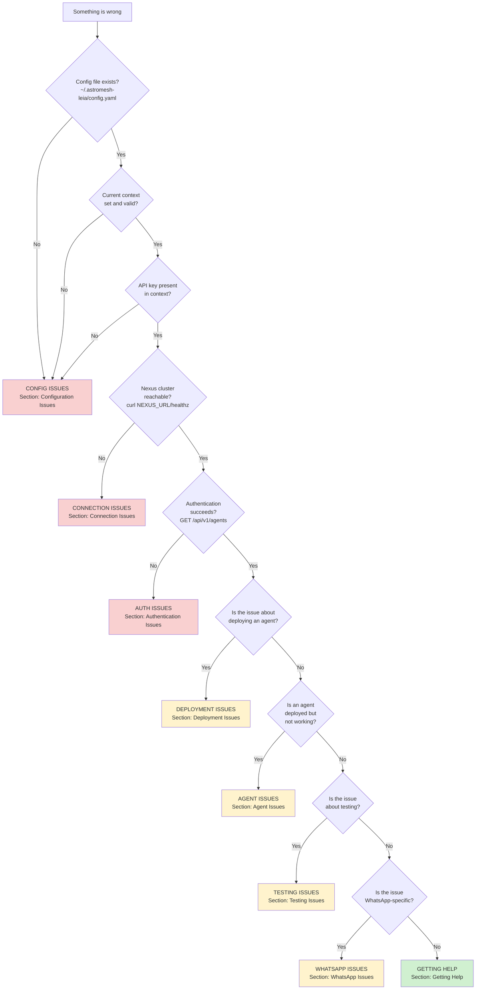
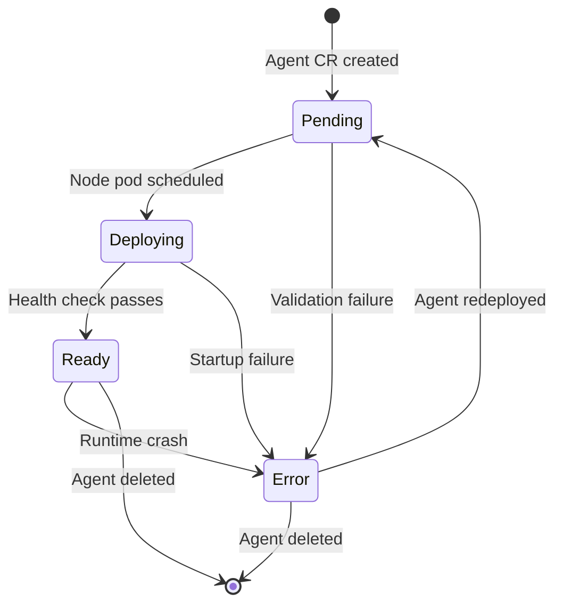

# Troubleshooting Guide

This guide provides systematic troubleshooting for the astromesh-leia CLI plugin. It covers configuration, connectivity, authentication, deployment, agent runtime, testing, and WhatsApp-specific issues.

---

## Table of Contents

- [Master Diagnostic Flowchart](#master-diagnostic-flowchart)
- [Configuration Issues](#configuration-issues)
- [Connection Issues](#connection-issues)
- [Authentication Issues](#authentication-issues)
- [Deployment Issues](#deployment-issues)
- [Agent Issues](#agent-issues)
- [Testing Issues](#testing-issues)
- [WhatsApp Issues](#whatsapp-issues)
- [Useful Commands Reference](#useful-commands-reference)
- [Getting Help](#getting-help)

---

## Master Diagnostic Flowchart

Start here when something goes wrong. Follow the flowchart to identify which section of this guide applies to your problem.



**Quick diagnostic command:** Run `/leia diagnose` to have the leia-doctor agent automatically walk through this flowchart and check each layer of the stack.

---

## Configuration Issues

Problems related to the `~/.astromesh-leia/config.yaml` file.

### Symptom / Diagnosis / Fix Table

| Symptom | Diagnosis | Fix |
|---------|-----------|-----|
| "Config file not found" or "No configuration loaded" | The file `~/.astromesh-leia/config.yaml` does not exist. This happens on first use or if the file was accidentally deleted. | Run `/leia bootstrap` to create a cluster and config file. Or run `/leia config show` which creates a default empty config if none exists. |
| "Invalid context" or "Context '<name>' not found" | The `current-context` value points to a context name that does not exist in the `contexts` map. This can happen if a context was manually deleted from the file without updating `current-context`. | Run `/leia config list` to see available contexts. Run `/leia config use <valid-name>` to switch to an existing context. |
| "Missing API key" or "No api-key in context" | The active context exists but its `api-key` field is empty or missing. | For Kind clusters: re-run `/leia bootstrap local` to regenerate the key. For remote clusters: obtain a key from your administrator and set it with `/leia config set contexts.<name>.api-key nxk_...` |
| "Missing nexus-url" | The active context exists but its `nexus-url` field is empty or missing. | Set it with `/leia config set contexts.<name>.nexus-url http://...` |
| YAML syntax error when reading config | The config file contains invalid YAML (bad indentation, missing colons, tabs instead of spaces). | Open `~/.astromesh-leia/config.yaml` in an editor and fix the syntax. Common issues: using tabs instead of spaces, missing colon after key names, unquoted special characters. If the file is heavily corrupted, delete it and run `/leia bootstrap` again. |
| Config changes not taking effect | You edited the file manually but made a typo in a field name (e.g., `nexus_url` instead of `nexus-url`). | Field names use hyphens, not underscores. Check field names against the [Configuration Reference](configuration.md). |
| "Cannot determine cluster type" | The `cluster-type` field has a value other than `kind` or `remote`. | Set it to one of the two allowed values: `/leia config set contexts.<name>.cluster-type remote` |

### Manual Config Validation

To verify your config file is valid, run:

```
/leia config show
```

This reads the config and displays the active context details in a human-readable format. If the output looks correct, the config file is valid.

To verify a specific context:

```
/leia config list
```

This lists all contexts and marks the active one with `*`.

---

## Connection Issues

Problems reaching the nexus cluster API.

### Symptom / Diagnosis / Fix Table

| Symptom | Diagnosis | Fix |
|---------|-----------|-----|
| "Connection refused" when running any command | The nexus API server is not running. For Kind clusters, the cluster may not be started. For remote clusters, the server may be down. | **Kind:** Check if the cluster exists: `kind get clusters`. If `nexus-local` is not listed, run `/leia bootstrap local`. If it is listed, check if nexus pods are running: `kubectl get pods -n nexus-system --context kind-nexus-local`. **Remote:** Verify the URL is correct and the server is operational by contacting your administrator. |
| "Connection timed out" | The nexus URL is wrong, a firewall is blocking the connection, or the remote server is not responding. | Verify the URL: `/leia config show`. Test manually: `curl -v <nexus-url>/healthz`. Check firewall rules. For VPN-protected clusters, ensure VPN is connected. |
| "Could not resolve host" | DNS resolution failed. The hostname in `nexus-url` is invalid or not resolvable from your machine. | Check the URL for typos. Test DNS: `nslookup <hostname>`. If on a corporate network, you may need VPN or specific DNS settings. |
| "SSL certificate problem" or "certificate verify failed" | The remote cluster uses a self-signed certificate or the certificate has expired. | For self-signed certs in development, this is expected. For production, renew the certificate. If you must use a self-signed cert, consult your administrator about adding it to your trust store. |
| Commands work intermittently | Network instability, DNS caching issues, or the nexus server is restarting. | Check cluster health: `kubectl get pods -n nexus-system`. If pods are restarting, check their logs: `kubectl logs -n nexus-system deploy/nexus-server --tail=50`. |
| "Port 8080 already in use" during local bootstrap | Another process is using port 8080, preventing the Kind cluster from port-forwarding. | Find what is using the port: `netstat -ano \| findstr :8080` (Windows) or `lsof -i :8080` (macOS/Linux). Stop the conflicting process or change the nexus port. |

### Network Diagnostic Steps

Run these commands in order to isolate connection issues:

```bash
# 1. Get the configured URL
/leia config show

# 2. Test basic connectivity (replace URL with your nexus-url)
curl -v http://localhost:8080/healthz

# 3. For Kind clusters, check if the cluster is running
kind get clusters
kubectl cluster-info --context kind-nexus-local

# 4. Check if nexus pods are healthy
kubectl get pods -n nexus-system

# 5. Check pod logs if pods exist but are not ready
kubectl logs -n nexus-system deploy/nexus-server --tail=50
```

---

## Authentication Issues

Problems with API key validation.

### Symptom / Diagnosis / Fix Table

| Symptom | Diagnosis | Fix |
|---------|-----------|-----|
| "401 Unauthorized" on all API calls | The API key is invalid, expired, or was never valid. | Verify the key in your config: `/leia config show`. For Kind clusters, regenerate: `kubectl exec -n nexus-system deploy/nexus-server -- nexus-admin create-key --name leia-cli --scope admin`, then update: `/leia config set contexts.<name>.api-key <new-key>`. For remote clusters, request a new key from your administrator. |
| "401 Unauthorized" only for certain operations | The API key does not have sufficient scope/permissions for the operation. For example, a read-only key cannot deploy agents. | Request a key with the appropriate scope from your administrator. For Kind clusters, regenerate with `--scope admin`. |
| "403 Forbidden" when deploying to a specific tenant | The API key is valid but does not have permission to access the specified tenant namespace. | Verify the tenant exists: `kubectl get nexustenant -n nexus-system`. Verify your key has access to the tenant. Contact your administrator for RBAC adjustments. |
| Auth works for cluster A but not cluster B | You are pointing to the wrong cluster or using a key from the wrong cluster. Each cluster has its own set of keys. | Check which context is active: `/leia config show`. Make sure the API key matches the cluster. Switch contexts: `/leia config use <correct-context>`. |
| "API key format invalid" | The API key does not start with the expected `nxk_` prefix, or contains invalid characters. | Check the key value. It should start with `nxk_` followed by alphanumeric characters. If you received the key from an administrator, make sure it was copied completely without truncation. |

### Key Regeneration for Kind Clusters

```bash
# Generate a new admin key
kubectl exec -n nexus-system deploy/nexus-server -- nexus-admin create-key --name leia-cli --scope admin

# Update the config with the new key
/leia config set contexts.local.api-key nxk_<new-key>

# Verify
/leia status
```

---

## Deployment Issues

Problems deploying agents to the cluster.

### Symptom / Diagnosis / Fix Table

| Symptom | Diagnosis | Fix |
|---------|-----------|-----|
| "Validation error: invalid apiVersion" | The agent YAML uses an incorrect `apiVersion`. It must be exactly `astromesh/v1`. | Edit the YAML file and set `apiVersion: astromesh/v1`. |
| "Validation error: invalid kind" | The agent YAML uses a `kind` other than `Agent`. | Edit the YAML file and set `kind: Agent`. |
| "Validation error: invalid metadata.name" | The agent name does not conform to RFC 1123. It must be lowercase alphanumeric with hyphens, 1-63 characters, and must start and end with an alphanumeric character. | Rename the agent. Examples of invalid names: `MyAgent` (uppercase), `my_agent` (underscore), `-agent` (starts with hyphen), `agent.v1` (dot). Valid examples: `my-agent`, `sales-bot-v1`, `pizzeria`. |
| "Validation error: invalid provider" | The model provider is not one of the allowed values. | Use one of: `ollama`, `openai`, `openai_compat`, `azure_openai`. |
| "Validation error: api_key and api_key_env are mutually exclusive" | Both `api_key` and `api_key_env` are set on the same model entry. | Remove one. Prefer `api_key_env` to avoid committing secrets. |
| "Tenant '<name>' does not exist" or "namespace not found" | The target tenant namespace has not been created in the cluster. | Check available tenants: `kubectl get nexustenant -n nexus-system`. If the tenant does not exist, ask your administrator to create it, or use the `default` tenant. |
| "409 Conflict: agent already exists" | An agent with the same `metadata.name` already exists in the target namespace. | Choose a different name, or delete the existing agent first (via `kubectl delete nexusagent <name> -n <namespace>`), then redeploy. |
| "Quota exceeded" | The tenant has reached its resource quota (maximum number of agents, CPU, memory). | Check tenant resource usage. Contact your administrator to increase quotas or delete unused agents. |
| "400 Bad Request" with no clear message | The YAML has a structural issue the validator caught but the error message is generic. | Run `/leia deploy <file>` which performs client-side validation first and gives more specific error messages. Also validate the YAML against the schema in `schemas/astromesh-v1-agent.md`. |
| Deploy succeeds but agent never becomes Ready | The YAML is valid but something prevents the agent from starting (missing model, bad prompt, resource issues). | Check agent status: `/leia status <agent-name>`. See the [Agent Issues](#agent-issues) section below. |

### YAML Validation Checklist

Before deploying, verify your YAML against this checklist:

1. `apiVersion` is `astromesh/v1`
2. `kind` is `Agent`
3. `metadata.name` is RFC 1123 compliant (lowercase, hyphens, no dots or underscores)
4. `spec.model.primary.provider` is one of: `ollama`, `openai`, `openai_compat`, `azure_openai`
5. `spec.model.primary.model` is non-empty
6. `spec.orchestration.pattern` (if set) is one of: `react`, `plan_and_execute`, `parallel_fan_out`, `pipeline`, `supervisor`, `swarm`
7. `temperature` (if set) is between 0.0 and 2.0
8. `top_p` (if set) is between 0.0 and 1.0
9. `max_iterations` (if set) is between 1 and 100
10. `timeout_seconds` (if set) is between 1 and 300

---

## Agent Issues

Problems with agents that are deployed but not functioning correctly.

### Symptom / Diagnosis / Fix Table

| Symptom | Diagnosis | Fix |
|---------|-----------|-----|
| Agent stuck in "Pending" phase | The agent custom resource was created but the node pod has not started. Common cause: the specified model is not available. | Check model availability: `ollama list`. If the model is missing, pull it: `ollama pull <model-name>`. Check pod status: `kubectl get pods -n <namespace> -l app.kubernetes.io/managed-by=nexus`. |
| Agent stuck in "Deploying" phase | The node pod is starting but not reaching healthy state. Could be a slow model download, resource limits, or configuration issue. | Check pod events: `kubectl describe pod <pod-name> -n <namespace>`. Check pod logs: `kubectl logs <pod-name> -n <namespace> --tail=100`. Wait 2-3 minutes for large models to load. |
| Agent in "Error" phase | The agent failed validation or encountered an unrecoverable error. | Describe the agent CR for details: `kubectl describe nexusagent <name> -n <namespace>`. The Events section will show the specific error. Fix the agent YAML and redeploy. |
| Agent is "Ready" but not responding to messages | The agent runtime is running but failing to process requests. Could be a model error, prompt issue, or tool misconfiguration. | Check agent logs: `/leia logs <agent-name>`. Look for error messages related to model calls, tool execution, or memory operations. Test directly: `/leia test <agent-name>`. |
| Agent pod in CrashLoopBackOff | The node process crashes repeatedly. Usually caused by a bad system prompt, invalid model configuration, or missing dependencies. | Get crash logs: `kubectl logs <pod-name> -n <namespace> --tail=50 --previous`. The `--previous` flag shows logs from the last crashed instance. Fix the underlying issue in the agent YAML and redeploy. |
| Agent responds very slowly (>30s) | The model is too large for available resources, the orchestration has too many iterations, or external tool calls are slow. | Reduce `max_iterations` in orchestration. Use a smaller/faster model. Check if tools have rate limits or slow external APIs. Set tighter `timeout_seconds`. |
| Agent gives irrelevant or incorrect responses | The system prompt is too vague, the model is not capable enough for the task, or the orchestration pattern is wrong. | Review and refine the system prompt. Try a more capable model. Check if the orchestration pattern matches the task (e.g., `react` for tool-using agents, `pipeline` for multi-step workflows). |
| Agent loses conversation context | Memory is not configured or is using `in_memory` backend which does not survive pod restarts. | Configure persistent memory: set `memory.conversational.backend: redis` or `sqlite`. Increase `max_turns` if needed. Check `ttl` is not too short. |
| "Model not found" in agent logs | The model specified in the YAML is not available on the configured provider. | For Ollama: run `ollama list` and verify the model name. Pull if missing: `ollama pull <model>`. For OpenAI: verify the model name matches an available model (e.g., `gpt-4o`, not `gpt4o`). |

### Agent Lifecycle Diagram



---

## Testing Issues

Problems encountered when using `/leia test`.

### Symptom / Diagnosis / Fix Table

| Symptom | Diagnosis | Fix |
|---------|-----------|-----|
| "No agent named '<name>' found" | The agent does not exist in the current context's cluster. You may be connected to the wrong cluster or the agent name is misspelled. | Check the context: `/leia config show`. List agents: `/leia status`. Verify the agent name is spelled correctly (case-sensitive, uses hyphens). |
| "Agent is not ready for testing" | The agent exists but is not in `Ready` phase. | Check the agent phase: `/leia status <agent-name>`. Wait for it to reach Ready. If it is stuck, see [Agent Issues](#agent-issues). |
| Test session times out (no response from agent) | The agent is taking too long to process the request. Could be a slow model, too many orchestration iterations, or network issues between the test client and the nexus API. | Check agent logs: `/leia logs <agent-name>`. Reduce `orchestration.timeout_seconds` and `max_iterations`. Use a faster model. Check network latency to the cluster. |
| Unexpected or empty responses during interactive test | The agent is responding but with unexpected content. Could be a prompt issue, model hallucination, or a tool returning unexpected data. | Review the agent logs for the test session. Check the system prompt for clarity. Run `/leia test <agent-name> --auto` for structured evaluation of response quality. |
| Automated tests all fail | The predefined test scenarios do not match the agent's capabilities or template type. | Run interactive tests first to understand the agent's actual behavior. Automated tests are tailored to template types -- make sure the agent was created from a recognized template. |
| "Connection lost during test" | The agent pod crashed or was evicted during the test session. | Check pod status: `kubectl get pods -n <namespace>`. Check for OOM kills or resource limit issues: `kubectl describe pod <pod-name> -n <namespace>`. Increase resource limits if needed. |
| Test works via `/leia test` but not via WhatsApp | The agent runtime works but the WhatsApp channel integration has an issue. `/leia test` bypasses the WhatsApp webhook and talks directly to the agent API. | This confirms the agent itself is fine. See [WhatsApp Issues](#whatsapp-issues) for channel-specific debugging. |

---

## WhatsApp Issues

Problems specific to the WhatsApp channel integration. For the full setup guide, see [WhatsApp Setup Guide](whatsapp-setup.md).

### Symptom / Diagnosis / Fix Table

| Symptom | Diagnosis | Fix |
|---------|-----------|-----|
| Webhook verification fails in Meta Dashboard | The astromesh-node is not reachable or the verify token does not match. | 1. Ensure the node pod is running. 2. Test the webhook URL manually: `curl "https://your-url/webhook?hub.mode=subscribe&hub.verify_token=your-token&hub.challenge=test123"`. Expected: 200 with body `test123`. 3. Verify `WHATSAPP_VERIFY_TOKEN` matches: `kubectl exec <pod> -n <ns> -- env \| grep WHATSAPP_VERIFY_TOKEN`. |
| Messages not being delivered to the bot | The webhook is not subscribed to the `messages` field, or the webhook URL is wrong. | Go to Meta Developer Console > WhatsApp > Configuration > Webhook fields. Ensure `messages` is checked. Verify the Callback URL is correct and current (ngrok URLs change on restart). |
| Bot sends no replies | The access token is invalid or expired, or the Phone Number ID is wrong. | Check logs for Graph API errors: `/leia logs <agent-name>`. Verify `WHATSAPP_ACCESS_TOKEN` is a valid, non-expired token. Verify `WHATSAPP_PHONE_NUMBER_ID` is the numeric ID (not the phone number). |
| Signature validation errors (401 in logs) | `WHATSAPP_APP_SECRET` does not match the actual App Secret. | Compare the secret in Kubernetes with the App Secret in Meta Dashboard > Settings > Basic. Update and restart the pod. |
| Duplicate messages | The webhook acknowledgment takes longer than 5 seconds, causing Meta to retry. | Check that the node acknowledges webhook POSTs immediately with 200 OK before processing. If processing is blocking the acknowledgment, this is a node-level issue. Check pod resource limits. |
| Messages only work with test numbers | You are using the Meta-provided test phone number, which only sends to whitelisted numbers. | Add your number to the whitelist in Meta Dashboard > WhatsApp > API Setup > "To" field. For production, register your own phone number (see [WhatsApp Setup](whatsapp-setup.md) Step 3). |
| "Unverified app" warning | Your Meta App is still in development mode. | For testing, development mode is fine (limited to 5 numbers). For production, submit the app for Meta review in the App Dashboard > App Review. |

### WhatsApp Diagnostic Checklist

Run through these checks when WhatsApp is not working:

```bash
# 1. Verify all four environment variables are set
kubectl exec <pod-name> -n <namespace> -- env | grep WHATSAPP

# Expected output (4 variables):
# WHATSAPP_VERIFY_TOKEN=...
# WHATSAPP_ACCESS_TOKEN=EAA...
# WHATSAPP_PHONE_NUMBER_ID=123...
# WHATSAPP_APP_SECRET=abc...

# 2. Test webhook URL reachability
curl -v "https://your-webhook-url/webhook?hub.mode=subscribe&hub.verify_token=your-token&hub.challenge=test123"

# 3. Check agent logs for WhatsApp-specific errors
/leia logs <agent-name>

# 4. Verify the Graph API token works
curl -s -H "Authorization: Bearer YOUR_ACCESS_TOKEN" \
  "https://graph.facebook.com/v21.0/YOUR_PHONE_NUMBER_ID"
```

---

## Useful Commands Reference

A consolidated reference of the most useful commands for diagnosing and resolving issues.

### Leia Plugin Commands

| Command | Description |
|---------|-------------|
| `/leia config show` | Display current config and active context details |
| `/leia config list` | List all configured contexts with the active one marked |
| `/leia config use <name>` | Switch to a different context |
| `/leia config set <key> <value>` | Set a config value using dot notation |
| `/leia status` | Full cluster dashboard: health, tenants, agents |
| `/leia status <agent-name>` | Detailed status for a specific agent including conditions |
| `/leia logs <agent-name>` | View agent logs (add `--follow` for live tailing) |
| `/leia logs <agent-name> -n 100` | View the last 100 log lines |
| `/leia test <agent-name>` | Interactive chat test with an agent |
| `/leia test <agent-name> --auto` | Automated test scenarios with scoring |
| `/leia diagnose` | Run the full diagnostic checklist automatically |
| `/leia bootstrap local` | Create a local Kind cluster with nexus |
| `/leia bootstrap remote` | Connect to an existing remote cluster |
| `/leia teardown` | Destroy or disconnect the current context cluster |
| `/leia templates` | Browse available agent templates |
| `/leia deploy <file>` | Deploy an agent YAML to the cluster |

### Kubernetes Commands

| Command | Description |
|---------|-------------|
| `kind get clusters` | List running Kind clusters |
| `kubectl cluster-info --context kind-nexus-local` | Verify Kind cluster is accessible |
| `kubectl get pods -n nexus-system` | Check nexus system pods |
| `kubectl get nexustenant -n nexus-system` | List all tenants and their status |
| `kubectl get nexusagent -n <namespace>` | List agent CRDs in a namespace |
| `kubectl describe nexusagent <name> -n <namespace>` | Detailed agent CR info with events |
| `kubectl get pods -n <namespace> -l app.kubernetes.io/managed-by=nexus` | List agent node pods |
| `kubectl logs <pod> -n <namespace> --tail=50` | View last 50 lines of pod logs |
| `kubectl logs <pod> -n <namespace> --previous` | View logs from the previous (crashed) container |
| `kubectl describe pod <pod> -n <namespace>` | Detailed pod info with events and resource usage |
| `kubectl exec <pod> -n <namespace> -- env \| grep WHATSAPP` | Check WhatsApp environment variables in a pod |
| `kubectl rollout restart deployment -n <namespace>` | Restart all pods in a namespace (after secret updates) |
| `kubectl exec -n nexus-system deploy/nexus-server -- nexus-admin create-key --name leia-cli --scope admin` | Generate a new API key |

### External Diagnostic Commands

| Command | Description |
|---------|-------------|
| `curl -s <nexus-url>/healthz` | Test nexus API health endpoint |
| `curl -s -H "Authorization: Bearer <key>" <nexus-url>/api/v1/agents` | Test API authentication |
| `ollama list` | List available Ollama models |
| `ollama pull <model-name>` | Download a model for Ollama |
| `ngrok http 8080` | Start an ngrok tunnel for local webhook testing |

---

## Getting Help

If this troubleshooting guide does not resolve your issue, try these resources in order.

### 1. Run Automated Diagnostics

The leia-doctor agent performs a systematic check of every layer in the stack:

```
/leia diagnose
```

This command checks: config validity, API connectivity, authentication, tenant status, agent CRD status, pod health, model availability, and WhatsApp webhook status (if applicable). It produces a diagnostic table with PASS/FAIL/SKIP for each check, identifies the most likely root cause, and suggests specific fix commands.

### 2. Check Agent Logs

Most runtime issues are visible in the agent logs:

```
/leia logs <agent-name> -n 100
```

Look for:
- **ERROR** or **FATAL** log lines indicating failures.
- **401** or **403** HTTP status codes indicating authentication problems.
- **timeout** messages indicating slow model or tool responses.
- **Connection refused** messages indicating unreachable dependencies.

### 3. Describe Kubernetes Resources

For cluster-level issues, describe the relevant resources to see events and error messages:

```bash
# Agent custom resource
kubectl describe nexusagent <name> -n <namespace>

# Node pod
kubectl describe pod <pod-name> -n <namespace>

# Tenant
kubectl describe nexustenant <tenant-name> -n nexus-system
```

The **Events** section at the bottom of the output is the most informative. Look for warnings and errors.

### 4. Collect Diagnostic Bundle

If you need to share information with someone helping you, collect this information:

```bash
# 1. Config (redact the api-key before sharing)
/leia config show

# 2. Cluster status
/leia status

# 3. Agent details
/leia status <agent-name>

# 4. Recent logs
/leia logs <agent-name> -n 200

# 5. Pod description
kubectl describe pod <pod-name> -n <namespace>

# 6. Nexus system pod status
kubectl get pods -n nexus-system -o wide
```

**Important:** Always redact API keys and access tokens before sharing diagnostic output.

### 5. File an Issue

If you believe you have found a bug in astromesh-leia:

1. Check existing issues at [github.com/monaccode/astromesh-leia/issues](https://github.com/monaccode/astromesh-leia/issues).
2. If your issue is not already reported, create a new issue with:
   - A clear title describing the problem.
   - Steps to reproduce the issue.
   - Expected behavior versus actual behavior.
   - Diagnostic output (redacted) from the steps above.
   - Your environment: OS, Kubernetes version, cluster type (Kind/remote).
