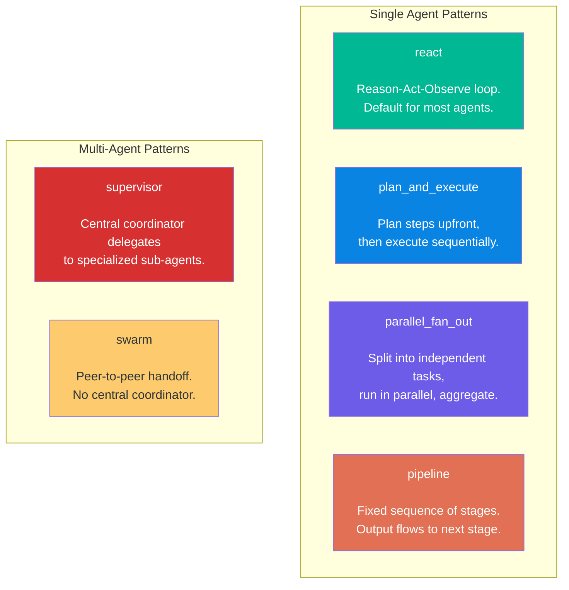

# Advanced Orchestration Patterns

This tutorial covers when and how to use orchestration patterns beyond the default `react`. You will build three agents using `plan_and_execute`, `parallel_fan_out`, and `supervisor`, with detailed explanations of why each pattern fits its use case.

## Prerequisites

- A running nexus cluster (complete the [first-agent tutorial](first-agent.md) or run `/leia bootstrap local`)
- `/leia status` shows `Health: OK`
- Familiarity with the basic agent creation flow (covered in [business-templates tutorial](business-templates.md))

## Overview: The Six Patterns

astromesh supports six orchestration patterns. Each controls how the agent processes tasks, uses tools, and structures its reasoning.



This tutorial focuses on three patterns that address common real-world needs:
1. **plan_and_execute** -- for multi-step workflows where order matters.
2. **parallel_fan_out** -- for independent tasks that benefit from concurrency.
3. **supervisor** -- for coordinating multiple specialized agents.

---

## Example 1: plan_and_execute for Hotel Booking

### The scenario

A boutique hotel needs a WhatsApp agent that handles the full reservation flow. This involves multiple sequential steps where each step depends on the previous one:

1. Greet the guest and ask for dates.
2. Check room availability for those dates.
3. Present available room types and rates.
4. Collect guest information (name, email, phone).
5. Confirm the reservation details.
6. Send a confirmation message with a booking reference.

### Why react does not work well here

The `react` pattern makes one decision at a time in a Reason-Act-Observe loop. For a simple Q&A bot, this is perfect -- each message is independent. But hotel booking is a structured workflow:

- Steps must happen in order (you cannot confirm before collecting guest info).
- The agent needs to track where it is in the process.
- If something changes mid-flow (e.g., the room is no longer available), the agent needs to re-plan.

With `react`, the agent would "forget" the overall plan between iterations and might skip steps, ask for information it already has, or lose track of the workflow state. `plan_and_execute` solves this by creating an explicit plan upfront and tracking progress through each step.

### The YAML

```
/leia create a hotel booking agent for The Grand Meridian boutique hotel.
It should handle the full reservation flow: check availability, show rooms,
collect guest info, confirm, and send booking confirmation. Use plan_and_execute pattern.
```

After the architect generates and you approve, the YAML looks like this:

```yaml
apiVersion: astromesh/v1
kind: Agent
metadata:
  name: grand-meridian-booking
  version: "1.0.0"
  labels:
    template: appointment-scheduler
    channel: whatsapp
    pattern: plan_and_execute
spec:
  identity:
    display_name: "The Grand Meridian Booking Concierge"
    description: "Handles the full hotel reservation flow from availability check through booking confirmation."
  model:
    primary:
      provider: ollama
      model: "llama3.1:8b"
      endpoint: "http://localhost:11434"
      parameters:
        temperature: 0.3
        max_tokens: 1024
  prompts:
    system: |
      You are the Booking Concierge for The Grand Meridian, a boutique hotel.

      ## Reservation Flow
      When a guest wants to book, follow these steps IN ORDER:
      1. Collect check-in date, check-out date, and number of guests.
      2. Check room availability using the check_availability tool.
      3. Present available room types with descriptions and rates.
      4. Once the guest selects a room, collect: full name, email, phone number.
      5. Summarize the complete reservation and ask for confirmation.
      6. Create the booking using the create_booking tool and provide the confirmation number.

      ## Room Types
      - Standard Room: Queen bed, city view — $180/night
      - Deluxe Room: King bed, garden view, balcony — $260/night
      - Suite: King bed, separate living area, panoramic view — $420/night

      ## Guidelines
      - Never skip steps in the flow. Always check availability before presenting rooms.
      - If no rooms are available for the requested dates, suggest alternative dates.
      - Confirm ALL details before creating the booking — mistakes are hard to fix.
      - Be warm and professional. Reflect the elegance of a boutique hotel.
      - Format for WhatsApp: short paragraphs, bullet points for room options.
  orchestration:
    pattern: plan_and_execute
    max_iterations: 10
    timeout_seconds: 60
  tools:
    - type: internal
      name: check_availability
      description: "Check room availability for given dates and guest count"
      parameters:
        type: object
        properties:
          check_in:
            type: string
            description: "Check-in date in YYYY-MM-DD format"
          check_out:
            type: string
            description: "Check-out date in YYYY-MM-DD format"
          guests:
            type: integer
            description: "Number of guests"
        required: [check_in, check_out, guests]
    - type: internal
      name: create_booking
      description: "Create a confirmed reservation and return a booking reference"
      parameters:
        type: object
        properties:
          room_type:
            type: string
            enum: [standard, deluxe, suite]
          check_in:
            type: string
          check_out:
            type: string
          guest_name:
            type: string
          guest_email:
            type: string
          guest_phone:
            type: string
        required: [room_type, check_in, check_out, guest_name, guest_email]
  memory:
    conversational:
      backend: in_memory
      strategy: sliding_window
      max_turns: 30
  guardrails:
    input:
      - type: pii_detection
        action: redact
    output:
      - type: max_length
        max_chars: 1600
```

### How plan_and_execute works at runtime

When a guest sends "I'd like to book a room for next weekend", the agent:

**Planning phase (1 LLM call):**
```
Plan:
  Step 1: Ask guest for exact check-in date, check-out date, and number of guests.
  Step 2: Call check_availability tool with the provided dates and guest count.
  Step 3: Present available room types and rates to the guest.
  Step 4: Wait for guest to select a room type.
  Step 5: Collect guest details: full name, email, phone number.
  Step 6: Summarize complete reservation and ask for confirmation.
  Step 7: Call create_booking tool and provide the confirmation number.
```

**Execution phase (1 LLM call per step):**
- Each step executes in order.
- The agent tracks which step it is on and what information it has collected.
- If the guest changes their mind (e.g., different dates), the agent revises the plan and re-executes from the appropriate step.

### Why max_iterations is 10

Each step in the plan costs at least one LLM call. With 7 plan steps plus the initial planning call, plus possible re-planning, 10 iterations gives enough headroom without allowing runaway loops.

---

## Example 2: parallel_fan_out for Price Comparison

### The scenario

A price comparison agent searches multiple product databases simultaneously and presents a consolidated comparison. The user asks "find me the best price for Nike Air Max 90" and the agent queries three sources at once.

### Why parallel matters

If the agent queried each source sequentially using `react`:
- Source 1: 2 seconds
- Source 2: 3 seconds
- Source 3: 2 seconds
- Total: 7 seconds

With `parallel_fan_out`, all three queries run simultaneously:
- All sources: max(2, 3, 2) = 3 seconds
- Total: 3 seconds + aggregation = ~4 seconds

For a WhatsApp user waiting for a response, this 43% reduction in latency makes a significant difference.

### The YAML

```yaml
apiVersion: astromesh/v1
kind: Agent
metadata:
  name: price-scout
  version: "1.0.0"
  labels:
    channel: whatsapp
    pattern: parallel_fan_out
spec:
  identity:
    display_name: "PriceScout"
    description: "Searches multiple product databases simultaneously and presents the best deals."
  model:
    primary:
      provider: ollama
      model: "llama3.1:8b"
      endpoint: "http://localhost:11434"
      parameters:
        temperature: 0.2
        max_tokens: 1024
  prompts:
    system: |
      You are PriceScout, a price comparison assistant on WhatsApp.

      ## How You Work
      When a user asks about a product:
      1. Search ALL three product databases simultaneously (this is automatic — your orchestration handles the parallelism).
      2. Collect results from all sources.
      3. Present a comparison table sorted by price (lowest first).
      4. Highlight the best deal and note any relevant differences (shipping, condition, seller rating).

      ## Response Format
      Always structure your comparison like this:
      Product: [name]

      1. [Source] — $XX.XX
         Shipping: [free/cost] | Condition: [new/used] | Rating: [stars]

      2. [Source] — $XX.XX
         ...

      Best deal: [source] at $XX.XX [reason]

      ## Guidelines
      - Always search all three sources — even if the first result looks good.
      - Include shipping costs in the total price comparison.
      - If a product is not found in a source, note it as "Not available" rather than omitting the source.
      - Be concise. WhatsApp users want quick answers.
      - If the user's query is ambiguous, ask for clarification (brand, model, size, color).
  orchestration:
    pattern: parallel_fan_out
    max_iterations: 5
    timeout_seconds: 60
  tools:
    - type: agent
      name: search_store_alpha
      agent: store-alpha-scraper
      description: "Search Store Alpha for product pricing, availability, and shipping options"
    - type: agent
      name: search_store_beta
      agent: store-beta-scraper
      description: "Search Store Beta for product pricing, availability, and shipping options"
    - type: agent
      name: search_store_gamma
      agent: store-gamma-scraper
      description: "Search Store Gamma for product pricing, availability, and shipping options"
  memory:
    conversational:
      backend: in_memory
      strategy: sliding_window
      max_turns: 15
  guardrails:
    output:
      - type: max_length
        max_chars: 1600
```

### How parallel_fan_out works at runtime

When a user sends "Find me the best price for Nike Air Max 90 size 10":

**Fan-out phase (parallel):**
```
Dispatching 3 parallel searches:
  → search_store_alpha("Nike Air Max 90 size 10") ... pending
  → search_store_beta("Nike Air Max 90 size 10")  ... pending
  → search_store_gamma("Nike Air Max 90 size 10") ... pending

  ← search_store_alpha: $129.99, free shipping, new, 4.5 stars
  ← search_store_gamma: $124.99, $5.99 shipping, new, 4.2 stars
  ← search_store_beta:  $119.99, $8.99 shipping, new, 4.7 stars
```

**Aggregation phase (1 LLM call):**
The agent receives all three results and synthesizes:

```
Nike Air Max 90 — Size 10

1. Store Alpha — $129.99
   Shipping: Free | Condition: New | Rating: 4.5/5
   Total: $129.99

2. Store Beta — $119.99
   Shipping: $8.99 | Condition: New | Rating: 4.7/5
   Total: $128.98

3. Store Gamma — $124.99
   Shipping: $5.99 | Condition: New | Rating: 4.2/5
   Total: $130.98

Best deal: Store Beta at $128.98 total (lowest price + highest seller rating)
```

### Why max_iterations is 5

The parallel_fan_out pattern needs far fewer iterations than other patterns:
- 1 iteration: parse the user query and fan out.
- 1 iteration: each parallel tool call (these run simultaneously, counting as 1).
- 1 iteration: aggregate results.
- 2 spare iterations: for follow-up questions or error recovery.

### Tool configuration note

The `type: agent` tools reference other deployed agents (`store-alpha-scraper`, etc.). These sub-agents must be deployed in the same tenant namespace before deploying the price-scout agent. Each sub-agent is a simple `react` agent with `http_request` tools configured to query a specific store's API.

---

## Example 3: supervisor for Enterprise Support

### The scenario

A large company needs a single WhatsApp entry point that routes customer inquiries to specialized agents: billing handles invoices and payment issues, technical handles product bugs and integration questions, and sales handles upgrades and new purchases. A supervisor agent sits at the front and decides which specialist should handle each message.

### Why a single react agent does not scale here

You could build one massive `react` agent with a huge system prompt covering billing, technical, and sales. Problems with that approach:

- **Prompt bloat**: The system prompt becomes enormous, reducing response quality as the model struggles to stay focused.
- **No specialization**: Each domain needs different tools, different context, and different tone. A single agent cannot optimize for all three.
- **Maintenance nightmare**: Updating billing policies means editing the same prompt that handles technical support. Changes risk breaking unrelated functionality.
- **Token cost**: Every interaction sends the full prompt (billing + technical + sales context) even if the query is purely about billing.

The `supervisor` pattern solves this by having a lightweight coordinator that routes to specialized agents, each with their own focused prompt and tools.

### The YAML

First, deploy the three specialist agents. Each is a standard `react` agent:

**Billing agent** (`billing-agent.agent.yaml`):

```yaml
apiVersion: astromesh/v1
kind: Agent
metadata:
  name: billing-agent
  version: "1.0.0"
  labels:
    role: specialist
    domain: billing
spec:
  identity:
    display_name: "Billing Specialist"
    description: "Handles invoice inquiries, payment issues, refunds, and billing plan changes."
  model:
    primary:
      provider: ollama
      model: "llama3.1:8b"
      endpoint: "http://localhost:11434"
      parameters:
        temperature: 0.3
        max_tokens: 1024
  prompts:
    system: |
      You are a Billing Specialist for Acme Corp.

      ## Responsibilities
      - Look up invoices by invoice number or customer account.
      - Explain charges and line items.
      - Process refund requests by collecting: invoice number, amount, reason.
      - Help customers change billing plans (upgrade, downgrade, cancel).
      - Resolve payment failures by guiding customers through retry steps.

      ## Guidelines
      - Always verify the customer's account before making changes.
      - For refunds over $500, escalate to a human agent.
      - Be precise with numbers — billing errors erode trust.
      - Keep responses concise for WhatsApp.
  orchestration:
    pattern: react
    max_iterations: 5
    timeout_seconds: 30
  tools:
    - type: internal
      name: lookup_invoice
      description: "Look up an invoice by number or customer account"
      parameters:
        type: object
        properties:
          invoice_number:
            type: string
          account_id:
            type: string
        required: []
    - type: internal
      name: process_refund
      description: "Submit a refund request"
      parameters:
        type: object
        properties:
          invoice_number:
            type: string
          amount:
            type: number
          reason:
            type: string
        required: [invoice_number, amount, reason]
  memory:
    conversational:
      backend: in_memory
      strategy: sliding_window
      max_turns: 20
```

**Technical agent** (`technical-agent.agent.yaml`):

```yaml
apiVersion: astromesh/v1
kind: Agent
metadata:
  name: technical-agent
  version: "1.0.0"
  labels:
    role: specialist
    domain: technical
spec:
  identity:
    display_name: "Technical Support Specialist"
    description: "Handles product bugs, integration issues, API questions, and technical troubleshooting."
  model:
    primary:
      provider: ollama
      model: "llama3.1:8b"
      endpoint: "http://localhost:11434"
      parameters:
        temperature: 0.4
        max_tokens: 1024
  prompts:
    system: |
      You are a Technical Support Specialist for Acme Corp.

      ## Responsibilities
      - Diagnose and troubleshoot product issues reported by customers.
      - Guide customers through integration setup (API keys, webhooks, SDKs).
      - Answer questions about API endpoints, rate limits, and error codes.
      - Help debug common integration problems with step-by-step guidance.
      - Escalate bugs to engineering when customer-side troubleshooting is exhausted.

      ## Guidelines
      - Ask for error messages, logs, and steps to reproduce before diagnosing.
      - Provide code examples when helpful (use WhatsApp-compatible formatting).
      - If the issue requires internal investigation, create a ticket and give the customer a reference number.
      - Be patient and thorough. Technical issues are frustrating.
  orchestration:
    pattern: react
    max_iterations: 8
    timeout_seconds: 30
  tools:
    - type: internal
      name: search_knowledge_base
      description: "Search the technical knowledge base for articles and solutions"
      parameters:
        type: object
        properties:
          query:
            type: string
        required: [query]
    - type: internal
      name: create_ticket
      description: "Create a support ticket for engineering investigation"
      parameters:
        type: object
        properties:
          title:
            type: string
          description:
            type: string
          severity:
            type: string
            enum: [low, medium, high, critical]
        required: [title, description, severity]
  memory:
    conversational:
      backend: in_memory
      strategy: sliding_window
      max_turns: 30
```

**Sales agent** (`sales-agent.agent.yaml`):

```yaml
apiVersion: astromesh/v1
kind: Agent
metadata:
  name: sales-agent
  version: "1.0.0"
  labels:
    role: specialist
    domain: sales
spec:
  identity:
    display_name: "Sales Assistant"
    description: "Handles upgrade inquiries, new purchases, pricing questions, and feature comparisons."
  model:
    primary:
      provider: ollama
      model: "llama3.1:8b"
      endpoint: "http://localhost:11434"
      parameters:
        temperature: 0.5
        max_tokens: 1024
  prompts:
    system: |
      You are a Sales Assistant for Acme Corp.

      ## Responsibilities
      - Help customers understand product tiers and pricing.
      - Compare features across plans to help customers choose the right fit.
      - Process upgrade requests by collecting current plan and desired plan.
      - Answer questions about enterprise features, custom pricing, and volume discounts.
      - For enterprise deals (>$10k/year), schedule a call with the sales team.

      ## Guidelines
      - Be enthusiastic but not pushy. Let the product sell itself.
      - Always present at least 2 plan options so the customer can compare.
      - Highlight value, not just features. Explain how each feature helps the customer.
      - For custom pricing requests, collect company size, expected usage, and timeline.
  orchestration:
    pattern: react
    max_iterations: 5
    timeout_seconds: 30
  tools:
    - type: internal
      name: get_pricing
      description: "Get pricing details for a specific plan"
      parameters:
        type: object
        properties:
          plan:
            type: string
            enum: [starter, professional, enterprise]
        required: [plan]
    - type: internal
      name: compare_plans
      description: "Get a feature comparison between two plans"
      parameters:
        type: object
        properties:
          plan_a:
            type: string
          plan_b:
            type: string
        required: [plan_a, plan_b]
  memory:
    conversational:
      backend: in_memory
      strategy: sliding_window
      max_turns: 20
```

**Now the supervisor agent** (`enterprise-support.agent.yaml`):

```yaml
apiVersion: astromesh/v1
kind: Agent
metadata:
  name: enterprise-support
  version: "1.0.0"
  labels:
    role: supervisor
    channel: whatsapp
spec:
  identity:
    display_name: "Acme Corp Support"
    description: "Routes customer inquiries to the appropriate specialist: billing, technical, or sales."
  model:
    primary:
      provider: ollama
      model: "llama3.1:8b"
      endpoint: "http://localhost:11434"
      parameters:
        temperature: 0.3
        max_tokens: 1024
  prompts:
    system: |
      You are the front-line support coordinator for Acme Corp. Your job is to
      understand the customer's issue and delegate to the right specialist agent.

      ## Routing Rules
      - Billing questions (invoices, payments, refunds, plan changes) → delegate to billing_specialist
      - Technical issues (bugs, integration, API, errors) → delegate to technical_specialist
      - Sales inquiries (upgrades, pricing, features, new purchases) → delegate to sales_specialist

      ## Guidelines
      - Greet the customer warmly and ask how you can help (if their intent is unclear).
      - Route on the FIRST message when the intent is obvious — do not ask unnecessary questions.
      - If the customer's issue spans multiple domains, start with the most urgent one.
      - Review each specialist's response before forwarding it to the customer.
      - If a specialist cannot resolve the issue, try a different specialist or escalate to human support.
      - Never expose internal routing to the customer. They should feel they are talking to one unified support team.
  orchestration:
    pattern: supervisor
    max_iterations: 15
    timeout_seconds: 120
  tools:
    - type: agent
      name: billing_specialist
      agent: billing-agent
      description: "Handles invoice inquiries, payment issues, refunds, and billing plan changes"
    - type: agent
      name: technical_specialist
      agent: technical-agent
      description: "Handles product bugs, integration issues, API questions, and technical troubleshooting"
    - type: agent
      name: sales_specialist
      agent: sales-agent
      description: "Handles upgrade inquiries, new purchases, pricing questions, and feature comparisons"
  memory:
    conversational:
      backend: in_memory
      strategy: sliding_window
      max_turns: 40
  guardrails:
    input:
      - type: pii_detection
        action: redact
    output:
      - type: pii_detection
        action: redact
      - type: max_length
        max_chars: 1600
```

### How supervisor works at runtime

When a customer sends "I was charged twice on my last invoice":

**Step 1 -- Routing (1 LLM call):**
The supervisor recognizes this as a billing issue and delegates:
```
Supervisor decision: billing_specialist
  Reason: Customer reports duplicate charge — this is an invoice/payment issue.
```

**Step 2 -- Specialist execution (1-5 LLM calls):**
The billing agent receives the conversation context, looks up the invoice, identifies the duplicate charge, and drafts a response.

**Step 3 -- Review (1 LLM call):**
The supervisor reviews the billing agent's response to ensure it is complete, accurate, and appropriate before sending it to the customer.

**Total: 3-7 LLM calls per customer message.**

### Why max_iterations is 15

The supervisor may need to:
- Route to a specialist (1 iteration).
- Wait for the specialist to respond (1-5 iterations for the specialist's react loop).
- Review the response (1 iteration).
- Re-delegate if the first specialist cannot help (repeat the above).
- Handle multi-turn conversations where the topic shifts (e.g., billing then sales).

15 iterations provides enough budget for a typical 2-3 message exchange with potential re-routing.

### Deployment order

The specialist agents must be deployed before the supervisor, because the supervisor's `type: agent` tools reference them by name:

```
/leia deploy billing-agent.agent.yaml
/leia deploy technical-agent.agent.yaml
/leia deploy sales-agent.agent.yaml
/leia deploy enterprise-support.agent.yaml
```

> **Troubleshooting: "Agent not found" when deploying supervisor**
>
> If the supervisor deployment fails with a reference error, make sure all three specialist agents are in `Ready` phase. Run `/leia status` to verify.

---

## Pattern Selection Decision Tree

Use this decision tree to choose the right orchestration pattern for your agent:

```
Is it a single conversational agent with a few tools?
  YES ──────────────────────────────────────────────────→ react

Does the task always follow the same steps in order?
  YES ──────────────────────────────────────────────────→ pipeline

Does the task require upfront planning with 5+ steps?
  YES ──────────────────────────────────────────────────→ plan_and_execute

Can the task be split into independent sub-tasks?
  YES ─── Are there 3+ sub-tasks that can run at once?
              YES ──────────────────────────────────────→ parallel_fan_out
              NO ───────────────────────────────────────→ react (with multiple tools)

Does it involve multiple specialized agents?
  YES ─── Does a coordinator need to review output?
              YES ──────────────────────────────────────→ supervisor
              NO ─── Is it a conversation handoff flow?
                        YES ────────────────────────────→ swarm
                        NO ─────────────────────────────→ supervisor

None of the above match?
  ─────────────────────────────────────────────────────→ react (safe default)
```

**Quick rules of thumb:**
- When in doubt, start with `react`. It handles most cases well and is the easiest to debug.
- Use `plan_and_execute` when the workflow has a clear beginning, middle, and end.
- Use `parallel_fan_out` when latency matters and tasks are independent.
- Use `supervisor` when you have 2-5 specialized agents.
- Use `pipeline` for content processing workflows (draft, review, edit, publish).
- Use `swarm` for sales funnels or department routing where agents hand off dynamically.

---

## Performance Considerations

| Pattern | Latency per Turn | Token Usage | Complexity | Best For |
|---|---|---|---|---|
| `react` | Low (1-5 LLM calls) | Moderate | Low | General Q&A, simple tools |
| `plan_and_execute` | Medium (3-20+ calls) | High | Medium | Multi-step workflows |
| `parallel_fan_out` | Low (wall-clock) | High (parallel calls) | Medium | Independent concurrent tasks |
| `pipeline` | Medium (N stages) | High | Low | Fixed processing chains |
| `supervisor` | Medium-High (2-10+ calls) | Very High | High | Multi-agent coordination |
| `swarm` | Low per agent | Moderate per agent | High | Dynamic conversation routing |

### Token cost breakdown

To estimate token cost for each pattern:

- **react**: `system_prompt_tokens + (context_growth * iterations)`. Context grows as conversation history accumulates.
- **plan_and_execute**: `system_prompt_tokens + plan_tokens + (context_growth * steps)`. The plan is carried in context throughout execution, adding overhead.
- **parallel_fan_out**: `N * (system_prompt_tokens + sub_task_tokens) + aggregation_tokens`. Parallel calls multiply the base cost by N.
- **supervisor**: `supervisor_prompt_tokens + specialist_cost + review_cost`. Each delegation adds the full specialist's prompt and response to the supervisor's context.

### When to upgrade from react

Start with `react` and upgrade when you notice these signals:

| Signal | Upgrade To |
|---|---|
| Agent skips steps in a multi-step workflow | `plan_and_execute` |
| Agent is too slow because it queries tools sequentially | `parallel_fan_out` |
| System prompt is too large with too many responsibilities | `supervisor` with specialists |
| Content passes through predictable transformation stages | `pipeline` |
| Users need to be routed to different "departments" | `swarm` |

---

## Next Steps

- [Your First WhatsApp Agent in 5 Minutes](first-agent.md) -- Start with the basics.
- [Using Templates for Different Businesses](business-templates.md) -- See how templates adapt to different business types.
- [Multi-Tenant Setup and Management](multi-tenant.md) -- Manage agents across multiple tenants.
- [Orchestration Patterns Reference](../../schemas/orchestration-patterns.md) -- Full schema reference for all 6 patterns with YAML examples.
