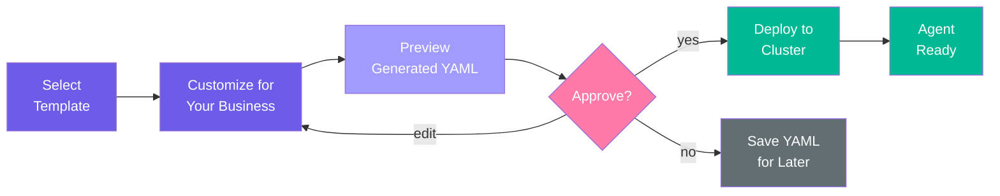

# Using Templates for Different Businesses

This tutorial walks through creating agents for three different business types using astromesh-leia's built-in templates. You will see how the same template system produces tailored agents for a restaurant, an online store, and a dental clinic -- each with a customized system prompt, appropriate orchestration pattern, and business-specific configuration.

## Prerequisites

- A running nexus cluster (complete the [first-agent tutorial](first-agent.md) or run `/leia bootstrap local`)
- `/leia status` shows `Health: OK`

## Overview

astromesh-leia ships with 6 built-in templates:

| Template | Best For | Pattern |
|---|---|---|
| `customer-support` | FAQ, complaints, escalation | `react` |
| `restaurant-booking` | Reservations, menu, hours | `plan_and_execute` |
| `ecommerce-assistant` | Products, orders, returns | `react` |
| `appointment-scheduler` | Bookings, calendar, availability | `plan_and_execute` |
| `lead-qualifier` | Sales qualification, pricing | `react` |
| `onboarding-guide` | New hire orientation, policies | `react` |

Each template is a complete `astromesh/v1` Agent YAML file with placeholder variables (like `{{restaurant_name}}` or `{{store_name}}`) that get filled in during creation.

## Template-to-Deploy Flow

Every template follows the same lifecycle, whether you use the wizard or natural language:



---

## Example 1: Restaurant -- "La Trattoria"

For this example, you will use the guided wizard to create a reservation and menu inquiry bot for an Italian restaurant.

### Step 1: Start the wizard

```
/leia create
```

### Step 2: Walk through the questions

The wizard asks questions one at a time. Here is the full conversation:

```
What kind of agent do you want to create?
  1. Restaurant Booking — reservations, menu, hours
  2. Customer Support — FAQ, complaints, escalation
  3. E-commerce Assistant — products, orders, returns
  4. Appointment Scheduler — bookings, calendar, availability
  5. Lead Qualifier — sales qualification, pricing, handoff
  6. Onboarding Guide — new hire orientation, policies, IT setup
  7. Custom — describe your own use case

> 1

Which messaging channel?
  - WhatsApp (default)
  - Web

> WhatsApp

What is the business or project name?

> La Trattoria

Briefly describe what the agent should do.

> Handle table reservations, answer questions about our Italian menu including
  daily specials, and provide directions to the restaurant.

A few more questions about your restaurant:

Cuisine type?
> Italian, traditional Roman-style

Capacity (number of seats)?
> 45

Hours of operation?
> Tuesday to Sunday, 12:00-15:00 and 18:30-23:00. Closed Mondays.
```

### Step 3: Review the generated YAML

After the wizard completes, the **leia-architect** generates a fully customized manifest. Here is what happens behind the scenes:

1. The architect loads the `restaurant-booking` template from `templates/restaurant-booking.agent.yaml`.
2. It replaces `{{restaurant_name}}` with "La Trattoria" and injects all your answers into the system prompt.
3. It selects the `plan_and_execute` pattern because restaurant bookings involve multi-step tasks (collect date, time, party size, confirm).
4. It keeps Ollama as the model provider since it is available locally.

The architect presents:

```yaml
apiVersion: astromesh/v1
kind: Agent
metadata:
  name: la-trattoria-booking
  version: "1.0.0"
  labels:
    template: restaurant-booking
    channel: whatsapp
spec:
  identity:
    display_name: "La Trattoria Booking Assistant"
    description: "Manages table reservations, answers menu and dietary questions, provides hours and location info for La Trattoria."
  model:
    primary:
      provider: ollama
      model: "llama3.1:8b"
      endpoint: "http://localhost:11434"
      parameters:
        temperature: 0.4
        max_tokens: 1024
  prompts:
    system: |
      You are the Booking Assistant for La Trattoria, a traditional Roman-style Italian restaurant.

      ## Restaurant Details
      - Cuisine: Italian, traditional Roman-style
      - Capacity: 45 seats
      - Hours: Tuesday to Sunday, 12:00-15:00 (lunch) and 18:30-23:00 (dinner). Closed Mondays.

      ## Responsibilities
      - Take table reservations by collecting: date, time, party size, guest name, and phone number.
      - Answer questions about the menu, daily specials, and seasonal offerings.
      - Provide operating hours and location details.
      - Handle dietary restriction inquiries (allergies, vegan, gluten-free, etc.).
      - Process reservation cancellations and modifications.

      ## Guidelines
      - Always confirm the full reservation details before finalizing.
      - If the requested time is unavailable, suggest the nearest alternative slots.
      - For parties over 8, recommend calling the restaurant directly for group arrangements.
      - Use a warm, hospitable tone that reflects La Trattoria's welcoming Italian atmosphere.
      - Format responses for WhatsApp — keep them short, friendly, and easy to read.
      - Reject reservation requests for Mondays — politely inform the guest that the restaurant is closed.
  orchestration:
    pattern: plan_and_execute
    max_iterations: 8
    timeout_seconds: 30
  memory:
    conversational:
      backend: in_memory
      strategy: sliding_window
      max_turns: 30
  guardrails:
    input:
      - type: pii_detection
        action: redact
    output:
      - type: max_length
        max_chars: 1600
```

### Step 4: Deploy

Type `yes` to deploy. The agent will reach `Ready` phase within seconds.

```
Deploying la-trattoria-booking...

  Submitting to nexus API... done
  Waiting for agent to be ready...
    Phase: Ready

la-trattoria-booking is deployed and ready!
```

### What makes this different from the raw template

Compare the generated YAML to the original `templates/restaurant-booking.agent.yaml`:

| Field | Template | Generated |
|---|---|---|
| `metadata.name` | `restaurant-booking` | `la-trattoria-booking` |
| `identity.display_name` | "Restaurant Booking Assistant" | "La Trattoria Booking Assistant" |
| System prompt restaurant name | `{{restaurant_name}}` | "La Trattoria" |
| Cuisine, capacity, hours | Not present | Injected into prompt |
| Closed-day rule | Not present | "Reject reservation requests for Mondays" |
| Large party rule | Not present | "For parties over 8, recommend calling" |

The architect does not just find-and-replace variables -- it reads your answers and generates contextually appropriate guidelines.

---

## Example 2: Online Store -- "UrbanKicks"

For this example, you will use natural language instead of the wizard. This shows how Leia interprets a free-text description and selects the right template automatically.

### Step 1: Describe what you need

```
/leia create I need a shopping assistant for my sneaker store UrbanKicks
```

### Step 2: Behind the scenes

1. The **leia-interpreter** parses your request:
   ```json
   {
     "intent": "create",
     "business_type": "ecommerce",
     "channel": "whatsapp",
     "agent_name": "urbankicks-assistant",
     "vertical": "ecommerce_assistant",
     "capabilities": ["product_search", "order_tracking", "returns", "promotions"]
   }
   ```
2. The interpreter detects `ecommerce` as the business type and maps it to the `ecommerce-assistant` template.
3. The **leia-architect** loads the template, adapts it for a sneaker store, and infers reasonable defaults (product categories = sneakers, channel = WhatsApp since it was not specified but is the default).

### Step 3: Review the generated YAML

```yaml
apiVersion: astromesh/v1
kind: Agent
metadata:
  name: urbankicks-assistant
  version: "1.0.0"
  labels:
    template: ecommerce-assistant
    channel: whatsapp
spec:
  identity:
    display_name: "UrbanKicks Shopping Assistant"
    description: "Helps customers find sneakers, check prices and promotions, track orders, and process returns for UrbanKicks."
  model:
    primary:
      provider: ollama
      model: "llama3.1:8b"
      endpoint: "http://localhost:11434"
      parameters:
        temperature: 0.3
        max_tokens: 1024
  prompts:
    system: |
      You are the Shopping Assistant for UrbanKicks, an online sneaker store.

      ## Responsibilities
      - Help customers find sneakers by brand, style, size, color, or use case (running, basketball, casual, skateboarding).
      - Provide accurate pricing information and highlight active promotions, drops, or limited editions.
      - Assist with order tracking — ask for the order number and provide status updates.
      - Guide customers through returns and exchanges by collecting the required details (order number, item, reason).
      - Answer questions about shipping options, accepted payment methods, and store policies.

      ## Guidelines
      - Know your audience: sneaker enthusiasts care about brands, colorways, and release dates. Speak their language.
      - Proactively suggest related or complementary products (matching socks, cleaning kits, insoles).
      - Always include prices when mentioning products.
      - When helping with order issues, ask for the order number first.
      - For returns, collect: order number, item name, size, and reason for return.
      - Use numbered lists for product recommendations to keep responses scannable on WhatsApp.
      - Never attempt to process payments or handle sensitive payment information directly.
  orchestration:
    pattern: react
    max_iterations: 5
    timeout_seconds: 30
  memory:
    conversational:
      backend: in_memory
      strategy: sliding_window
      max_turns: 25
  guardrails:
    input:
      - type: pii_detection
        action: redact
    output:
      - type: pii_detection
        action: redact
      - type: max_length
        max_chars: 1600
```

Notice how the architect adapted the template:
- **Product categories** were changed from generic to sneaker-specific (brand, style, size, color, use case).
- **Audience awareness** was added ("sneaker enthusiasts care about brands, colorways, and release dates").
- **Complementary products** were specialized (socks, cleaning kits, insoles instead of generic "related products").
- **Returns** now include size as a required field (important for footwear).
- The **pattern** stays as `react` because e-commerce conversations are typically Q&A-driven, not multi-step workflows.

### Step 4: Deploy

```
Deploy this agent? (yes / no / edit)
> yes

Deploying urbankicks-assistant...

  Submitting to nexus API... done
  Waiting for agent to be ready...
    Phase: Ready

urbankicks-assistant is deployed and ready!
```

---

## Example 3: Dental Clinic -- "Bright Smile Dental"

For this example, you will use the wizard again but select the appointment-scheduler template, then customize it for dental services.

### Step 1: Start the wizard

```
/leia create
```

### Step 2: Walk through the questions

```
What kind of agent do you want to create?
  1. Restaurant Booking — reservations, menu, hours
  2. Customer Support — FAQ, complaints, escalation
  3. E-commerce Assistant — products, orders, returns
  4. Appointment Scheduler — bookings, calendar, availability
  5. Lead Qualifier — sales qualification, pricing, handoff
  6. Onboarding Guide — new hire orientation, policies, IT setup
  7. Custom — describe your own use case

> 4

Which messaging channel?
> WhatsApp

What is the business or project name?
> Bright Smile Dental

Briefly describe what the agent should do.
> Book dental appointments, answer questions about our services and pricing,
  handle rescheduling and cancellations.

A few more questions about your appointment scheduling:

Service type?
> Dental clinic — general dentistry, cosmetic, orthodontics

Business hours?
> Monday to Friday 8:00-18:00, Saturday 9:00-14:00, closed Sunday

Appointment duration?
> Standard appointments are 30 minutes, cleanings 45 minutes,
  consultations 15 minutes, procedures 60-90 minutes
```

### Step 3: Review the generated YAML

The architect uses the `appointment-scheduler` template and customizes the `{{services_list}}` and `{{business_name}}` variables:

```yaml
apiVersion: astromesh/v1
kind: Agent
metadata:
  name: bright-smile-scheduler
  version: "1.0.0"
  labels:
    template: appointment-scheduler
    channel: whatsapp
spec:
  identity:
    display_name: "Bright Smile Dental Scheduler"
    description: "Books, confirms, reschedules, and cancels dental appointments. Provides information about dental services and pricing."
  model:
    primary:
      provider: ollama
      model: "llama3.1:8b"
      endpoint: "http://localhost:11434"
      parameters:
        temperature: 0.3
        max_tokens: 1024
  prompts:
    system: |
      You are the Appointment Scheduler for Bright Smile Dental.

      Available services:
      - General Dentistry: checkups, fillings, extractions (30 min)
      - Dental Cleaning: routine cleaning and deep cleaning (45 min)
      - Consultation: initial consultation for new patients (15 min)
      - Cosmetic Dentistry: teeth whitening, veneers, bonding (60-90 min)
      - Orthodontics: braces consultation, adjustment visits (30-60 min)

      Business Hours:
      - Monday to Friday: 8:00 - 18:00
      - Saturday: 9:00 - 14:00
      - Sunday: Closed

      ## Responsibilities
      - Book appointments by collecting: service type, preferred date, preferred time, patient name, and phone number.
      - Send appointment confirmations with all relevant details including estimated duration.
      - Handle rescheduling requests — find the next available slot that works for the patient.
      - Process cancellations promptly.
      - Answer questions about available services, pricing, and what to expect during each procedure.
      - For emergencies (severe pain, trauma, swelling), advise calling the office directly at the emergency number.

      ## Guidelines
      - Always confirm the full appointment details (service, date, time, name, phone) before finalizing.
      - Include the estimated duration when confirming an appointment.
      - When the requested slot is unavailable, suggest the next available times.
      - After booking, send a clear summary with all appointment details.
      - Reject appointment requests for Sundays — politely inform the patient the office is closed.
      - For Saturday appointments, remind patients that hours are limited (9:00-14:00).
      - Maintain a professional but friendly tone. Dental visits can be stressful — be reassuring.
      - Never provide medical diagnoses or treatment recommendations. Always defer to the dentist.
  orchestration:
    pattern: plan_and_execute
    max_iterations: 8
    timeout_seconds: 30
  memory:
    conversational:
      backend: in_memory
      strategy: sliding_window
      max_turns: 20
  guardrails:
    output:
      - type: max_length
        max_chars: 1600
```

Key customizations the architect made:
- The **services_list** was expanded from the raw `{{services_list}}` placeholder into a structured list with durations.
- **Emergency handling** was added as a dental-specific guideline.
- **Medical disclaimer** was added ("Never provide medical diagnoses").
- **Reassuring tone** guidance was added because dental visits can cause anxiety.
- **Saturday hours reminder** was generated from the business hours you provided.
- The **pattern** is `plan_and_execute` because appointment booking is a multi-step task: collect service type, find available slots, collect patient info, confirm.

### Step 4: Deploy

```
Deploy this agent? (yes / no / edit)
> yes

Deploying bright-smile-scheduler...

  Submitting to nexus API... done
  Waiting for agent to be ready...
    Phase: Ready

bright-smile-scheduler is deployed and ready!
```

---

## Comparing the Three Agents

All three agents were created from templates, but each is tailored to its business. Here is a side-by-side comparison:

| Aspect | La Trattoria | UrbanKicks | Bright Smile Dental |
|---|---|---|---|
| Template | `restaurant-booking` | `ecommerce-assistant` | `appointment-scheduler` |
| Pattern | `plan_and_execute` | `react` | `plan_and_execute` |
| Temperature | 0.4 | 0.3 | 0.3 |
| Max turns | 30 | 25 | 20 |
| Why that pattern | Reservations are multi-step (date, time, size, name, confirm) | Shopping is Q&A-driven, unpredictable flow | Appointments are multi-step (service, date, time, name, confirm) |
| Guardrails | PII redact (in + out), max length | PII redact (in + out), max length | Max length only (no PII on input since patients provide contact info intentionally) |

### Why different temperatures?

- **La Trattoria (0.4)**: Slightly higher because a restaurant bot benefits from a warmer, more expressive tone.
- **UrbanKicks (0.3)**: Lower because product information and prices need to be accurate and consistent.
- **Bright Smile Dental (0.3)**: Lower because medical/health-adjacent information must be precise.

---

## How to Customize Further

After deployment, you may want to refine your agent. Here are the main approaches:

### 1. Edit during creation

When the architect shows the YAML preview, type `edit` instead of `yes`:

```
Deploy this agent? (yes / no / edit)
> edit

What would you like to change?
> Change the model to qwen2.5:7b and add a greeting template
```

The architect will regenerate the YAML with your changes.

### 2. Edit the YAML file directly

Save the YAML to a file and edit it manually:

```bash
# Save during creation by typing 'no' — Leia will suggest a file path
# Or copy the YAML from the preview into a file:
vim my-agent.agent.yaml
```

Key fields you might want to change:

| Field | What to change | Example |
|---|---|---|
| `spec.model.primary.model` | Use a different Ollama model | `qwen2.5:7b`, `mistral:7b` |
| `spec.model.primary.parameters.temperature` | Adjust creativity vs precision | `0.2` for strict, `0.7` for creative |
| `spec.prompts.system` | Add business-specific details | Menu items, policies, contact info |
| `spec.orchestration.max_iterations` | Allow more reasoning steps | Increase to `10` for complex workflows |
| `spec.memory.max_turns` | Keep more conversation history | Increase for long conversations |
| `spec.guardrails` | Add or remove safety rules | Add `topic_filter` to block off-topic messages |

Then deploy the edited file:

```
/leia deploy my-agent.agent.yaml
```

### 3. Use a different model provider

To switch from Ollama to OpenAI:

```yaml
spec:
  model:
    primary:
      provider: openai
      model: gpt-4o
      api_key_env: OPENAI_API_KEY
      parameters:
        temperature: 0.4
        max_tokens: 1024
```

Make sure the `OPENAI_API_KEY` environment variable is set in your deployment environment.

---

## Viewing All Templates

To browse all available templates at any time:

```
/leia templates
```

Output:

```
TEMPLATE               CHANNEL    PATTERN            DESCRIPTION
restaurant-booking     whatsapp   plan_and_execute   Reservations, menu inquiries, hours
customer-support       whatsapp   react              FAQ, complaints, escalation handling
ecommerce-assistant    whatsapp   react              Product search, orders, returns
appointment-scheduler  whatsapp   plan_and_execute   Booking, rescheduling, availability
lead-qualifier         whatsapp   react              Sales qualification, pricing, handoff
onboarding-guide       whatsapp   react              New hire orientation, policies, IT setup

Use /leia templates <name> to preview a template in detail.
Use /leia create to build a new agent from a template.
```

To see the full YAML of a specific template:

```
/leia templates appointment-scheduler
```

This shows the raw template with placeholder variables and a plain-language explanation of each section.

---

## Next Steps

- [Your First WhatsApp Agent in 5 Minutes](first-agent.md) -- If you have not done the basics yet, start here.
- [Multi-Tenant Setup and Management](multi-tenant.md) -- Deploy agents for multiple clients in isolated tenant namespaces.
- [Advanced Orchestration Patterns](advanced-patterns.md) -- Learn when and how to use `parallel_fan_out`, `supervisor`, and other patterns.
