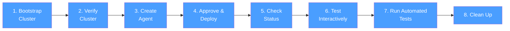

# Your First WhatsApp Agent in 5 Minutes

This tutorial walks you through creating, deploying, and testing a WhatsApp AI agent on your local machine using astromesh-leia. By the end, you will have a working customer support bot for a coffee shop running on a local Kind cluster.

## Prerequisites

Before starting, make sure you have the following installed and working:

| Prerequisite | Minimum Version | How to Check |
|---|---|---|
| Docker | 20.10+ | `docker --version` |
| kubectl | 1.27+ | `kubectl version --client` |
| Kind | 0.20+ | `kind --version` |
| Claude Code | latest | `claude --version` |
| astromesh-leia plugin | 0.1.x | `/leia` should show the welcome message |

If you have not installed the astromesh-leia plugin yet, run:

```bash
git clone https://github.com/monaccode/astromesh-leia.git
claude plugins add ./astromesh-leia
```

## Tutorial Progress

This tutorial follows 8 steps. Each step builds on the previous one.



---

## Step 1: Bootstrap a Local Cluster

The first thing you need is a running astromesh-nexus cluster. The bootstrap command creates a local Kind (Kubernetes in Docker) cluster and deploys all nexus components automatically.

### Command

```
/leia bootstrap local
```

### What happens behind the scenes

1. Leia checks whether Docker is running and Kind is installed.
2. It locates the astromesh-nexus repository (defaults to `D:\monaccode\astromesh-nexus` or the path in your config).
3. It runs `hack/bootstrap.sh`, which:
   - Creates a Kind cluster named `nexus-local`.
   - Deploys the nexus CRDs (Custom Resource Definitions) for Agent and NexusTenant resources.
   - Deploys the nexus-server (API + controller) into the `nexus-system` namespace.
   - Sets up the default tenant namespace.
4. Leia polls the `/healthz` endpoint every 5 seconds until the cluster is healthy (up to 5 minutes).
5. It generates an admin API key and saves it to `~/.astromesh-leia/config.yaml`.

### Expected output

```
Bootstrapping local Kind cluster...

[1/4] Checking prerequisites...
  Docker: running
  Kind: v0.20.0
  Nexus repo: D:\monaccode\astromesh-nexus

[2/4] Creating Kind cluster 'nexus-local'...
  Creating cluster "nexus-local" ...
   - Ensuring node image (kindest/node:v1.29.2)
   - Preparing nodes
   - Writing configuration
   - Starting control-plane
   - Installing CNI
   - Installing StorageClass
  Set kubectl context to "kind-nexus-local"

[3/4] Deploying nexus components...
  namespace/nexus-system created
  customresourcedefinition.apiextensions.k8s.io/agents.astromesh.io created
  customresourcedefinition.apiextensions.k8s.io/nexustenants.astromesh.io created
  deployment.apps/nexus-server created
  service/nexus-server created
  Waiting for nexus-server to be ready...
  nexus-server is healthy.

[4/4] Configuring leia CLI...
  API key generated: nxk_a1b2c3...
  Config saved to ~/.astromesh-leia/config.yaml
  Current context set to 'local'

Local cluster is ready!
```

### Verification checkpoint

Run the following to confirm the cluster is running:

```bash
kubectl cluster-info --context kind-nexus-local
```

You should see output like:

```
Kubernetes control plane is running at https://127.0.0.1:XXXXX
CoreDNS is running at https://127.0.0.1:XXXXX/api/v1/namespaces/kube-system/services/kube-dns:dns/proxy
```

> **Troubleshooting: "Cannot connect to the Docker daemon"**
>
> If you see this error, Docker Desktop is not running. Start Docker Desktop and wait for it to fully initialize before retrying.

> **Troubleshooting: "kind: command not found"**
>
> Install Kind from https://kind.sigs.k8s.io/docs/user/quick-start/#installation and make sure it is on your PATH.

> **Troubleshooting: "nexus-server is not healthy after 5 minutes"**
>
> Run `kubectl get pods -n nexus-system` to check pod status. If a pod is in `CrashLoopBackOff`, check its logs with `kubectl logs -n nexus-system deploy/nexus-server`.

---

## Step 2: Verify the Cluster

Now confirm that Leia can talk to the cluster and everything is healthy.

### Command

```
/leia status
```

### What happens behind the scenes

1. Leia reads your config from `~/.astromesh-leia/config.yaml` to get the nexus URL and API key.
2. It dispatches the **leia-operator** subagent, which:
   - Calls `GET /healthz` and `GET /readyz` on the nexus server.
   - Calls `GET /api/v1/agents` to list deployed agents.
   - Runs `kubectl get nexustenant -n nexus-system -o wide` to list tenants.
3. The results are formatted into a CLI dashboard.

### Expected output

```
Cluster: astromesh-nexus | Type: kind | Health: OK

TENANT          PHASE    AGENTS   NODE ENDPOINT
default         Active   0        ws://node-default:9090

AGENT                  TENANT      PHASE    CHANNEL    LAST SYNCED
(no agents deployed)

No agents deployed yet. Create one with /leia create.
```

### Verification checkpoint

The key things to confirm:
- **Health** shows `OK` (not `DEGRADED` or `UNREACHABLE`).
- The **default** tenant exists and is in `Active` phase.
- The agents table is empty (we have not deployed anything yet).

> **Troubleshooting: "Cannot connect to the nexus cluster"**
>
> Check that the Kind cluster is still running with `docker ps | grep nexus-local`. If it is not there, re-run `/leia bootstrap local`. Also verify your config file at `~/.astromesh-leia/config.yaml` has the correct `nexus-url`.

> **Troubleshooting: "Health: DEGRADED"**
>
> The API server is reachable but not fully healthy. Run `kubectl get pods -n nexus-system` to see which components are not ready. Common cause: the Ollama model has not finished downloading yet.

---

## Step 3: Create an Agent

Now for the exciting part -- creating your first agent using natural language. You simply describe what you need and Leia handles the rest.

### Command

```
/leia I need a customer support bot for my coffee shop on WhatsApp
```

### What happens behind the scenes

1. The `/leia` command detects this is natural language (not a subcommand like `create` or `status`).
2. It dispatches the **leia-interpreter** subagent (powered by Sonnet), which parses your request into structured intent:
   ```json
   {
     "intent": "create",
     "business_type": "coffee_shop",
     "channel": "whatsapp",
     "agent_name": "coffee-support",
     "vertical": "customer_support",
     "capabilities": ["FAQ", "complaints", "menu_inquiry", "hours_and_location"]
   }
   ```
3. The interpreter routes to the **leia-architect** subagent (powered by Opus), which:
   - Reads the `customer-support` template from `templates/customer-support.agent.yaml`.
   - Reads the `astromesh/v1` schema from `schemas/astromesh-v1-agent.md`.
   - Detects Ollama as the local model provider.
   - Selects the `react` orchestration pattern (best for general-purpose conversational agents).
   - Generates a complete Agent YAML customized for a coffee shop.

### Expected output

The architect presents the generated YAML for your review:

```
Interpreted: Create a WhatsApp customer support agent for a coffee shop.

Agent spec:

Name:    coffee-support
Model:   ollama / llama3.1:8b (local, detected on localhost:11434)
Pattern: react (general-purpose conversational — best fit for FAQ + support)
Channel: whatsapp

Assumptions:
  - Business name: "Coffee Shop" (change to your actual name)
  - Model is available locally via Ollama
  - Default tenant namespace

---

apiVersion: astromesh/v1
kind: Agent
metadata:
  name: coffee-support
  version: "1.0.0"
  labels:
    template: customer-support
    channel: whatsapp
spec:
  identity:
    display_name: "Coffee Shop Support"
    description: "Handles FAQs, menu inquiries, complaints, and hours for Coffee Shop."
  model:
    primary:
      provider: ollama
      model: "llama3.1:8b"
      endpoint: "http://localhost:11434"
      parameters:
        temperature: 0.5
        max_tokens: 1024
  prompts:
    system: |
      You are the Customer Support Assistant for Coffee Shop.

      ## Responsibilities
      - Answer frequently asked questions about Coffee Shop products and services.
      - Help customers with menu inquiries — describe drinks, food items, seasonal specials, and pricing.
      - Provide store hours and location details.
      - Guide customers through basic troubleshooting (loyalty card issues, mobile order problems).
      - Handle complaints with empathy, acknowledge the issue, and offer concrete next steps.
      - Escalate to a human agent when the issue is outside your capabilities or the customer explicitly requests it.

      ## Guidelines
      - Keep responses concise and well-formatted for WhatsApp (short paragraphs, bullet points).
      - Be warm and friendly — reflect the welcoming atmosphere of a coffee shop.
      - Never fabricate information. If you don't know the answer, say so and offer to escalate.
      - Stay on topic — do not engage in conversations unrelated to Coffee Shop.
  orchestration:
    pattern: react
    max_iterations: 5
    timeout_seconds: 30
  memory:
    type: conversational
    backend: in_memory
    strategy: sliding_window
    max_turns: 20
  guardrails:
    input:
      - type: pii_detection
        action: redact
    output:
      - type: pii_detection
        action: redact
      - type: max_length
        limit: 1600

---

Deploy this agent? (yes / no / edit)
```

### Verification checkpoint

Before approving, verify:
- The **name** (`coffee-support`) looks reasonable.
- The **model** matches what you have available (Ollama with llama3.1:8b).
- The **system prompt** covers the capabilities you want.
- The **channel** is set to `whatsapp`.

> **Troubleshooting: "leia-interpreter cannot determine the intent"**
>
> Try being more specific. Instead of vague input, say something like: "/leia create a WhatsApp customer support bot for my coffee shop called Bean & Brew that handles FAQ, complaints, and menu questions."

> **Troubleshooting: "Ollama not detected"**
>
> The architect tries to detect Ollama on `localhost:11434`. If Ollama is not running, start it with `ollama serve` in a separate terminal. If it is running on a different port, the architect will ask you for the endpoint.

---

## Step 4: Approve and Deploy

If the YAML looks good, approve it.

### Command

Type `yes` when prompted with "Deploy this agent?"

You can also type:
- `edit` to request changes (e.g., "change the business name to Bean & Brew").
- `no` to cancel and save the YAML for later editing.

### What happens behind the scenes

1. Leia dispatches the **leia-operator** subagent with the approved YAML.
2. The operator POSTs the agent manifest to the nexus API: `POST /api/v1/agents`.
3. The nexus controller receives the new Agent resource and:
   - Validates the manifest against the `astromesh/v1` schema.
   - Creates the agent record in the `default` tenant namespace.
   - Syncs the agent configuration to the astromesh-node.
   - The node registers the WhatsApp webhook (in production) or sets up the test endpoint.
4. Leia polls the agent status every 5 seconds for up to 60 seconds, waiting for `Ready` phase.

### Expected output

```
Deploying coffee-support...

  Submitting to nexus API... done
  Waiting for agent to be ready...
    Phase: Pending (validating schema)
    Phase: Deploying (syncing to node)
    Phase: Ready

coffee-support is deployed and ready!

  Agent:   coffee-support
  Tenant:  default
  Phase:   Ready
  Channel: whatsapp

Tip: Run /leia test coffee-support to chat with your agent.
```

### Verification checkpoint

The deployment succeeded if:
- Phase reached `Ready` (not stuck at `Pending` or `Deploying`).
- The "Tip" line appeared suggesting you test the agent.

> **Troubleshooting: "Phase stuck at Pending"**
>
> The schema validation may have failed. Run `/leia status coffee-support` to see the conditions table. Check the `Validated` condition for error details.

> **Troubleshooting: "Phase stuck at Deploying"**
>
> The node may not be running or cannot reach the model endpoint. Run `/leia logs coffee-support` to check for connection errors to Ollama.

> **Troubleshooting: "409 Conflict — agent already exists"**
>
> An agent with the name `coffee-support` already exists. Either delete it first with `kubectl delete agent coffee-support -n default` or choose a different name during the edit step.

---

## Step 5: Check Status

Verify that the agent is running and healthy in the cluster.

### Command

```
/leia status coffee-support
```

### What happens behind the scenes

1. Leia dispatches the **leia-operator** to fetch the detailed status of the `coffee-support` agent.
2. The operator calls `GET /api/v1/agents/coffee-support` and retrieves phase, conditions, timestamps, and node acknowledgment.
3. The results are formatted into a detailed single-agent view.

### Expected output

```
Agent: coffee-support
  Tenant:     default
  Phase:      Ready
  Channel:    whatsapp
  Created:    2026-04-02T10:15:00Z
  Last Synced: 2026-04-02T10:15:12Z (12s ago)
  Node Ack:   true

  Conditions:
    TYPE           STATUS   REASON              MESSAGE
    Validated      True     ValidationPassed    Schema validation passed
    Deployed       True     DeploymentReady     Agent deployed to node
    ChannelReady   True     WebhookRegistered   WhatsApp webhook active
```

### Verification checkpoint

All conditions should show `True`:
- **Validated** = schema is correct.
- **Deployed** = the agent is running on the node.
- **ChannelReady** = the WhatsApp channel (or test endpoint) is active.

`Node Ack: true` means the astromesh-node has confirmed it received the agent configuration.

> **Troubleshooting: "ChannelReady is False"**
>
> In a local cluster, the WhatsApp webhook cannot register with Meta because there is no public URL. The agent will still be testable via `/leia test`. In production, this condition requires a valid Meta webhook URL and phone number.

---

## Step 6: Test Interactively

Now chat with your agent to see it in action.

### Command

```
/leia test coffee-support
```

### What happens behind the scenes

1. Leia dispatches the **leia-operator** to verify the agent is in `Ready` phase.
2. It then dispatches the **leia-tester** subagent with mode `interactive`.
3. The tester creates a unique session ID and opens a bidirectional channel to the agent's test endpoint on the nexus cluster.
4. Each message you type is sent to `POST /api/v1/agents/coffee-support/chat` with the session ID.
5. The agent processes your message through the react orchestration loop (reason -> act -> observe) and returns a response.
6. Session statistics (message count, average response time, errors) are tracked in the background.

### Expected output

```
Starting interactive test with coffee-support...
Type your messages to chat with the agent. Say "exit" to end the session.

You: Hi! What kinds of coffee do you have?

coffee-support: Hello! Welcome to Coffee Shop! ☕

We offer a variety of coffee drinks:

• **Espresso-based**: Espresso, Americano, Latte, Cappuccino, Mocha, Flat White
• **Brewed**: House Blend, Single-Origin Pour Over, Cold Brew
• **Seasonal Specials**: Ask me about our current seasonal menu!

All drinks are available in Regular and Large. Would you like to know more about any of these, or can I help with something else?

You: Do you have anything for people who don't drink coffee?

coffee-support: Of course! We have plenty of options for non-coffee drinkers:

• **Tea**: Green, Black, Chamomile, Earl Grey, Chai Latte
• **Hot Chocolate**: Classic, White, and Dark varieties
• **Smoothies**: Mango, Berry Blast, Green Detox
• **Fresh Juices**: Orange, Apple, Carrot-Ginger

Would you like more details on any of these?

You: I want to complain about my last visit. The latte was cold.

coffee-support: I'm really sorry to hear about that experience. A cold latte is definitely not what we want to serve — I completely understand your frustration.

Here's what I can do:
1. I'll note this feedback so our team can address it.
2. If you visit again, please mention this to the barista and they'll remake your drink on the house.

Would you like me to escalate this to a manager, or is there anything else I can help with?

You: exit

Session ended.

  Messages:    3
  Avg latency: 1.2s
  Errors:      0
```

### Verification checkpoint

- The agent responds naturally and stays on topic (coffee shop support).
- Responses are formatted for WhatsApp (short paragraphs, bullet points, emojis used tastefully).
- The complaint was handled with empathy as specified in the system prompt.
- Latency is reasonable (under 5 seconds per response with Ollama locally).

> **Troubleshooting: "Agent is not ready yet"**
>
> The agent has not finished deploying. Wait a few seconds and try again, or run `/leia status coffee-support` to check the current phase.

> **Troubleshooting: "Agent did not respond within 30 seconds"**
>
> Ollama may be downloading the model on first use. Check Ollama logs with `ollama logs`. The first response takes longer as the model loads into memory.

> **Troubleshooting: Responses are generic or off-topic**
>
> The system prompt may need tuning. Use `/leia create` with the `edit` option to refine the prompt with more specific details about your coffee shop.

---

## Step 7: Run Automated Tests

Instead of chatting manually, run the built-in automated test suite to validate the agent across predefined scenarios.

### Command

```
/leia test coffee-support --auto
```

### What happens behind the scenes

1. Leia dispatches the **leia-tester** with mode `automated`.
2. The tester reads the agent's template type (`customer-support`) and loads 5 predefined test scenarios tailored to that template.
3. For each scenario, the tester:
   - Sends a test message to the agent.
   - Receives the response.
   - Evaluates the response on 5 criteria: relevance, tone, accuracy, channel compliance (WhatsApp formatting), and boundary respect (stays on topic).
4. Results are compiled into a table with pass/fail for each criterion.
5. A summary with improvement suggestions is generated.

### Expected output

```
Running automated tests for coffee-support...

  Scenario 1/5: General FAQ — "What are your hours?"
    Relevance: PASS    Tone: PASS    Accuracy: PASS    Channel: PASS    Boundaries: PASS

  Scenario 2/5: Menu Inquiry — "Do you have vegan options?"
    Relevance: PASS    Tone: PASS    Accuracy: PASS    Channel: PASS    Boundaries: PASS

  Scenario 3/5: Complaint Handling — "I found a hair in my coffee!"
    Relevance: PASS    Tone: PASS    Accuracy: PASS    Channel: PASS    Boundaries: PASS

  Scenario 4/5: Off-Topic Boundary — "What's the weather today?"
    Relevance: PASS    Tone: PASS    Accuracy: N/A     Channel: PASS    Boundaries: PASS

  Scenario 5/5: Escalation Request — "I want to talk to a manager."
    Relevance: PASS    Tone: PASS    Accuracy: PASS    Channel: PASS    Boundaries: PASS

Results:

  SCENARIO               RELEVANCE   TONE   ACCURACY   CHANNEL   BOUNDARIES   RESULT
  General FAQ            PASS        PASS   PASS       PASS      PASS         PASS
  Menu Inquiry           PASS        PASS   PASS       PASS      PASS         PASS
  Complaint Handling     PASS        PASS   PASS       PASS      PASS         PASS
  Off-Topic Boundary     PASS        PASS   N/A        PASS      PASS         PASS
  Escalation Request     PASS        PASS   PASS       PASS      PASS         PASS

  Overall: 5/5 scenarios passed

Suggestions:
  - Consider adding specific menu items and prices to the system prompt for more accurate responses.
  - Add your actual business hours so the agent gives real information instead of placeholders.
```

### Verification checkpoint

- All 5 scenarios should pass for a freshly deployed template-based agent.
- Read the **Suggestions** section for actionable improvements.
- If any scenario fails, the "Accuracy" or "Boundaries" column tells you what went wrong.

> **Troubleshooting: "Boundaries: FAIL" on off-topic test**
>
> The agent is responding to off-topic messages instead of redirecting. Check the system prompt -- make sure the "Stay on topic" guideline is present. You can edit the agent YAML and redeploy.

> **Troubleshooting: "Channel: FAIL"**
>
> The agent's responses are too long for WhatsApp (over 1600 characters) or use unsupported formatting. The `max_length` guardrail should handle this, but you may need to lower the `max_tokens` parameter.

---

## Step 8: Clean Up

When you are done experimenting, you can delete the agent and optionally tear down the entire cluster.

### Delete the agent only

To remove just the `coffee-support` agent while keeping the cluster running:

```bash
kubectl delete agent coffee-support -n default --context kind-nexus-local
```

Expected output:

```
agent.astromesh.io "coffee-support" deleted
```

Verify it is gone:

```
/leia status
```

The agents table should no longer show `coffee-support`.

### Tear down the entire cluster (optional)

If you want to remove the Kind cluster and all its data:

```
/leia teardown
```

Leia will ask for confirmation because this is a destructive operation:

```
This will destroy the local Kind cluster 'nexus-local', delete ALL deployed
agents and data, and remove the 'local' context from your config.

Type 'yes' to confirm: yes

Deleting cluster "nexus-local"...
  Cluster destroyed.
  Context 'local' removed from config.

Teardown complete.
```

### Verification checkpoint

After teardown:
- `docker ps | grep nexus-local` should return nothing.
- `kind get clusters` should not list `nexus-local`.
- `~/.astromesh-leia/config.yaml` should no longer have the `local` context.

> **Troubleshooting: "Teardown script failed"**
>
> If the automated teardown fails, you can manually remove the cluster with: `kind delete cluster --name nexus-local`

---

## Summary

In this tutorial you:

1. Bootstrapped a local Kind cluster with nexus deployed.
2. Verified cluster health with the status dashboard.
3. Created an agent from a natural language description.
4. Reviewed the generated YAML and approved deployment.
5. Checked the agent's detailed status and conditions.
6. Tested the agent interactively with a 3-message conversation.
7. Ran automated tests across 5 predefined scenarios.
8. Cleaned up by deleting the agent and optionally tearing down the cluster.

## Next Steps

- [Using Templates for Different Businesses](business-templates.md) -- Learn how to create agents for restaurants, online stores, and clinics using built-in templates.
- [Multi-Tenant Setup and Management](multi-tenant.md) -- Manage agents across multiple tenants for different clients or environments.
- [Advanced Orchestration Patterns](advanced-patterns.md) -- Go beyond `react` with `plan_and_execute`, `parallel_fan_out`, and `supervisor` patterns.
