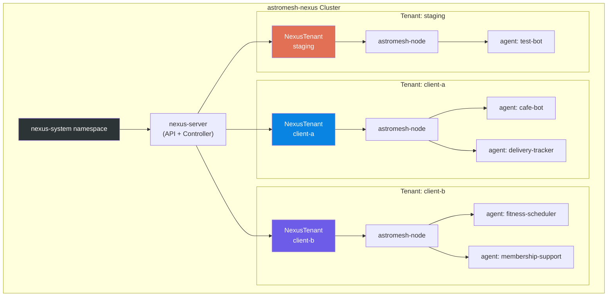
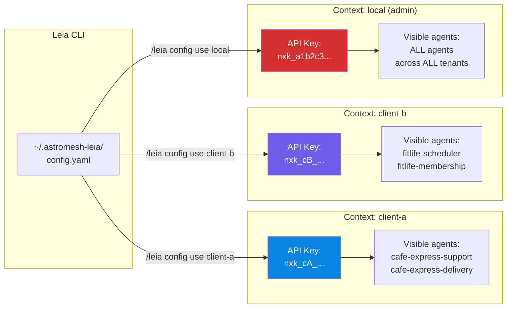

# Multi-Tenant Setup and Management

This tutorial walks through managing agents across multiple tenants using astromesh-leia. Tenants provide isolation boundaries -- each tenant gets its own Kubernetes namespace, its own agents, and its own API key. This is essential when you manage agents for different clients, environments (staging vs production), or business units.

## Prerequisites

- A running nexus cluster (complete the [first-agent tutorial](first-agent.md) or run `/leia bootstrap local`)
- `/leia status` shows `Health: OK`
- `kubectl` access to the cluster (for creating tenants and API keys)

## Architecture Overview

The following diagram shows how nexus organizes multiple tenants, each with their own isolated agents and astromesh-node:



Key isolation properties:
- Each tenant runs in its own Kubernetes namespace.
- Agents in one tenant cannot see or interact with agents in another tenant.
- Each tenant has its own API key -- a key scoped to `client-a` cannot access `client-b` resources.
- Each tenant gets its own astromesh-node instance.

---

## Step 1: Create the First Tenant and API Key

Tenants are Kubernetes custom resources managed by the nexus controller. You create them with `kubectl`.

### Create the tenant

```bash
kubectl apply -f - <<EOF
apiVersion: astromesh.io/v1
kind: NexusTenant
metadata:
  name: client-a
  namespace: nexus-system
spec:
  displayName: "Cafe Express (Client A)"
  contactEmail: admin@cafeexpress.com
EOF
```

### What happens behind the scenes

1. The nexus controller detects the new NexusTenant resource.
2. It creates a Kubernetes namespace named `client-a` (matching the tenant name).
3. It deploys an astromesh-node pod into the namespace.
4. It sets up RBAC (Role-Based Access Control) so that the tenant's API key can only access resources in its own namespace.
5. The tenant enters `Active` phase once the node is ready.

### Expected output

```
nexustenant.astromesh.io/client-a created
```

### Generate an API key for the tenant

```bash
kubectl exec -n nexus-system deploy/nexus-server -- \
  nexus-admin create-key --name client-a-key --scope tenant --tenant client-a
```

### Expected output

```
API key created:
  Name:    client-a-key
  Scope:   tenant
  Tenant:  client-a
  Key:     nxk_cA_x7k9m2p4r6...

Store this key securely — it will not be shown again.
```

Save this key. You will need it in the next step.

### Verification checkpoint

```bash
kubectl get nexustenant -n nexus-system
```

Expected:

```
NAME       DISPLAY NAME              PHASE    AGE
default    Default Tenant            Active   2h
client-a   Cafe Express (Client A)   Active   30s
```

> **Troubleshooting: Tenant stuck in "Provisioning" phase**
>
> The astromesh-node pod may be failing to start. Check with: `kubectl get pods -n client-a`. Common cause: insufficient cluster resources for another node pod. On a local Kind cluster, make sure Docker has at least 4GB of memory allocated.

---

## Step 2: Configure a Leia Context for Client A

Leia contexts let you switch between different nexus connections. Each context stores a URL, API key, and metadata. This maps naturally to tenant management -- one context per client.

### Command

```
/leia config add client-a
```

### What happens behind the scenes

Leia will ask you for the connection details interactively. Since this is a local cluster, the URL is the same -- only the API key differs.

### Expected interaction

```
Adding new context 'client-a'...

nexus-url (required): http://localhost:8080
api-key (required): nxk_cA_x7k9m2p4r6...
cluster-type (kind/remote) [remote]: kind
cluster-name [client-a]: nexus-local

Context 'client-a' added.
Switch to this context now? (yes/no): yes

Switched to context 'client-a'.
```

### What the config file looks like

After adding the context, `~/.astromesh-leia/config.yaml` contains:

```yaml
current-context: client-a
contexts:
  local:
    nexus-url: http://localhost:8080
    api-key: nxk_a1b2c3...
    cluster-type: kind
    cluster-name: nexus-local
    nexus-repo: D:\monaccode\astromesh-nexus
  client-a:
    nexus-url: http://localhost:8080
    api-key: nxk_cA_x7k9m2p4r6...
    cluster-type: kind
    cluster-name: nexus-local
defaults:
  channel: whatsapp
  model-provider: auto
  tenant: default
```

Notice that `current-context` is now `client-a`. All subsequent Leia commands will use this context's API key, which is scoped to the `client-a` tenant.

### Verification checkpoint

```
/leia config
```

Expected:

```
Current context: client-a
  URL:          http://localhost:8080
  Cluster type: kind
  Cluster name: nexus-local

Defaults:
  Channel:        whatsapp
  Model provider: auto
  Tenant:         default
```

> **Troubleshooting: "Authentication failed" after switching context**
>
> Double-check the API key. Tenant-scoped keys start with `nxk_` followed by a tenant prefix. If the key was not copied correctly, regenerate it with the `nexus-admin create-key` command.

---

## Step 3: Deploy Agents for Client A

Now that you are in the `client-a` context, any agents you create will be deployed to the `client-a` tenant namespace.

### Command

```
/leia create I need a WhatsApp bot for Cafe Express that handles customer
questions about the menu, daily specials, and store hours
```

### What happens behind the scenes

1. The **leia-interpreter** parses the request and identifies it as a customer-support agent for a cafe.
2. The **leia-architect** generates the YAML with `metadata.namespace: client-a` (inferred from the current context's tenant-scoped API key).
3. When you approve, the **leia-operator** POSTs the manifest using the `client-a` API key.
4. The nexus controller deploys the agent into the `client-a` namespace.

### Expected output (after approval)

```
Deploying cafe-express-support...

  Submitting to nexus API (context: client-a)... done
  Waiting for agent to be ready...
    Phase: Ready

cafe-express-support is deployed and ready!

  Agent:   cafe-express-support
  Tenant:  client-a
  Phase:   Ready
  Channel: whatsapp
```

Deploy a second agent for the same client:

```
/leia create I need a delivery tracking bot for Cafe Express on WhatsApp
```

After approval:

```
Deploying cafe-express-delivery...

  Submitting to nexus API (context: client-a)... done
  Waiting for agent to be ready...
    Phase: Ready

cafe-express-delivery is deployed and ready!
```

### Verification checkpoint

```
/leia status
```

Expected:

```
Cluster: astromesh-nexus | Type: kind | Health: OK

TENANT          PHASE    AGENTS   NODE ENDPOINT
client-a        Active   2        ws://node-client-a:9090

AGENT                      TENANT      PHASE    CHANNEL    LAST SYNCED
cafe-express-support       client-a    Ready    whatsapp   45s ago
cafe-express-delivery      client-a    Ready    whatsapp   20s ago
```

Notice that you only see agents in the `client-a` tenant. The tenant-scoped API key cannot see agents in other tenants.

---

## Step 4: Create the Second Tenant

Repeat the tenant creation process for a second client.

### Create the tenant

```bash
kubectl apply -f - <<EOF
apiVersion: astromesh.io/v1
kind: NexusTenant
metadata:
  name: client-b
  namespace: nexus-system
spec:
  displayName: "FitLife Gym (Client B)"
  contactEmail: admin@fitlifegym.com
EOF
```

### Generate an API key

```bash
kubectl exec -n nexus-system deploy/nexus-server -- \
  nexus-admin create-key --name client-b-key --scope tenant --tenant client-b
```

Expected:

```
API key created:
  Name:    client-b-key
  Scope:   tenant
  Tenant:  client-b
  Key:     nxk_cB_p3q5r7s9t1...
```

### Add the Leia context

```
/leia config add client-b
```

```
Adding new context 'client-b'...

nexus-url (required): http://localhost:8080
api-key (required): nxk_cB_p3q5r7s9t1...
cluster-type (kind/remote) [remote]: kind
cluster-name [client-b]: nexus-local

Context 'client-b' added.
Switch to this context now? (yes/no): yes

Switched to context 'client-b'.
```

### Verification checkpoint

```
/leia config list
```

Expected:

```
CONTEXT      CLUSTER        TYPE
local        nexus-local    kind
client-a     nexus-local    kind
* client-b   nexus-local    kind
```

The `*` marks the active context.

---

## Step 5: Deploy Agents for Client B

With the `client-b` context active, deploy agents for the gym:

```
/leia create I need a fitness class scheduler for FitLife Gym on WhatsApp.
Classes include yoga, spinning, CrossFit, and boxing. Open 6am-10pm weekdays,
8am-8pm weekends.
```

After approval:

```
Deploying fitlife-scheduler...

  Submitting to nexus API (context: client-b)... done
  Waiting for agent to be ready...
    Phase: Ready

fitlife-scheduler is deployed and ready!

  Agent:   fitlife-scheduler
  Tenant:  client-b
  Phase:   Ready
  Channel: whatsapp
```

Deploy a second agent:

```
/leia create I need a membership support bot for FitLife Gym that handles
billing questions, membership upgrades, and cancellation requests
```

After approval:

```
Deploying fitlife-membership...

  Submitting to nexus API (context: client-b)... done
  Waiting for agent to be ready...
    Phase: Ready

fitlife-membership is deployed and ready!
```

### Verification checkpoint

```
/leia status
```

Expected (showing only client-b agents because we are in the client-b context):

```
Cluster: astromesh-nexus | Type: kind | Health: OK

TENANT          PHASE    AGENTS   NODE ENDPOINT
client-b        Active   2        ws://node-client-b:9090

AGENT                      TENANT      PHASE    CHANNEL    LAST SYNCED
fitlife-scheduler          client-b    Ready    whatsapp   30s ago
fitlife-membership         client-b    Ready    whatsapp   15s ago
```

---

## Step 6: Switch Between Contexts

The power of contexts is instant switching between tenants. Here is how it works:

### Switch to Client A

```
/leia config use client-a
```

Expected:

```
Switched to context 'client-a'.
```

Now check status:

```
/leia status
```

Expected:

```
Cluster: astromesh-nexus | Type: kind | Health: OK

TENANT          PHASE    AGENTS   NODE ENDPOINT
client-a        Active   2        ws://node-client-a:9090

AGENT                      TENANT      PHASE    CHANNEL    LAST SYNCED
cafe-express-support       client-a    Ready    whatsapp   5m ago
cafe-express-delivery      client-a    Ready    whatsapp   4m ago
```

You only see Client A's agents. Client B's agents are invisible from this context.

### Switch back to Client B

```
/leia config use client-b
```

```
/leia status
```

Now you see only Client B's agents again.

### Context switching flow



---

## Step 7: View All Tenants from Admin Context

The `local` context (created during bootstrap) has an admin-scoped API key. This lets you see all tenants and all agents across the entire cluster.

### Switch to admin context

```
/leia config use local
```

### View full dashboard

```
/leia status
```

Expected:

```
Cluster: astromesh-nexus | Type: kind | Health: OK

TENANT          PHASE    AGENTS   NODE ENDPOINT
default         Active   0        ws://node-default:9090
client-a        Active   2        ws://node-client-a:9090
client-b        Active   2        ws://node-client-b:9090

AGENT                      TENANT      PHASE    CHANNEL    LAST SYNCED
cafe-express-support       client-a    Ready    whatsapp   10m ago
cafe-express-delivery      client-a    Ready    whatsapp   9m ago
fitlife-scheduler          client-b    Ready    whatsapp   5m ago
fitlife-membership         client-b    Ready    whatsapp   4m ago
```

Now you can see every agent in every tenant. This is the view you would use as a platform operator managing multiple clients.

### Filter by tenant

To see only one tenant's agents from the admin context:

```
/leia status --tenant client-a
```

Expected:

```
Cluster: astromesh-nexus | Type: kind | Health: OK

TENANT          PHASE    AGENTS   NODE ENDPOINT
client-a        Active   2        ws://node-client-a:9090

AGENT                      TENANT      PHASE    CHANNEL    LAST SYNCED
cafe-express-support       client-a    Ready    whatsapp   10m ago
cafe-express-delivery      client-a    Ready    whatsapp   9m ago
```

### Verification checkpoint

From the `local` (admin) context, verify:
- All 3 tenants appear in the tenants table.
- All 4 agents appear in the agents table (2 per tenant, 0 in default).
- Each agent shows the correct tenant.

> **Troubleshooting: "Only see agents from one tenant in admin context"**
>
> Make sure you are using the `local` context (admin key), not a tenant-scoped context. Check with `/leia config` -- the current context should be `local`.

---

## Best Practices

### Naming conventions

Use consistent naming to keep your contexts and tenants organized:

| Entity | Convention | Example |
|---|---|---|
| Tenant name | `client-<identifier>` or `env-<name>` | `client-cafeexpress`, `env-staging` |
| Context name | Same as tenant name | `client-cafeexpress` |
| Agent name | `<business>-<function>` | `cafe-express-support`, `fitlife-scheduler` |
| API key name | `<tenant>-<purpose>` | `client-a-key`, `staging-deploy-key` |

### Context organization

For a typical agency or platform operator managing multiple clients:

```yaml
# ~/.astromesh-leia/config.yaml
current-context: client-acme

contexts:
  # Admin context — full cluster access, use sparingly
  admin:
    nexus-url: https://nexus.myplatform.com
    api-key: nxk_admin_...
    cluster-type: remote
    cluster-name: production

  # Per-client contexts
  client-acme:
    nexus-url: https://nexus.myplatform.com
    api-key: nxk_acme_...
    cluster-type: remote
    cluster-name: production

  client-globex:
    nexus-url: https://nexus.myplatform.com
    api-key: nxk_globex_...
    cluster-type: remote
    cluster-name: production

  # Local development
  local-dev:
    nexus-url: http://localhost:8080
    api-key: nxk_dev_...
    cluster-type: kind
    cluster-name: nexus-local
    nexus-repo: D:\monaccode\astromesh-nexus
```

### Per-client isolation guarantees

| Isolation Layer | What It Prevents |
|---|---|
| Kubernetes namespace | Agents cannot access other tenants' pods, services, or secrets |
| API key scoping | A tenant key cannot list, create, or modify resources in another tenant |
| Network policy | Astromesh-node pods cannot communicate across tenant namespaces |
| Resource quotas | One tenant cannot consume all cluster resources (CPU, memory) |

### Security recommendations

1. **Never share admin keys with clients.** Each client should only have their tenant-scoped key.
2. **Rotate API keys regularly.** Use `nexus-admin create-key` to generate new keys and update your Leia config.
3. **Use separate clusters for production and development.** Local Kind clusters are for development only.
4. **Audit context usage.** The admin context should only be used for cross-tenant operations like viewing the full dashboard or creating new tenants.

---

## Next Steps

- [Your First WhatsApp Agent in 5 Minutes](first-agent.md) -- If you have not done the basics yet, start here.
- [Using Templates for Different Businesses](business-templates.md) -- Learn how templates adapt to different business types.
- [Advanced Orchestration Patterns](advanced-patterns.md) -- Go beyond `react` with multi-step, parallel, and multi-agent patterns.
