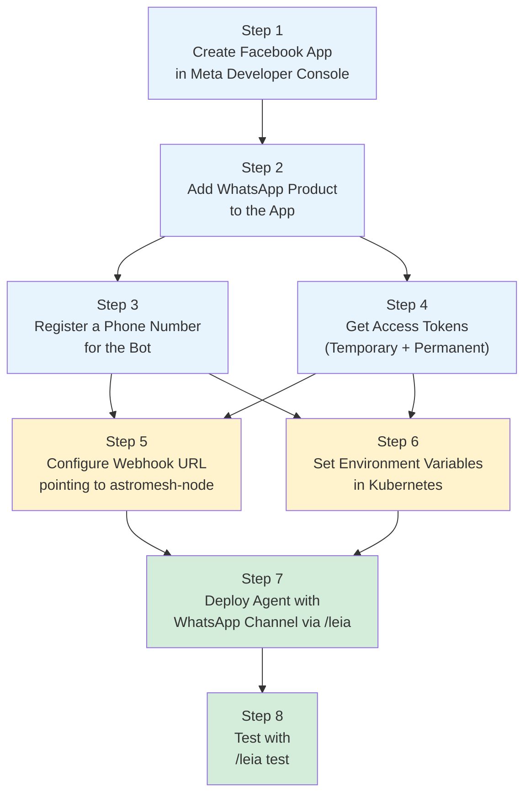
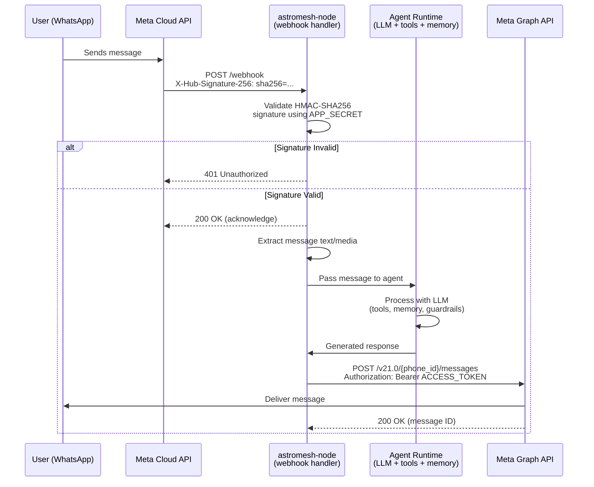
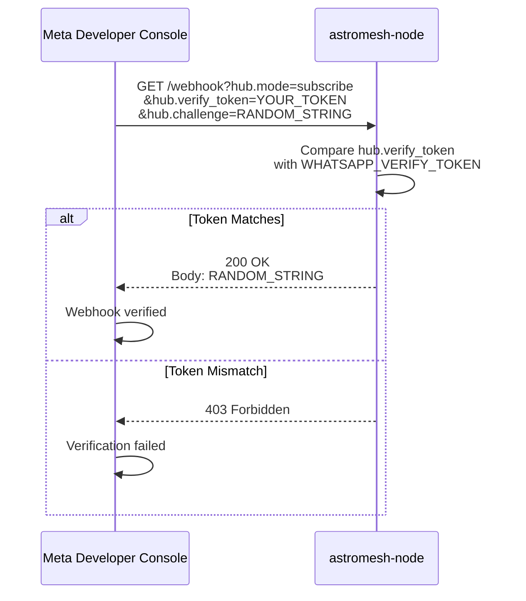

# WhatsApp Setup Guide

This guide walks you through the complete end-to-end setup for deploying an astromesh agent as a WhatsApp bot. It covers everything from creating the Meta Business Account to sending the first test message.

---

## Table of Contents

- [Prerequisites](#prerequisites)
- [Setup Overview](#setup-overview)
- [Step 1: Create a Facebook App](#step-1-create-a-facebook-app)
- [Step 2: Add WhatsApp Product](#step-2-add-whatsapp-product)
- [Step 3: Register a Phone Number](#step-3-register-a-phone-number)
- [Step 4: Get Access Tokens](#step-4-get-access-tokens)
- [Step 5: Configure Webhook URL](#step-5-configure-webhook-url)
- [Step 6: Set Environment Variables](#step-6-set-environment-variables)
- [Step 7: Deploy Agent with WhatsApp Channel](#step-7-deploy-agent-with-whatsapp-channel)
- [Step 8: Test with /leia test](#step-8-test-with-leia-test)
- [Webhook Flow](#webhook-flow)
- [Troubleshooting](#troubleshooting)
- [Security Best Practices](#security-best-practices)

---

## Prerequisites

Before starting, make sure you have the following:

| Prerequisite | Description | Where to Get It |
|--------------|-------------|-----------------|
| Meta Business Account | A verified Meta Business account. Personal Facebook accounts are not sufficient. | [business.facebook.com](https://business.facebook.com/) |
| Facebook Developer Account | A developer account linked to your Meta Business Account. | [developers.facebook.com](https://developers.facebook.com/) |
| Phone Number | A phone number that is not already registered with WhatsApp. This number will be used by your bot. You cannot use a number that has an active WhatsApp consumer or Business account. | Any phone number you own that can receive SMS or voice calls for verification. |
| Running Nexus Cluster | An astromesh-nexus cluster with at least one tenant. Can be a local Kind cluster or a remote cluster. | `/leia bootstrap` |
| Public HTTPS Endpoint | A publicly accessible HTTPS URL for the webhook. Required for Meta to deliver messages. For local development, use ngrok or a similar tunnel. | [ngrok.com](https://ngrok.com/) for local dev, or your cluster's ingress for production. |
| astromesh-leia configured | The leia CLI plugin configured and connected to a nexus cluster. | `/leia config show` |

---

## Setup Overview

The following diagram shows the 8 steps and their dependencies.



**Color legend:** Blue = Meta Developer Console steps. Yellow = Configuration steps. Green = Deployment and testing steps.

---

## Step 1: Create a Facebook App

1. Go to [Meta Developer Console](https://developers.facebook.com/apps/).
2. Click **Create App**.
3. Select **Business** as the app type.
4. Fill in the details:
   - **App Name**: Choose a descriptive name (e.g., "Acme Corp WhatsApp Bot").
   - **App Contact Email**: Your business email.
   - **Business Account**: Select your Meta Business Account from the dropdown.
5. Click **Create App**.
6. You will be redirected to the App Dashboard.

**Important:** Note down the **App ID** from the dashboard. You will need it later.

To find your **App Secret** (needed in Step 6):
1. Go to **Settings > Basic** in the left sidebar.
2. Click **Show** next to the App Secret field.
3. Copy and save the App Secret securely. This value becomes `WHATSAPP_APP_SECRET`.

---

## Step 2: Add WhatsApp Product

1. In the App Dashboard, scroll down to **Add Products to Your App**.
2. Find **WhatsApp** and click **Set Up**.
3. You will be taken to the WhatsApp Getting Started page.
4. Select your Meta Business Account when prompted (if not already linked).
5. The WhatsApp product is now added to your app.

After this step, you should see **WhatsApp** in the left sidebar navigation under your app.

---

## Step 3: Register a Phone Number

You need a phone number that the bot will use to send and receive messages.

### Option A: Use the Test Number (Development Only)

Meta provides a test phone number for development. It allows sending messages only to numbers you add to a whitelist.

1. Go to **WhatsApp > API Setup** in the left sidebar.
2. Under **Send and receive messages**, you will see a test phone number already assigned.
3. Under **To**, add up to 5 phone numbers for testing.
4. Each number must be verified via a 6-digit code sent by SMS.

This is sufficient for development and testing. Skip to Step 4.

### Option B: Register Your Own Number (Production)

For production use, register your own phone number.

1. Go to **WhatsApp > API Setup**.
2. Under **From**, click **Add phone number**.
3. Enter your business display name and phone number.
4. Select verification method: **SMS** or **Voice call**.
5. Enter the verification code you receive.
6. Your number is now registered and linked to the WhatsApp Business API.

**Important:** Note down the **Phone Number ID** displayed under your registered number. This is NOT the phone number itself -- it is a numeric identifier like `123456789012345`. This value becomes `WHATSAPP_PHONE_NUMBER_ID`.

---

## Step 4: Get Access Tokens

### Temporary Token (For Testing)

Meta provides a temporary access token that expires after 24 hours.

1. Go to **WhatsApp > API Setup**.
2. Under **Temporary access token**, you will see a pre-generated token.
3. Copy this token. It works immediately for testing.

This token expires after 24 hours and must be manually regenerated.

### Permanent Token (For Production)

For production, generate a permanent System User token.

1. Go to [Meta Business Settings](https://business.facebook.com/settings/).
2. Navigate to **Users > System Users**.
3. Click **Add** to create a new System User:
   - **Name**: "astromesh-bot" (or similar)
   - **Role**: Admin
4. Click **Generate New Token** for this system user.
5. Select your app from the dropdown.
6. Enable the following permissions:
   - `whatsapp_business_messaging` -- required to send and receive messages.
   - `whatsapp_business_management` -- required to manage the WhatsApp Business Account.
7. Click **Generate Token**.
8. Copy the generated token immediately. It will not be shown again.

This token does not expire. Store it securely. This value becomes `WHATSAPP_ACCESS_TOKEN`.

---

## Step 5: Configure Webhook URL

The webhook URL is the endpoint where Meta delivers incoming WhatsApp messages to your astromesh-node.

### Determine Your Webhook URL

The URL depends on your deployment:

| Environment | Webhook URL | Notes |
|-------------|-------------|-------|
| Local (Kind + ngrok) | `https://<random>.ngrok-free.app/webhook` | Start ngrok with `ngrok http 8080` and use the generated HTTPS URL |
| Staging | `https://nexus-staging.example.com/webhook` | Must be the public ingress endpoint of your astromesh-node |
| Production | `https://nexus.example.com/webhook` | Must be the public ingress endpoint of your astromesh-node |

**The URL must use HTTPS.** Meta will not deliver webhooks to HTTP endpoints.

### For Local Development with ngrok

1. Install ngrok: [ngrok.com/download](https://ngrok.com/download)
2. Start the tunnel:
   ```bash
   ngrok http 8080
   ```
3. Copy the HTTPS forwarding URL (e.g., `https://a1b2c3d4.ngrok-free.app`).
4. Your webhook URL is: `https://a1b2c3d4.ngrok-free.app/webhook`

**Note:** The ngrok URL changes every time you restart ngrok (unless you have a paid plan with a reserved domain). You will need to update the webhook URL in the Meta dashboard each time.

### Register the Webhook in Meta

1. Go to **WhatsApp > Configuration** in the left sidebar.
2. Under **Webhook**, click **Edit**.
3. Enter:
   - **Callback URL**: Your webhook URL (e.g., `https://a1b2c3d4.ngrok-free.app/webhook`)
   - **Verify Token**: A secret string you choose. This must match the `WHATSAPP_VERIFY_TOKEN` environment variable on your astromesh-node. Example: `my-secure-verify-token-2026`
4. Click **Verify and Save**.

**What happens during verification:**
1. Meta sends a GET request to your webhook URL with query parameters:
   - `hub.mode=subscribe`
   - `hub.verify_token=<your-verify-token>`
   - `hub.challenge=<random-string>`
2. Your astromesh-node must respond with `200 OK` and the `hub.challenge` value as the response body.
3. If the verify token does not match, respond with `403 Forbidden`.
4. If verification succeeds, Meta registers the webhook.

**Important:** Your astromesh-node must be running and accessible at the webhook URL before you click "Verify and Save". If verification fails, see the [Troubleshooting](#troubleshooting) section.

### Subscribe to Message Events

After webhook verification:

1. On the same **Configuration** page, find the **Webhook fields** section.
2. Click **Manage**.
3. Subscribe to the **messages** field. This ensures Meta delivers incoming messages to your webhook.
4. Click **Done**.

---

## Step 6: Set Environment Variables

The astromesh-node needs four environment variables to communicate with the WhatsApp Business API. These are stored as a Kubernetes Secret and injected into the node pod.

### Required Variables

| Variable | Value Source | Example |
|----------|-------------|---------|
| `WHATSAPP_VERIFY_TOKEN` | The verify token you chose in Step 5 | `my-secure-verify-token-2026` |
| `WHATSAPP_ACCESS_TOKEN` | The permanent token from Step 4 | `EAAx1234567890...` |
| `WHATSAPP_PHONE_NUMBER_ID` | The Phone Number ID from Step 3 | `123456789012345` |
| `WHATSAPP_APP_SECRET` | The App Secret from Step 1 | `abcdef1234567890fedcba` |

### Create the Kubernetes Secret

```bash
kubectl create secret generic whatsapp-credentials \
  --namespace default \
  --from-literal=WHATSAPP_VERIFY_TOKEN="my-secure-verify-token-2026" \
  --from-literal=WHATSAPP_ACCESS_TOKEN="EAAx1234567890..." \
  --from-literal=WHATSAPP_PHONE_NUMBER_ID="123456789012345" \
  --from-literal=WHATSAPP_APP_SECRET="abcdef1234567890fedcba"
```

Replace `default` with your tenant namespace if you are using a non-default tenant.

Alternatively, create the secret from a YAML manifest:

```yaml
apiVersion: v1
kind: Secret
metadata:
  name: whatsapp-credentials
  namespace: default
type: Opaque
stringData:
  WHATSAPP_VERIFY_TOKEN: "my-secure-verify-token-2026"
  WHATSAPP_ACCESS_TOKEN: "EAAx1234567890..."
  WHATSAPP_PHONE_NUMBER_ID: "123456789012345"
  WHATSAPP_APP_SECRET: "abcdef1234567890fedcba"
```

Apply it:

```bash
kubectl apply -f whatsapp-secret.yaml
```

**Security note:** Do not commit this file to version control. Add `whatsapp-secret.yaml` to your `.gitignore`.

### Verify the Secret Exists

```bash
kubectl get secret whatsapp-credentials -n default
```

You should see:

```
NAME                     TYPE     DATA   AGE
whatsapp-credentials     Opaque   4      10s
```

---

## Step 7: Deploy Agent with WhatsApp Channel

Now deploy an agent configured for the WhatsApp channel.

### Option A: Create via Natural Language

```
/leia create a WhatsApp bot for a pizza restaurant that handles reservations and menu inquiries
```

The creation wizard will:
1. Parse your description.
2. Generate an `astromesh/v1 Agent` YAML with WhatsApp-optimized settings (short timeouts, concise responses, PII guardrails).
3. Show you a preview for approval.
4. Deploy to the nexus cluster.

### Option B: Deploy an Existing YAML

If you already have an agent YAML file:

```
/leia deploy my-agent.agent.yaml
```

**Make sure your agent YAML includes WhatsApp-appropriate settings:**

```yaml
metadata:
  labels:
    channel: whatsapp

spec:
  model:
    primary:
      timeout: 30                    # WhatsApp users expect fast responses
      parameters:
        max_tokens: 1024             # WhatsApp message limit is ~4096 chars
  orchestration:
    timeout_seconds: 25              # Leave margin for Graph API call
    max_iterations: 5                # Fewer iterations = faster responses
  memory:
    conversational:
      backend: redis                 # Persistent across pod restarts
      strategy: sliding_window
      max_turns: 50
      ttl: 86400                     # 24 hours
  guardrails:
    input:
      - type: pii_detection
        action: mask                 # Mask PII before storing in memory/logs
    output:
      - type: content_filter
        categories: [hate_speech, self_harm]
        action: block
```

### Verify Deployment

After deploying, check the agent status:

```
/leia status my-agent
```

Wait until the agent phase is `Ready` and the `ChannelReady` condition shows `True` with reason `WebhookRegistered`.

---

## Step 8: Test with /leia test

### Interactive Test

```
/leia test my-agent
```

This starts an interactive chat session proxied through the nexus API. Type messages and see the agent's responses. Say "exit" to end the session.

### Automated Test

```
/leia test my-agent --auto
```

This runs 5 predefined test scenarios tailored to the agent's template type and evaluates each response for relevance, tone, accuracy, channel compliance, and boundary respect.

### End-to-End WhatsApp Test

To test the complete WhatsApp flow (including Meta's Cloud API):

1. Open WhatsApp on your phone.
2. Send a message to the bot's phone number (the number you registered in Step 3).
3. Wait for a response. The first response may take 5-10 seconds as the agent initializes.
4. Check the agent logs for any errors:
   ```
   /leia logs my-agent
   ```

**If using the test phone number:** Make sure your personal phone number is in the whitelist (added in Step 3, Option A).

---

## Webhook Flow

The following diagram shows the complete message flow for a WhatsApp conversation.



**Key timing constraints:**
- Meta expects a `200 OK` acknowledgment within **5 seconds** of delivering the webhook POST. The astromesh-node acknowledges immediately and processes the message asynchronously.
- If the node does not acknowledge within 5 seconds, Meta retries the delivery. This can cause duplicate processing.
- The agent runtime should generate a response within **25-30 seconds** for a good user experience. WhatsApp users expect near-instant replies.

### Webhook Verification Flow

When you first register the webhook URL, Meta sends a verification request:



---

## Troubleshooting

### Common WhatsApp Issues

| Symptom | Likely Cause | Diagnosis | Fix |
|---------|-------------|-----------|-----|
| Webhook verification fails with "Callback URL verification failed" | The astromesh-node is not running or not reachable at the webhook URL | Check that the node pod is running: `kubectl get pods -n <namespace>`. Test the URL manually: `curl -v "https://your-url/webhook?hub.mode=subscribe&hub.verify_token=your-token&hub.challenge=test"` | Ensure the node pod is running and the URL is publicly accessible. For local dev, check that ngrok is running and the tunnel is active. |
| Webhook verification fails with 403 | The verify token in the Meta dashboard does not match `WHATSAPP_VERIFY_TOKEN` on the node | Check the environment variable: `kubectl exec <pod> -n <ns> -- env \| grep WHATSAPP_VERIFY_TOKEN` | Update the Kubernetes secret with the correct verify token and restart the pod: `kubectl rollout restart deployment -n <ns>` |
| Messages sent but bot never responds | The webhook is registered but not subscribed to the `messages` field, or the signature validation is failing | Check agent logs: `/leia logs <agent-name>`. Look for "signature validation failed" or absence of incoming message logs. | Go to WhatsApp > Configuration > Webhook fields and make sure `messages` is subscribed. Verify `WHATSAPP_APP_SECRET` is correct. |
| Bot responds to the first message but not subsequent ones | The access token has expired (temporary tokens expire after 24 hours) | Check agent logs for "401" or "OAuthException" errors from the Graph API. | Replace the temporary token with a permanent System User token (see Step 4). Update the secret and restart the pod. |
| Messages sending fails with "Invalid phone number ID" | The `WHATSAPP_PHONE_NUMBER_ID` is wrong (using the phone number itself instead of the ID) | Verify the Phone Number ID in Meta Dashboard > WhatsApp > API Setup. It is a numeric string like `123456789012345`, not a phone number like `+15551234567`. | Update the secret with the correct Phone Number ID. |
| Signature validation errors (401 on incoming webhooks) | The `WHATSAPP_APP_SECRET` does not match the actual App Secret | Go to Settings > Basic in the Meta App Dashboard and verify the App Secret. Compare with the secret value in Kubernetes. | Update the secret with the correct App Secret. Restart the pod. |
| Bot responds with garbled or empty messages | The agent response exceeds WhatsApp's message size limit (~4096 characters) or contains unsupported formatting | Check agent logs for the full response content. | Set `max_tokens: 1024` in the agent YAML and add instructions in the system prompt to keep responses concise. |
| Duplicate responses | The node is not acknowledging the webhook fast enough, causing Meta to retry | Check agent logs for duplicate message IDs (same `wamid`). Check response times -- if processing takes more than 5 seconds before acknowledgment, Meta retries. | The astromesh-node should acknowledge immediately (200 OK) before processing. If it does not, check for blocking I/O in the webhook handler. |
| Images/audio not processed | The agent is not using a vision-capable model | Check the model in the agent YAML. Models like `llama3.1:8b` do not support vision. | Switch to a vision-capable model like `gpt-4o` or `llama3.2-vision:11b`. |
| "Rate limit exceeded" errors | Too many messages sent in a short period. WhatsApp Business API has rate limits based on your messaging tier. | Check the [WhatsApp rate limits](https://developers.facebook.com/docs/whatsapp/messaging-limits/) for your tier. | Reduce message frequency. Request a higher messaging tier in the Meta Business Manager if needed. |

### Diagnostic Commands

If you are experiencing issues, run these commands in order:

```bash
# 1. Check agent status
/leia status <agent-name>

# 2. Check agent logs for errors
/leia logs <agent-name>

# 3. Run full diagnostics
/leia diagnose

# 4. Check the pod directly
kubectl get pods -n <namespace> -l app.kubernetes.io/managed-by=nexus
kubectl logs <pod-name> -n <namespace> --tail=100

# 5. Check WhatsApp environment variables are set
kubectl exec <pod-name> -n <namespace> -- env | grep WHATSAPP

# 6. Test webhook reachability manually
curl -v "https://your-webhook-url/webhook?hub.mode=subscribe&hub.verify_token=your-token&hub.challenge=test123"
```

---

## Security Best Practices

### HTTPS is Required

Meta will not deliver webhooks to HTTP endpoints. In production, always use HTTPS with a valid TLS certificate.

| Environment | HTTPS Approach |
|-------------|---------------|
| Local development | Use ngrok, which provides HTTPS automatically |
| Staging/Production | Use a proper TLS certificate (Let's Encrypt, ACM, etc.) on your ingress controller |

### Signature Validation

Every incoming webhook POST from Meta includes an `X-Hub-Signature-256` header containing an HMAC-SHA256 signature of the request body, computed using your App Secret as the key.

The astromesh-node validates this signature automatically. **Never disable signature validation**, even in development. If validation fails:
1. Check that `WHATSAPP_APP_SECRET` matches the App Secret in the Meta Developer Console.
2. Ensure the raw request body is used for HMAC computation (not a parsed/re-serialized version).

### Secret Management

- **Never commit secrets to version control.** The `whatsapp-secret.yaml` file and any file containing tokens or keys should be in `.gitignore`.
- **Rotate tokens periodically.** Even permanent System User tokens should be rotated on a regular schedule (e.g., every 90 days).
- **Use Kubernetes Secrets.** Do not pass tokens as plain environment variables in pod specs. Always use Secret references.
- **Limit token scope.** When generating System User tokens, grant only the minimum required permissions (`whatsapp_business_messaging` and `whatsapp_business_management`).

### PII Guardrails

WhatsApp conversations frequently contain personally identifiable information (names, phone numbers, addresses, financial details). Always enable PII guardrails in your agent YAML:

```yaml
spec:
  guardrails:
    input:
      - type: pii_detection
        action: mask       # Mask PII before storing in memory or logs
    output:
      - type: content_filter
        categories: [hate_speech, self_harm]
        action: block
```

**Additional PII considerations:**
- Configure `memory.conversational.ttl` to automatically expire conversation data after a reasonable period (e.g., 24 hours).
- Review your data retention policies to ensure compliance with GDPR, CCPA, or other applicable regulations.
- Do not store raw WhatsApp messages in long-term logs without PII masking.

### Network Isolation

If your cluster supports NetworkPolicy, restrict the agent pod's outbound traffic to only the necessary endpoints:

- `graph.facebook.com` (Meta Graph API for sending messages)
- `api.openai.com` or your model provider endpoint
- Any internal services the agent tools require

This limits the blast radius if an agent is compromised.
